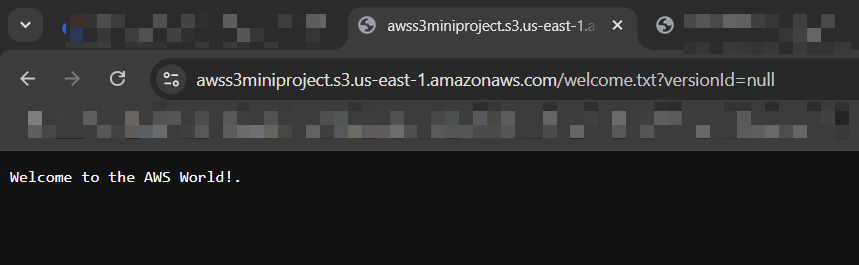

# AWS S3 Mini Project

## 📌 Overview

This project provides hands-on experience with **Amazon S3 (Simple Storage Service)**—a fundamental AWS cloud storage service. It includes tasks such as creating a bucket, uploading files, enabling versioning, configuring access permissions, and applying lifecycle rules. The aim is to equip you with real-world knowledge on S3 storage management.

---

## ☁️ What is Amazon S3?

Amazon S3 is an object storage service that lets you store and retrieve any amount of data from anywhere. It offers:

- **11 9s Durability** (99.999999999%)
- Scalability to exabytes
- Fine-grained security and access control
- Global accessibility
- Pay-as-you-go pricing

---

## ✅ Benefits

- **High Durability**: Data is stored redundantly across multiple availability zones.
- **Scalability**: Easily scale from megabytes to petabytes.
- **Cost Efficiency**: Choose from different storage classes to optimize cost.
- **Security**: Supports encryption, access control, and audit logging.
- **Accessibility**: Data accessible via HTTP, HTTPS, SDKs, or AWS CLI.

---

## 📚 Use Cases

- **Backup and Restore**
- **Static Website Hosting**
- **Media Storage (Photos, Videos)**
- **Big Data Analytics**
- **Disaster Recovery**
- **Application Data Hosting**

---

## 🧠 Core Concepts

| Concept         | Description |
|----------------|-------------|
| **Bucket**      | A container for objects. Must have a unique global name. |
| **Object**      | Files stored in S3, consisting of data and metadata. |
| **Key**         | The unique identifier (like filename) for each object. |
| **Storage Class** | Different options for cost/durability (e.g., Standard, IA, Glacier). |
| **Permissions** | Access control via IAM, ACLs, or bucket policies. |
| **Versioning**  | Maintain multiple versions of objects to protect against overwrites. |
| **Lifecycle Rule** | Automate transition or deletion of data based on age or rule. |

---

## 🔁 What is S3 Versioning?

S3 versioning allows you to:
- Store **multiple versions** of an object.
- Recover from **accidental deletes or overwrites**.
- Maintain **data history**.

When versioning is enabled, S3 creates a new version each time an object is updated or deleted, rather than replacing it.

---

## 🧪 Walkthrough: Step-by-Step

### 🔹 Step 1: Create a Bucket

1. Login to AWS Console
2. Navigate to **S3** from the search bar


3. Click **Create bucket**


4. Enter a unique name (e.g., `my-first-s3-bucket-090`)
5. Leave versioning **disabled** for now
6. Keep **Block all public access** checked


7. Click **Create bucket**


---

### 🔹 Step 2: Upload an Object

1. Create a file on your system (e.g., `welcome.txt`) with:
```
Welcome to the AWS world
````


2. Click **Upload** in your S3 bucket


3. Add the file and complete the upload


---

### 🔹 Step 3: Enable Versioning

1. Go to the **Properties** tab of the bucket


2. Scroll to **Bucket Versioning** and click **Edit**


3. Select **Enable** and **Save changes**


4. Upload an updated version of the file to see versioning in action


5. Enable **"Show versions"** in the **Objects** tab


---

### 🔹 Step 4: Access Object Versions

* Click on different object versions via **Show versions**
* Open each **Object URL** to verify content

### Older version




### Newer version


---

### 🔹 Step 5: Configure Public Access

1. Go to **Permissions** tab
2. Click **Edit** on **Block public access**


3. Uncheck and confirm changes by typing `confirm`


4. Save changes


---

### 🔹 Step 6: Add a Bucket Policy

1. Scroll to **Bucket Policy**, click **Edit**


2. Use the **Policy Generator** with:
- Policy Type: *S3 Bucket Policy*
- Effect: *Allow*
- Principal: `*`
- Action: `s3:GetObject`, `s3:GetObjectVersion`
- ARN: `arn:aws:s3:::my-first-s3-bucket-090/*`
3. Generate and paste the policy into the editor
4. Save changes

```json
{
"Version": "2012-10-17",
"Statement": [
 {
   "Sid": "PublicReadAccess",
   "Effect": "Allow",
   "Principal": "*",
   "Action": [
     "s3:GetObject",
     "s3:GetObjectVersion"
   ],
   "Resource": "arn:aws:s3:::my-first-s3-bucket-090/*"
 }
]
}
````


---

### 🔹 Step 7: Create Lifecycle Rule

1. Go to **Management** tab


2. Click **Add lifecycle rule**
3. Name the rule and set it to transition objects to `STANDARD_IA` after 30 days


4. Save the rule


---

## 🔄 Lifecycle Policy Explanation

The lifecycle rule helps reduce storage costs by **moving infrequently accessed files** to cheaper storage (e.g., Standard-IA). For example, objects older than 30 days are transitioned automatically without manual intervention.

---

## 🎯 Reflection

By completing this project, I learned to:

* Create and configure S3 buckets
* Upload and manage objects
* Use versioning to protect object history
* Set public access with IAM-compliant policies
* Implement lifecycle rules for cost control

These skills are directly applicable to real-world cloud administration tasks and contribute to mastering AWS storage solutions.

---
