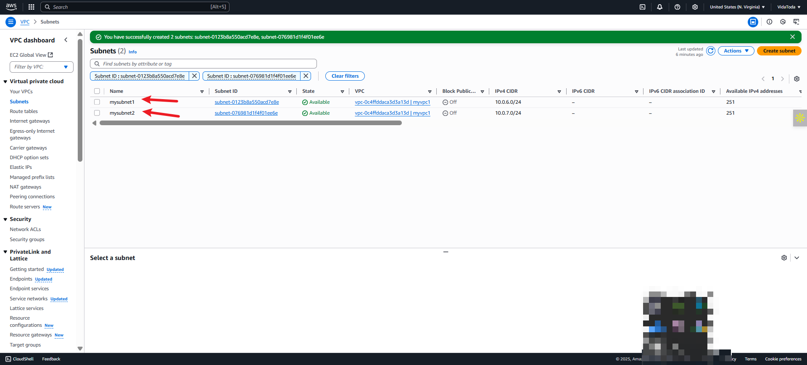

# 🛠️ Network Mastery with AWS VPC – Mini Project Walkthrough

**⏱️ Duration:** 3 hours  
**🎯 Objective:** Deploy and configure a secure, scalable, and functional network architecture on AWS using VPCs, subnets, gateways, route tables, VPC peering, and VPC endpoints. || Imagine building your own *private neighborhood on the internet*. You get to decide which houses (servers) can talk to outsiders (the internet), and which ones stay invisible for safety. That’s what we’re doing here with **AWS Virtual Private Cloud (VPC)** — creating a secure space in the cloud for computers to communicate, share resources, and access the internet securely when needed.

---

## 📘 What You’ll Learn

- Core concepts: VPC, Subnet, Internet Gateway, NAT Gateway, Route Table, CIDR, IP Address
- Difference between Internet Gateway and NAT Gateway
- Secure Internet connectivity and outbound access
- VPC Peering and its use case
- How VPC Endpoints provide secure access to AWS services

---

## 🧠 Key Concepts Explained (Simple Terms)

| Concept | Explanation | Analogy
|--------|-------------|-------------|
| **VPC** | A private network in the cloud, like your company's virtual office. | Like your fenced private estate in the cloud          
| **Subnet** | A segmented zone in your VPC (like HR, IT departments). | Rooms within your house (VPC) – some face the street (public), others are interior (private)    |
| **Internet Gateway** | A door that lets your network access the internet. | A front door – lets people from outside reach the house (internet access)                       |
| **NAT Gateway** | A one-way window: internal systems can browse out, but can’t be accessed from outside. | A peephole – your house can see out, but outsiders can't see 
| **CIDR** | Shorthand notation to define IP ranges (e.g. `10.0.0.0/16`). |
| **IP Address** | A unique digital address like a phone number for devices. | Like a phone number for each device in your network                           
| **Route Table** | A GPS that decides where traffic should go. | GPS/map that tells data where to go                                                             |
| **VPC Peering** | A bridge between two private networks. | Bridge between two private estates so they can talk directly                                    |
| **VPC Endpoint** | A private tunnel from your VPC to AWS services like S3. | Private shortcut from your house to the library (S3, DynamoDB, etc.) without leaving the estate |
| **Gateway + Route Table**  | Route table tells data to use gateway when leaving the estate                                   |

---

## 📈 Network Architecture Diagram (SKETCH)

---

## 🚀 Step-by-Step Practical Walkthrough

### ✅ Part 1: Setting Up a Virtual Private Cloud (VPC)

1. Go to the AWS Console and search for **"VPC"**

2. Click on **"Create VPC"**

3. Choose **"VPC only"**
4. Specify the IPv4 CIDR block (e.g. `10.0.0.0/16`)

5. Click **Create VPC**

---

### ✅ Part 2: Configuring Subnets within the VPC

1. Navigate to **Subnets** on the left panel.
2. Click **Create subnet**

3. Select your VPC ID.
4. Add:
   - **Public Subnet** (e.g. `10.0.1.0/24`) – choose Availability Zone
   - **Private Subnet** (e.g. `10.0.2.0/24`) – choose another AZ

5. Click **Create subnet**

---

### ✅ Part 3: Create and Attach an Internet Gateway

1. Go to **Internet Gateways**
2. Click **Create internet gateway**

3. Name it, then **Create**

4. It will appear as "Detached" → click **Attach to VPC**

5. Select the VPC and confirm

---

### ✅ Part 4: Setup Routing Table for Public Subnet

1. Go to **Route Tables**
2. Click **Create route table**

3. Name it (e.g., `public-route-table`) and select your VPC

4. After creation:
   - Go to **Subnet Associations** → click **Edit subnet associations**

   

   - Select **Public Subnet**

   

   - Go to **Routes** → click **Edit routes**
   
   

   - Add:
     - Destination: `0.0.0.0/0`
     - Target: **Internet Gateway**
      
      
5. Save the route

---

### ✅ Part 5: Enable Outbound Internet Access with NAT Gateway

1.	Navigate to the "NAT Gateways" section, then click on "Create NAT Gateway."

2.	Then mention the name of the NAT Gateway
3.	Select the **Private Subnet** for the NAT
4. Now select the connectivity type as Private.

5. Create

🧠 **Why NAT?**

> Allows private subnet instances to access the internet (e.g., for software updates) *without being exposed*.

6.	Select your NAT Gateway.
7.	Then navigate to the "Details" tab.
8.	From there, locate the subnet ID and click on it.

9.	In the subnet page, navigate to the "Route Table" section.

10.	Then click on the "route table ID "

11.	Proceed to the "Routes" section, then click on "Edit routes."

12.	Then click on “Add routes.”

- Select "Destination" as "0.0.0.0/0."
- In the "Target" field, choose "NAT Gateway,"
- Then select the NAT Gateway you created.

- Finally, save the changes.
13. On the subnet association section, click on edit subnet association.

- Choose the private subnet and click on “Save associations”

### 🆚 Internet Gateway vs NAT Gateway

| Feature | Internet Gateway | NAT Gateway |
|--------|------------------|-------------|
| Access Direction | Inbound + Outbound | Outbound only |
| For Public/Private Subnets | Public | Private |
| Needs Public IP? | Yes | NAT holds public IP, not EC2s |

---

### ✅ Part 6: Establishing VPC Peering

1. Go to **Peering Connections**
2. Click **Create Peering Connection**

3. Create **two VPCs** (e.g. `10.0.0.0/16` and `192.168.0.0/16`)

4.	Now, provide a name for the VPC peering connection.
- Select the requester VPC.
- Choose the account "My account" since the VPCs are in our own AWS account.
- Ensure to use the same region, "This Region," as the VPCs were created in the same region.
-  Next, select the accepter VPC.
- Proceed by clicking on the "Create Peering Connection" button.

4. After creation, go to **Actions > Accept Request** (In the Peering Connection page, locate the "Actions" option on the right side.
- Click on it, then select "Accept Request.")

#### ➕ Configure Route Tables for Peering

1. Go to **VPC-A Route Table**

  

   - Click on "Edit route."

   

   - Click on add route.
   
   

      - Go to the VPC page
         - select the requester VPC.
         - In the details tab, you'll find the IPv4 CIDR. (in this case - 192.168.0.0/16)
         - Copy this CIDR and paste it in the "Destination" field when adding a route.

   
   

   

2. Repeat for **VPC-B**, adding VPC-A’s CIDR

  

   - Click on "Edit route."

   

   - Click on add route.
   
   

      - Go to the VPC page
         - select the accepter VPC.
         - In the details tab, you'll find the IPv4 CIDR. (in this case - 172.16.0.0/16)
         - Copy this CIDR and paste it in the "Destination" field when adding a route.

   
   

   

🧠 **Why VPC Peering?**

> To enable secure, private communication between resources in different VPCs (e.g., Dev ↔ Prod environments)
---

### ✅ Part 7: Add VPC Endpoint for Private S3 Access

1. Go to **Endpoints > Create Endpoint**

2. **Type**: `AWS services`
      -  **Service name**: Search for and select `com.amazonaws.<region>.s3` (e.g., `com.amazonaws.eu-west-1.s3`)

3. Select **VPC (Select the VPC where your private subnet reside)**
4. Choose **Route Table** for private subnet
      * You can:

         * Use the **default** policy (full access to S3)
         * Or define a **custom policy** to restrict access to specific buckets

         For most projects, **default is fine**.
5. Create

🧠 Why?  
→ Keeps S3 traffic off the internet. Good for backups, secure data transfers from private instances. A **VPC Endpoint** allows private, secure connectivity between your VPC and AWS services (like S3), without using the public internet.

---

## ✅ Project Reflection & Takeaways

- Gained hands-on AWS VPC configuration skills
- Understood real-world cloud network setups
- Learned to control traffic using NAT, route tables, and endpoints
- Saw how peering enables collaboration between cloud environments
- Strengthened cloud security awareness

---

## 📁 Additional Notes

- Always ensure **CIDR blocks don’t overlap** in VPC peering
- Route tables and security groups are essential for connectivity
- Use **Draw.io** or **Lucidchart** for AWS network diagrams
- Keep **naming conventions consistent** for clarity in real-world projects

---

> 👩‍💻 *This walkthrough was part of a mini project to master AWS networking by setting up a secure and connected VPC infrastructure.*

## 🎓 **Final Reflection**

This mini project provided foundational skills in AWS networking. By combining theory with practical tasks, I gained confidence in architecting secure and scalable networks. The structured setup mimics real-world architectures used in production environments.

---
