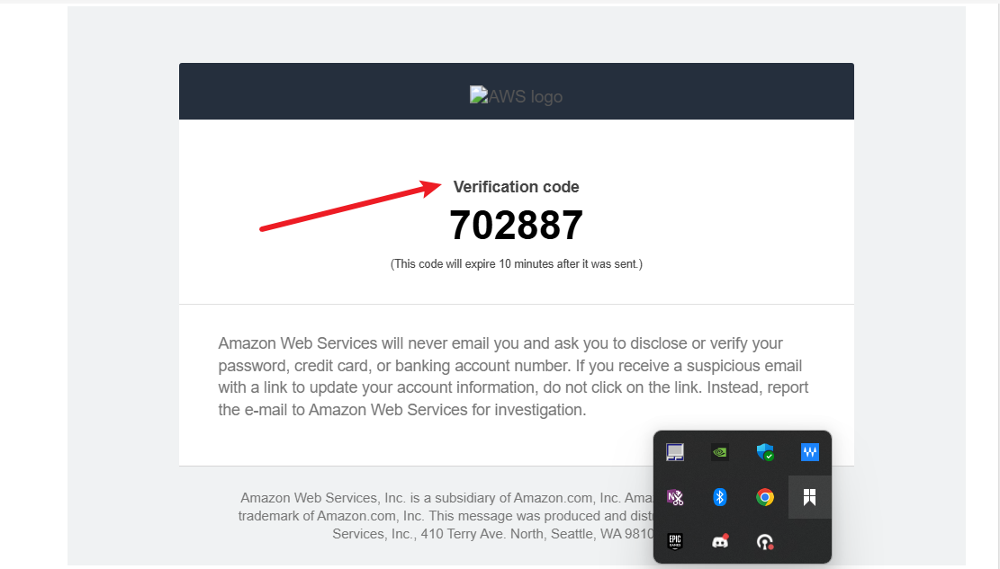
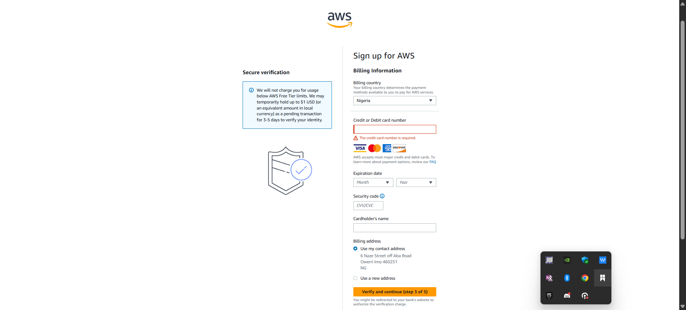
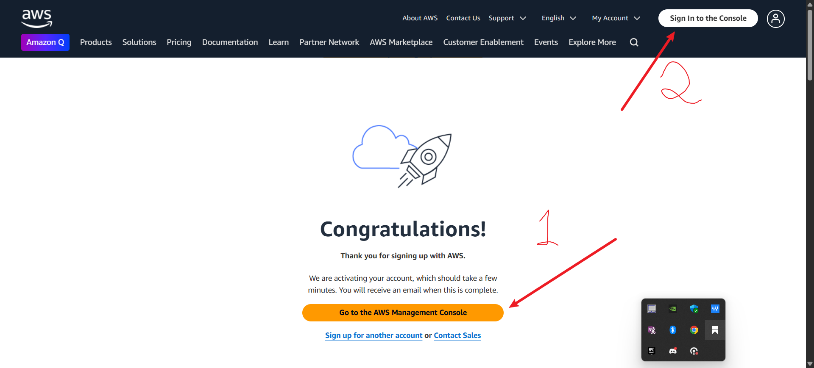

# ☁️ Introduction to Cloud Computing (with Focus on AWS Cloud)

## 🔹 What is Cloud Computing?

**Cloud computing** is the delivery of computing services—such as servers, storage, databases, networking, software, analytics, and intelligence—over the internet (“the cloud”) to provide faster innovation, flexible resources, and economies of scale.

Instead of owning and maintaining physical data centers and servers, organizations can rent access to anything from applications to storage from a cloud service provider like **Amazon Web Services (AWS)**.

---

## 🔹 What is AWS Cloud?

**AWS (Amazon Web Services)** is the world’s most comprehensive and widely adopted **cloud platform**, offering over **200 fully featured services** from data centers globally.

### Key Characteristics of AWS Cloud:

* **On-demand delivery** of resources
* **Scalability** (scale up or down as needed)
* **Pay-as-you-go** pricing
* **Global infrastructure** with multiple regions and availability zones
* **Highly secure** and compliant

---

## 🔹 Importance of AWS Cloud

1. **Cost Efficiency**
   You pay only for the resources you use—no upfront hardware costs.

2. **Scalability & Flexibility**
   Instantly scale up or down depending on your needs without worrying about hardware.

3. **Speed and Agility**
   Deploy resources in minutes; innovate faster by focusing on applications instead of infrastructure.

4. **Global Reach**
   AWS has data centers in multiple regions around the world, making it ideal for businesses operating globally.

5. **Security**
   AWS follows best security practices with compliance programs like ISO 27001, GDPR, SOC, and more.

6. **Reliability**
   Built-in redundancy and high availability ensure services are reliable and resilient.

---

## 📝 How to Create an AWS Account

1. Visit: [https://aws.amazon.com](https://aws.amazon.com)
2. Click on **“Create an AWS Account”**

### Steps:

* **Enter email**, password, and choose a unique AWS account name.
* Provide **contact details** (choose between personal or professional).
* Enter **billing information** (credit/debit card required even for free-tier).
* Complete **identity verification** via phone or text.
* Select **Basic (Free)** support plan.
* Log in to the **AWS Management Console**.

> ✅ AWS Free Tier offers 12 months of free usage for core services like EC2, S3, and Lambda—great for learning or small projects.

---

## 🧭 AWS Management Console Overview

The **AWS Management Console** is a web-based GUI for accessing and managing AWS services.

### Key Features:

* **Dashboard**: Central access point to all services.
* **Search bar**: Quickly find services like S3, EC2, or RDS.
* **Region selector**: Choose where your resources will be hosted.
* **IAM access**: Securely manage users and permissions.
* **Billing dashboard**: Track usage and cost.

---

## 🔐 Best Practices for Account Security and Management

* **Enable MFA** on your root account.
* **Create IAM users** with limited permissions instead of using the root account.
* **Use groups and roles** to organize permissions.
* **Set up billing alarms** to prevent unexpected charges.
* **Tag resources** for better tracking and management.

---

## ✅ Summary

Cloud computing allows organizations and individuals to access powerful IT resources over the internet without owning physical infrastructure. **AWS Cloud** leads the industry by offering a vast array of scalable, secure, and cost-effective services. Creating an AWS account and navigating the AWS Management Console are the first steps toward harnessing the power of the cloud for development, data storage, analytics, AI/ML, and more.

---
