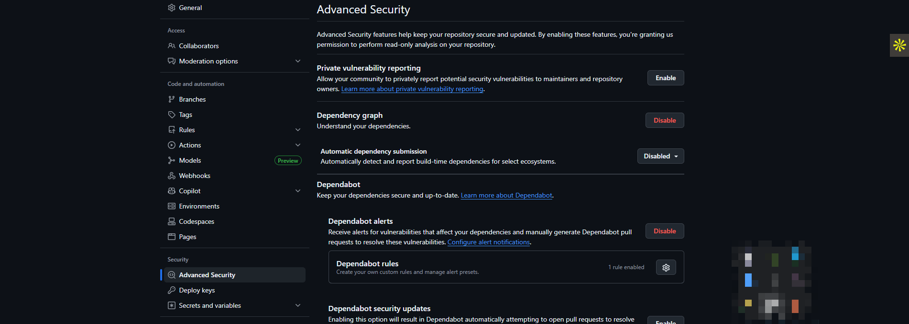
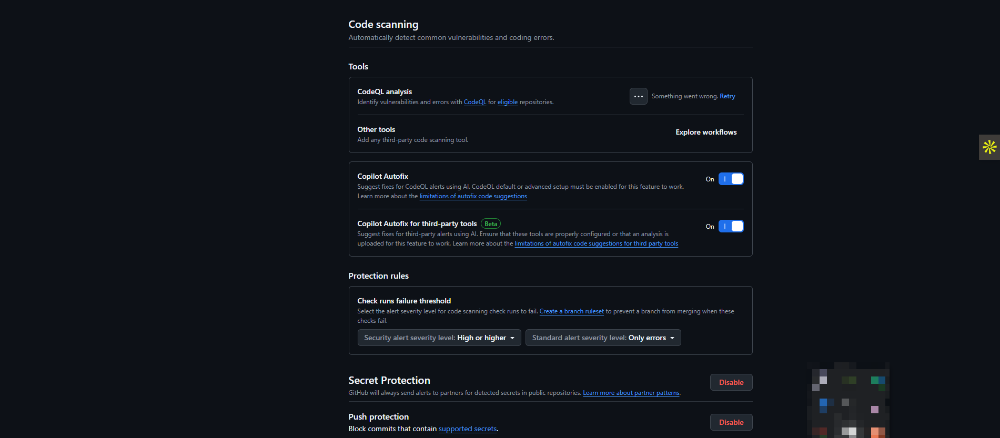
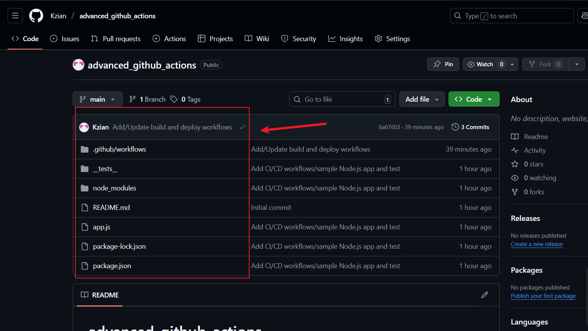

# 🚀 Advanced GitHub Actions — Best Practices, Performance & Security

## 📌 Introduction

This project demonstrates advanced concepts and best practices in **GitHub Actions CI/CD**. It was structured as a learning lab with three lessons:

1. **Best Practices for Workflows**
2. **Performance Optimization**
3. **Security Considerations**

A simple Node.js app with Jest tests was used to validate workflows. The project also simulated **deployment with fake secrets** to ensure workflows are both functional and secure.

## Repo

[advanced_github_actions](https://github.com/Kzian/advanced_github_actions.git)

---

## 🔹 Lesson 1: Best Practices

✅ **Descriptive Naming**

* Workflows named clearly (`Build and Test Node.js Application`, `Deploy Application`).

✅ **Documentation with Comments**

* YAML files include inline comments for clarity.

✅ **Modularization**

* Created a reusable `test.yml` workflow to centralize test logic.

✅ **Organized Workflow Files**

* Workflows stored under `.github/workflows/` with separate files:

  * `build.yml` → CI build & test
  * `test.yml` → reusable test workflow
  * `deploy.yml` → simulated deployment

---

## 🔹 Lesson 2: Performance Optimization

✅ **Parallelization**

* Used `strategy.matrix` to test across multiple Node.js versions (16, 18, 20).

✅ **Caching**

* Implemented caching with `actions/cache@v4` to reuse npm dependencies, reducing build times.

---

## 🔹 Lesson 3: Security Considerations

✅ **Principle of Least Privilege**

* Workflows configured with `permissions: contents: read` to minimize scope.

✅ **Securing Secrets**

* Added **encrypted secrets** via GitHub repo settings (simulated with `FAKE_SECRET`).
* Used `${{ secrets.FAKE_SECRET }}` in `deploy.yml`, ensuring secrets never appear in plaintext.

✅ **Audit & Monitoring**

* Checked workflow run logs for anomalies.
* Discussed enabling GitHub security features:

  * Dependabot alerts
  * CodeQL scanning
  * Secret scanning
* Recommended branch protection rules for secure deployments.

---

## 🔹 Implementation Details

### Node.js App Setup

* Minimal app (`app.js`) with add function.
* Unit test (`__tests__/app.test.js`) using Jest.
* Updated `package.json` with custom scripts for Windows compatibility.

### CI Workflow (`build.yml`)

* Runs tests on pushes and PRs.
* Caches dependencies for faster runs.
* Uses least-privilege permissions.

### CD Workflow (`deploy.yml`)

* Installs dependencies.
* Runs tests before deployment.
* Simulates deployment using fake secrets (masked in logs).

---

## 🎯 Key Achievements

* ✅ Designed **maintainable and modular workflows**
* ✅ Implemented **performance improvements** via caching and parallelization
* ✅ Practiced **securing workflows with least privilege + encrypted secrets**
* ✅ Completed **audit & monitoring** coverage for full lifecycle security
* ✅ Successfully debugged Windows-specific issues (Jest runner path fix)
* ✅ Achieved a **functional CI/CD pipeline simulation**

---

## 📖 Conclusion

This project successfully demonstrated **Advanced GitHub Actions Concepts** through hands-on implementation. The workflows created here are robust, modular, optimized, and secure — aligning with industry best practices.

The repo now serves as a **practical template** for future real-world CI/CD pipelines.

---
