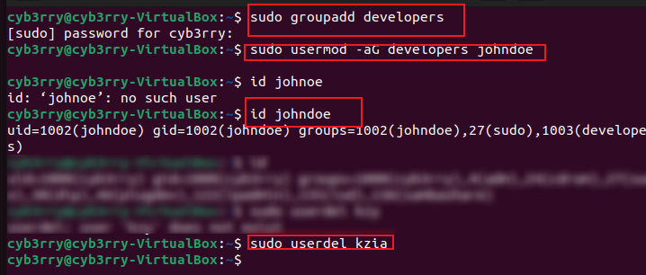

# Advance linux commands
---

## 🔐 **Linux File Permissions & Access Rights**

In Linux, **file permissions** control **who can read, write, or execute** a file or directory. This ensures **security** and **proper access control** in a multi-user environment.

---

### 🧱 **Permission Structure**

Each file or directory has **three types of permissions** for **three categories of users**:

| Category      | Symbol | Meaning         |
|---------------|--------|-----------------|
| **User**      | `u`    | Owner of file   |
| **Group**     | `g`    | Users in group  |
| **Others**    | `o`    | Everyone else   |

### 🔤 **Shorthand Representation:**
When you run `ls -l`, you’ll see something like:

```
-rwxr-xr--  1 user group  file.txt
```
It breaks down as:

| Section     | Meaning                 |
|-------------|--------------------------|
| `-`         | File type (`-` = file, `d` = directory) |
| `rwx`       | **User**: read, write, execute |
| `r-x`       | **Group**: read, execute        |
| `r--`       | **Others**: read only           |

### Practice
```bash
ls -latr #view permissions
touch script.sh
chmod +x script.sh #assign execute rights to everyone
chmod 755 script.sh #can be used instead
chmod 777 note.txt #gives everyone rwx rights
```

---

### 🔢 **Numeric (Octal) Representation:**

Permissions can also be represented using numbers:

| Permission | Binary | Octal |
|------------|--------|-------|
| `r` (read) | 4      |       |
| `w` (write)| 2      |       |
| `x` (exec) | 1      |       |

You **sum the values** for each group:

- `rwx` = `4 + 2 + 1 = 7`
- `rw-` = `4 + 2 = 6`
- `r--` = `4`

So:

```bash
chmod 754 file.txt
```

Means:

- **7** → user: read, write, execute
- **5** → group: read, execute
- **4** → others: read

---

### 🔧 **File Permission Command: `chmod`**

Used to **change file permissions**.

#### 📌 Syntax:
```bash
chmod [options] mode file
```

#### 🔹 Examples:

- Numeric:
  ```bash
  chmod 755 script.sh
  ```

- Symbolic:
  ```bash
  chmod u+x myfile.txt     # Give user execute permission
  chmod g-w myfile.txt     # Remove write permission from group
  chmod o=r myfile.txt     # Set others to read only
  ```
---

## 🏷️ `chown` – *Change File Ownership*

The `chown` command is used to **change the ownership** of files and directories in Linux.

---

### 🔧 **Purpose:**
- Assign a **new owner** (user) to a file or directory
- Optionally, change the **group ownership** as well

---

### 📌 **Syntax:**
```bash
chown [options] user[:group] filename
```

- `user` – the new owner's username or UID  
- `group` – (optional) the new group name or GID  
- `filename` – the file or directory whose ownership is being changed

---

### 🔹 **Examples:**

- Change the owner of a file to `alice`:
  ```bash
  sudo chown alice document.txt
  ```

- Change the owner to `bob` and group to `developers`:
  ```bash
  sudo chown bob:developers project/
  ```

- Recursively change ownership of a directory and all its contents:
  ```bash
  sudo chown -R alice:teamA /home/alice/projects
  ```
---

### ⚠️ **Note:**
- Only the **superuser (root)** or the file owner (with appropriate permissions) can change file ownership.
- Use `ls -l` to check ownership before and after changes.
---

### 👑 **Superuser Privileges (`sudo`)**

- Only the **superuser (root)** can access or modify **protected system files** and **manage users and services**.
- Use `sudo` to run commands with elevated privileges:
  ```bash
  sudo chmod 700 /etc/secret.conf
  ```

---

### 👤 **User Management in Linux**

| Command            | Description                          |
|--------------------|--------------------------------------|
| `adduser username` | Add a new user                       |
| `deluser username` | Delete a user                        |
| `passwd username`  | Set or change a user’s password      |
| `usermod`          | Modify user settings (e.g., group)   |
| `groups username`  | Show user’s group memberships        |
| `id username`      | Show user ID and group info          |

#### 🔹 Example:
```bash
sudo useradd john
sudo passwd john
sudo usermod -aG sudo johndoe #grant admin priv
```
To switch user account while in the same terminal, use: `su <username>`
---

## 👤 `usermod` – *Modify a User Account*

The `usermod` command is used to **change user account settings** in Linux, such as username, group membership, home directory, or shell.

---

### 🔧 **Syntax:**
```bash
sudo usermod [options] username
```

---

### 🔹 **Common Options:**

| Option         | Description                                      |
|----------------|--------------------------------------------------|
| `-l newname`   | Change the username                              |
| `-d /new/home` | Change the home directory                        |
| `-m`           | Move files to the new home directory             |
| `-G group1,group2` | Add user to supplementary groups             |
| `-aG group`    | **Append** user to a group (used with `-G`)      |
| `-s /bin/bash` | Change the user’s login shell                    |
| `-L`           | Lock the user account                            |
| `-U`           | Unlock the user account                          |

---

### 🔸 **Examples:**

- 🔄 **Change username** from `john` to `jdoe`:
  ```bash
  sudo usermod -l jdoe john
  ```

- 🏠 **Change home directory** and move files:
  ```bash
  sudo usermod -d /home/newjdoe -m jdoe
  ```

- 👥 **Add user to multiple groups**:
  ```bash
  sudo usermod -aG sudo,developers jdoe
  ```

- 🔒 **Lock user account**:
  ```bash
  sudo usermod -L jdoe
  ```

---

### ⚠️ **Note:**
- Always use `-aG` (append) when adding a user to groups, or you may overwrite existing group memberships.
- Only the **root user** can execute `usermod`.
---

### Practice
```bash
sudo adduser johndoe
sudo usermod -aG sudo johndoe
su johndoe
sudo passwd johndoe
sudo groupadd developers
sudo usermod -aG developers johndoe
id johnoe
sudo userdel username
sudo chown :developers /path/to/directory
sudo chmod g+rw /path/to/directory
```




### TASKS


### Side Hustle Task3


---

## DONE!!!