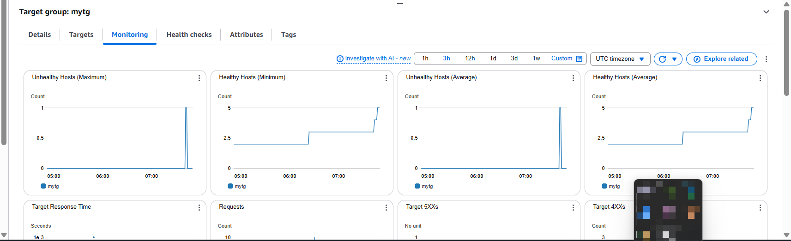

# 📝 **Professional Summary: Auto Scaling with ALB using Launch Template**

This mini project demonstrates how to configure **Auto Scaling in AWS** integrated with an **Application Load Balancer (ALB)** using a **Launch Template**. The goal is to create a scalable and resilient architecture that dynamically adjusts the number of EC2 instances based on demand.

The project walks through the entire process—from creating a Launch Template to configuring an Auto Scaling group, setting up scaling policies, attaching the group to an ALB, and finally testing the Auto Scaling behavior using stress tools. By completing this project, you gain practical experience in designing fault-tolerant and cost-efficient AWS infrastructure using automation and monitoring best practices. The knowledge gained is crucial for building scalable cloud applications that can respond to varying workloads without manual intervention.

---

## 🛠️ Step-by-Step Guidelines

### ✅ **Task 1: Create a Launch Template**

1. **Log in** to the AWS Management Console.
2. Navigate to **EC2**.
3. On the left panel, click **Launch Templates**.
4. Click **Create launch template**.


5. Provide the following:

   * **Name** for the template.
   * **AMI ID** (Amazon Machine Image).
   * **Instance type** (e.g., t2.micro).
   * **Key pair** (for SSH access).
   * In **Advanced details**, paste the **User Data script** if any (e.g., to install web server or monitoring tool).


6. Click **Create launch template**.


---

### 🔹**Task 2: Create an Auto Scaling Group (Attach to ALB & Target Group)**

1. Go to **EC2 → Auto Scaling Groups** → **Create Auto Scaling group**.


2. Select the **Launch Template** you created earlier.
3. Set:

   * Auto Scaling Group name
   * VPC and subnets (same as ALB)
4. Set desired, minimum, and maximum capacity.
5. Configure **scaling policies** (e.g., based on CPU utilization).
6. Click **Create Auto Scaling Group**.
7. Choose policy type (e.g., **Target Tracking Scaling Policy**).

    Configure:

   * Metric type (e.g., **Average CPU Utilization**).
   * Target value (e.g., 50%).
   * Cooldown period.
   


8. Click **Create Auto Scaling group**.


*Note:* Ensure your Launch Template includes the necessary **security group** that allows traffic from the ALB.

---

### ✅ **Task 3 Test Auto Scaling**

1. **Connect to an EC2 instance** (via SSH) that’s part of your Auto Scaling group.
2. Install the stress tool:

   ```bash
   sudo yum install stress -y
   ```
3. Generate load to simulate high demand:

   ```bash
   stress -c 4
   ```
4. Go back to your AWS Console and monitor:

   * **Auto Scaling Group instance count**
   * **CloudWatch metrics (CPU Utilization)**
   * Confirm that new instances are launched as demand increases.


### Before stress was activated:


### After:


### If stress is left for a longer period:




---
