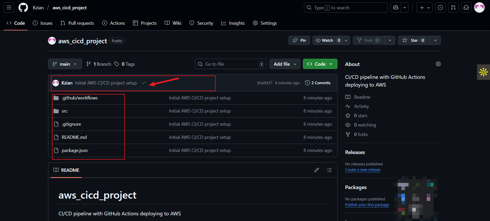
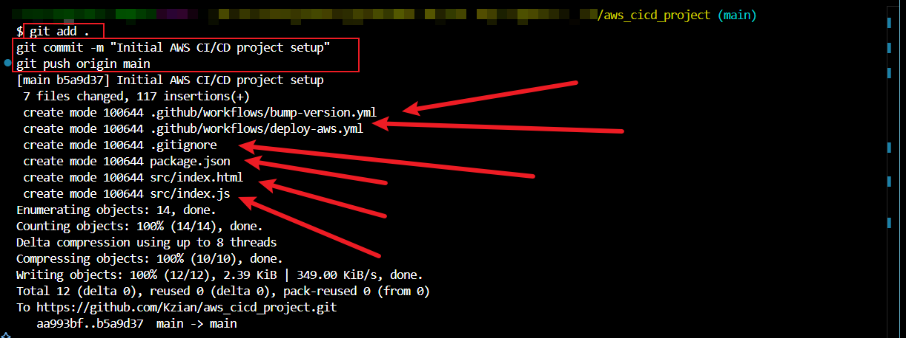
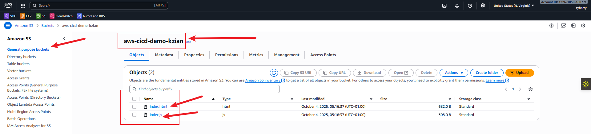
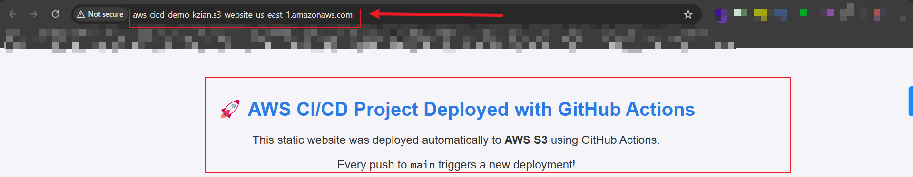

# 🌐 Project Report: Automating CI/CD with GitHub Actions and AWS S3

## 📖 1. Introduction

This project demonstrates the design and implementation of a **Continuous Integration and Continuous Deployment (CI/CD) pipeline** using **GitHub Actions** and **Amazon Web Services (AWS S3)**.

The solution automates:

* ✅ **Versioning & Tagging** → Automatic semantic version bumps on each commit to `main`.
* ✅ **Releases** → Automated GitHub release creation whenever a new tag is pushed.
* ✅ **Deployment** → Code is continuously deployed to **AWS S3**, enabling static website hosting.

This approach ensures that every update is tested, versioned, released, and deployed **without manual intervention**.


- ### The repo can be visited via this link: 

[aws-cicd-project](https://github.com/Kzian/aws_cicd_project.git)

---

## ⚙️ 2. Tools & Technologies

* **GitHub Actions** → Workflow automation for CI/CD.
* **AWS S3** → Hosting platform for static site deployment.
* **IAM & GitHub Secrets** → Secure credentials management.
* **Node.js / HTML** → Application stack for testing deployment.

---

## 🛠️ 3. Project Setup

### 🔹 3.1 Repository

A new GitHub repository `aws-cicd-project` was created with the following structure:

```
aws-cicd-project/
 ├── src/
 │   ├── index.html
 │   
 ├── .github/
 │   └── workflows/
 │       ├── bump-version.yml
 │       ├── create-release.yml
 │       └── deploy-aws.yml
 └── README.md
```



---

### 🔹 3.2 Workflows

1. **bump-version.yml**

   * Uses `anothrNick/github-tag-action` to increment project version automatically.
   * Example: `1.0.0 → 1.0.1`.

```bash
name: Bump version and tag
on:
  push:
    branches: [ main ]

jobs:
  create_tag:
    runs-on: ubuntu-latest
    steps:
      - uses: actions/checkout@v2
      - name: Bump version and push tag
        uses: anothrNick/github-tag-action@1.26.0
        env:
          GITHUB_TOKEN: ${{ secrets.GITHUB_TOKEN }}
          DEFAULT_BUMP: patch

```

2. **create-release.yml**

   * Creates a GitHub Release based on the new tag.
   * Provides a structured version history.

3. **deploy-aws.yml**

   * Configures AWS credentials from GitHub Secrets.
   * Deploys code to **S3 bucket** using `aws s3 sync`.
   * Ensures that the live website always reflects the latest changes.

```bash
name: Deploy to AWS

on:
  push:
    branches: [ main ]

jobs:
  deploy:
    runs-on: ubuntu-latest
    steps:
      - name: Checkout code
        uses: actions/checkout@v2

      - name: Configure AWS
        uses: aws-actions/configure-aws-credentials@v1
        with:
          aws-access-key-id: ${{ secrets.AWS_ACCESS_KEY_ID }}
          aws-secret-access-key: ${{ secrets.AWS_SECRET_ACCESS_KEY }}
          aws-region: us-east-1   # Change to your AWS region

      - name: Deploy to S3
        run: |
          aws s3 sync ./src s3://${{ secrets.S3_BUCKET }} --delete        
```





---


## ☁️ 4. AWS Configuration

### 🪣 4.1 S3 Bucket

* Created a bucket (`aws-cicd-demo-username`).
* Enabled **Static Website Hosting** with:

  * **Index document:** `index.html`




### 🔑 4.2 IAM & Secrets

* IAM user created with `AmazonS3FullAccess` (demo level).
* Access keys securely stored in GitHub Secrets:

  * `AWS_ACCESS_KEY_ID`
  * `AWS_SECRET_ACCESS_KEY`
  * `AWS_REGION`
  * `S3_BUCKET`

### 🔓 4.3 Public Access & Policy

* Disabled **Block Public Access** for the bucket.
* Configured a **bucket policy** to allow public read access:

```json
{
  "Version": "2012-10-17",
  "Statement": [
    {
      "Sid": "PublicReadGetObject",
      "Effect": "Allow",
      "Principal": "*",
      "Action": "s3:GetObject",
      "Resource": "arn:aws:s3:::aws-cicd-demo-username/*"
    }
  ]
}
```

---

## 🚀 5. Deployment Process

1. Developer **pushes code to `main`**.
2. GitHub Actions:

   * **Bumps version** & tags commit.
   * **Creates GitHub Release** from tag.
   * **Deploys files to AWS S3**.
3. S3 automatically serves the updated website at the public endpoint:

   ```
   http://aws-cicd-demo-username.s3-website-us-east-1.amazonaws.com
   ```


---

## 🌍 6. Testing & Validation

* **index.html** deployed successfully:

```html
<h1>🚀 AWS CI/CD Project</h1>
<p>Deployed automatically with GitHub Actions to AWS S3.</p>
```


✅ Testing confirmed that every push updates the live site automatically.

---

## 🏁 7. Conclusion

This project demonstrates a **complete CI/CD workflow** integrating GitHub Actions with AWS:

* **Automation** → No manual deployment needed.
* **Reliability** → Every update is deployed consistently.
* **Scalability** → Same pattern can extend to **Elastic Beanstalk**, **ECS**, or other AWS services.

By achieving this, the project highlights **practical DevOps skills** in CI/CD pipeline design, automation, and cloud deployment.


---
