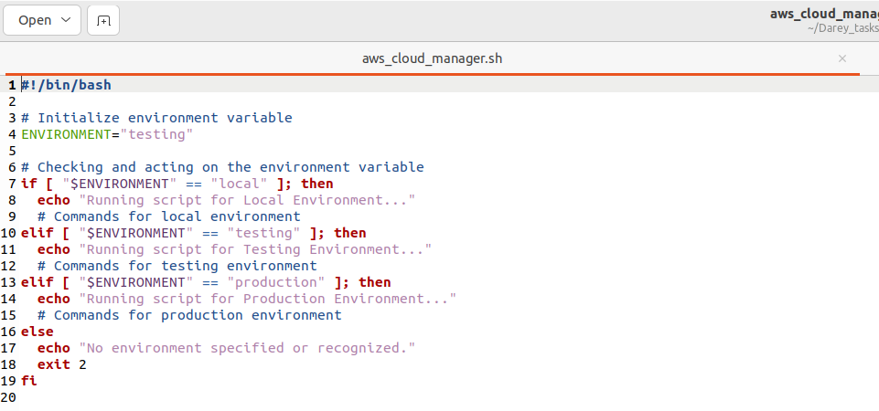
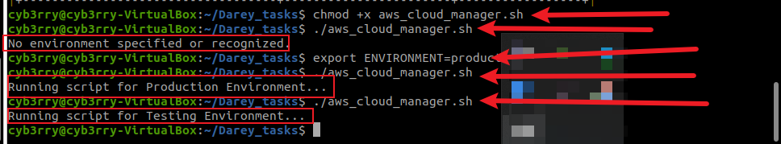
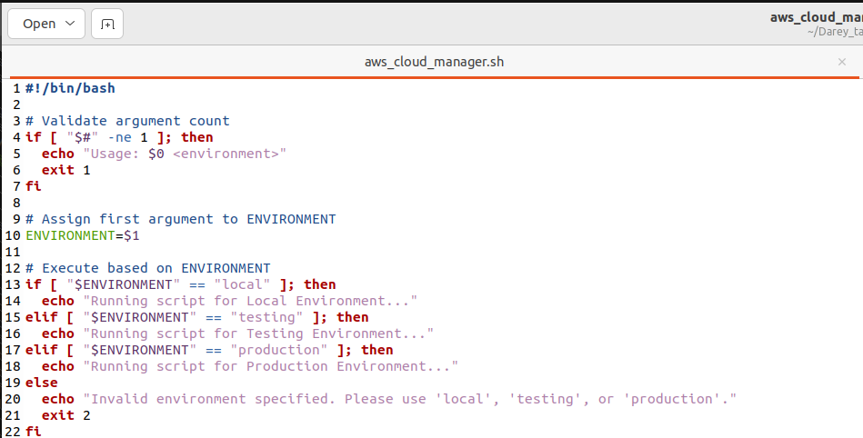
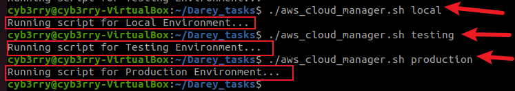

# Understanding Environment Variables & Infrastructure Environments

## 1. **Introduction**

This section introduces two core concepts in cloud-based software development: **Infrastructure Environments** and **Environment Variables**. Although the two terms share the word “environment,” they serve different purposes—Infrastructure Environments define *where* the application runs (e.g., development, testing, production), while Environment Variables define *how* the application behaves in those environments using dynamic configuration values.

---

## 2. **Infrastructure Environments**

Describes a typical multi-environment deployment pipeline:

* **Local Development** using VirtualBox + Ubuntu
* **Testing Environment** on AWS Account 1 (staging EC2 instance)
* **Production Environment** on AWS Account 2 (live EC2 instance)

Each setup constitutes a distinct **infrastructure environment** and supports a structured software lifecycle from development to production.

---

## 3. **Environment Variables**

Explains how different environments (local, testing, production) require different database credentials. Environment variables (`DB_URL`, `DB_USER`, `DB_PASS`) are used to store these credentials in a secure, environment-specific way. This allows scripts and apps to behave correctly without modifying the codebase.

---

## 4. **Script Creation - `aws_cloud_manager.sh`**

Begins development of a reusable shell script. The goal is to dynamically apply logic depending on the target environment by checking the value of an environment variable.

Sample script:

```bash
#!/bin/bash

# Checking and acting on the environment variable
if [ "$ENVIRONMENT" == "local" ]; then
  echo "Running script for Local Environment..."
elif [ "$ENVIRONMENT" == "testing" ]; then
  echo "Running script for Testing Environment..."
elif [ "$ENVIRONMENT" == "production" ]; then
  echo "Running script for Production Environment..."
else
  echo "No environment specified or recognized."
  exit 2
fi
```

To run it:

1. Save the file as `aws_cloud_manager.sh`
2. Make it executable:

   ```bash
   chmod +x aws_cloud_manager.sh
   ```

Before doing no. 3, run the script and view its output:

3. Export the environment before running:

   ```bash
   export ENVIRONMENT=production
   ./aws_cloud_manager.sh
   ```

---

## 5. **Hardcoding vs Dynamic Variables**

Instead of hardcoding environment values within the script, it’s better to pass them dynamically via arguments. Hardcoding reduces flexibility and leads to repetitive maintenance.

Example of hardcoding:

```bash
ENVIRONMENT="testing"
```
Now update the script and run:
```bash
#!/bin/bash

# Initialize environment variable
ENVIRONMENT="testing"

# Checking and acting on the environment variable
if [ "$ENVIRONMENT" == "local" ]; then
  echo "Running script for Local Environment..."
  # Commands for local environment
elif [ "$ENVIRONMENT" == "testing" ]; then
  echo "Running script for Testing Environment..."
  # Commands for testing environment
elif [ "$ENVIRONMENT" == "production" ]; then
  echo "Running script for Production Environment..."
  # Commands for production environment
else
  echo "No environment specified or recognized."
  exit 2
fi
```


This forces the script to always assume it's running in the testing environment, regardless of context.



---

## 6. **Using Positional Parameters**

This section introduces positional parameters (like `$1`, `$2`) which allow users to pass values when executing the script. This enhances reusability and reduces dependency on hardcoded or manually exported environment variables.

**Example**:

```bash
./aws_cloud_manager.sh testing
```

Inside script:

```bash
ENVIRONMENT=$1
```

For multiple parameters:

```bash
./aws_cloud_manager.sh testing 5

ENVIRONMENT=$1
NUMBER_OF_INSTANCES=$2
```

---

## 7. **Argument Validation**

Best practice involves validating the number of arguments passed to avoid unexpected behavior.

**Check number of arguments:**

```bash
if [ "$#" -ne 1 ]; then
  echo "Usage: $0 <environment>"
  exit 1
fi
```

**Final Script Template**:

```bash
#!/bin/bash

# Validate argument count
if [ "$#" -ne 1 ]; then
  echo "Usage: $0 <environment>"
  exit 1
fi

# Assign first argument to ENVIRONMENT
ENVIRONMENT=$1

# Execute based on ENVIRONMENT
if [ "$ENVIRONMENT" == "local" ]; then
  echo "Running script for Local Environment..."
elif [ "$ENVIRONMENT" == "testing" ]; then
  echo "Running script for Testing Environment..."
elif [ "$ENVIRONMENT" == "production" ]; then
  echo "Running script for Production Environment..."
else
  echo "Invalid environment specified. Please use 'local', 'testing', or 'production'."
  exit 2
fi
```




---

## 🔹 **Walkthrough Summary**

| **Step** | **Action**                                                                            | **Purpose**                                                    |
| -------- | ------------------------------------------------------------------------------------- | -------------------------------------------------------------- |
| 1        | Create shell script: `aws_cloud_manager.sh`                                           | Automates cloud tasks per environment                          |
| 2        | Make it executable: `chmod +x aws_cloud_manager.sh`                                   | Grants permission to run the script                            |
| 3        | (Option A) Export environment variable: `export ENVIRONMENT=production`               | Dynamically control behavior based on environment              |
| 4        | (Option B - Preferred) Pass environment as argument: `./aws_cloud_manager.sh testing` | Enables flexibility and reuse                                  |
| 5        | Validate arguments in the script                                                      | Prevents misuse and clarifies expected input                   |
| 6        | Use conditionals to run environment-specific logic                                    | Automates separate actions for local/testing/production setups |

---

## 🔹 **Summary**

This mini project deepened my understanding of **Infrastructure Environments** and **Environment Variables**, especially their importance in building flexible and scalable cloud-based scripts. I learned how to structure a Bash script (`aws_cloud_manager.sh`) that responds dynamically to different environments using exported variables and positional parameters. I also applied best practices like input validation and avoiding hardcoded values, which enhances script reliability and maintainability across development, testing, and production setups.

---

