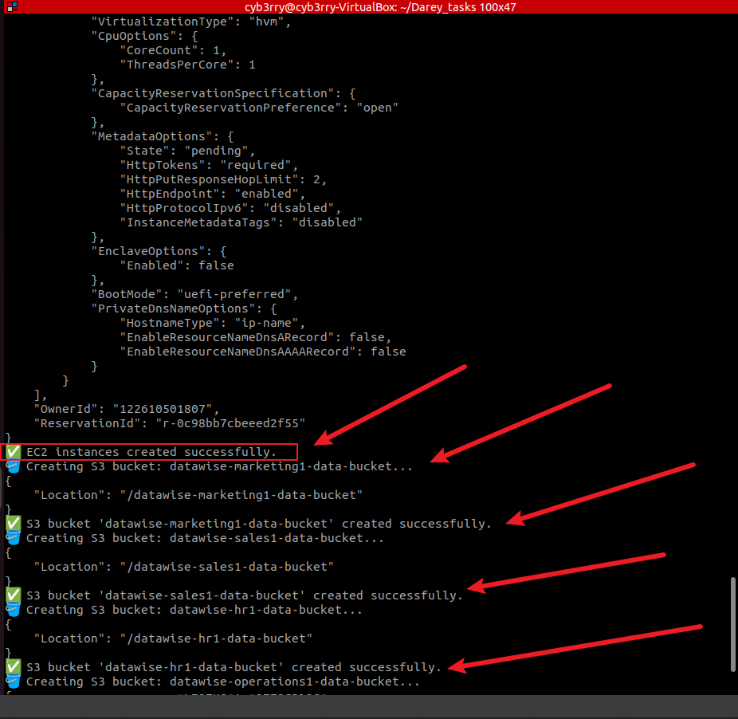

# 📊 **Project Summary: Building Automated Cloud Infrastructure with Shell Scripting**

### 🎯 **Project Goal**

The goal of this project was to **bridge shell scripting with cloud computing** by automating the deployment of resources (EC2 and S3) on **Amazon Web Services (AWS)**. The project was designed to teach **five foundational scripting concepts** and show how these can be applied to real-world cloud engineering tasks.

---

## 🧠 **Foundational Shell Scripting Skills**

### 1. **Functions** – *Organizing logic into blocks*

> Reusable blocks of code that perform specific tasks, making scripts easier to manage and debug.

### 2. **Arrays** – *Handling multiple values easily*

> Used to hold a list of related items (like departments), enabling us to loop over them efficiently.

### 3. **Environment Variables** – *Externalizing configuration*

> Helps store values like AWS region, profile, or instance types without hardcoding them directly in the script.

### 4. **Command-Line Arguments** – *User-defined input when running the script*

> The script accepts an argument like `local`, `testing`, or `production` to decide what logic to run.

### 5. **Error Handling** – *Making the script robust*

> The script checks for missing tools, incorrect inputs, and AWS errors, and provides clear feedback to the user.

---

## 🏗️ **Scenario Background**

You played the role of a **cloud engineer at DataWise Solutions**, a data science consulting firm helping a startup deploy their **data infrastructure on AWS**.

### The client’s needs:

* Launch **EC2 instances** (virtual servers) for computing power
* Create **S3 buckets** (cloud storage) for different departments
* Automate the setup using a shell script

---

## 📜 **Understanding the Script (Layman Explanation)**

Let’s break down the script like a story:

### Step 1: 🧾 **User Input**

When the script starts, it **expects you to tell it which environment** you're setting up:

```bash
./awsfuncarray.sh local
```

You can use `local`, `testing`, or `production`.

If you forget to include this, the script reminds you how to use it and then stops.

---

### Step 2: 🧪 **Environment Logic**

Depending on your input, it prints a relevant message like:

* "Running for Testing Environment"
* "Running for Production Environment"

This is just to simulate how different environments (like test or production) might use different configurations.

```bash
check_num_of_args() {
    if [ "$#" -ne 1 ]; then
        echo "Usage: $0 <environment>"
        echo "Example: $0 default | testing | production"
        exit 1
    fi
}

# -------------------------
# Function: Activate environment-specific logic
# -------------------------
activate_infra_environment() {
    if [ "$ENVIRONMENT" == "local" ]; then
        echo "🛠️ Running script for default Environment..."
    elif [ "$ENVIRONMENT" == "testing" ]; then
        echo "🧪 Running script for Testing Environment..."
    elif [ "$ENVIRONMENT" == "production" ]; then
        echo "🚀 Running script for Production Environment..."
    else
        echo "❌ Invalid environment specified. Use 'local', 'testing', or 'production'."
        exit 2
    fi
}
```
---

### Step 3: 🔍 **Checks Before Launching Anything**

The script checks:

* If **AWS CLI** (a tool that talks to AWS) is installed.
* If the **AWS profile** (credentials to log in) is set.

If not, it politely stops and tells you what to fix.

```bash
check_aws_cli() {
    if ! command -v aws &> /dev/null; then
        echo "❌ AWS CLI is not installed. Please install it before proceeding."
        exit 1
    fi
}

# -------------------------
# Function: Check if AWS profile is set
# -------------------------
check_aws_profile() {
    if [ -z "$AWS_PROFILE" ]; then
        echo "❌ AWS profile environment variable is not set."
        exit 1
    fi
}
```

---

### Step 4: 💻 **Create EC2 Instances**

The script:

* Picks a **default server type** (`t2.micro`) and a **pre-defined AMI ID** (template for the server).
* Launches **an EC2 instance** in a specific AWS region (`us-east-1`).
* Tells you whether it was successful or not.

Right now it creates **one instance**. This can be expanded in future projects.

```bash
    create_ec2_instances() {
    instance_type="t2.micro"
    ami_id="ami-05ffe3c48a9991133"
    region="us-east-1"
    key_name="linuxkey"  # Replace with your actual key pair

    echo "📦 Creating $count EC2 instances in region $region..."

    aws ec2 run-instances \
        --image-id "$ami_id" \
        --instance-type "$instance_type" \
        --key-name "$key_name" \
        --region "$region"

    if [ $? -eq 0 ]; then
        echo "✅ EC2 instances created successfully."
    else
        echo "❌ Failed to create EC2 instances."
    fi
}
```
---

### Step 5: 🪣 **Create S3 Buckets for Departments**

It then loops through **five departments**:

* Marketing1
* Sales1
* HR1
* Operations1
* Media1

For each department:

* It creates a unique **S3 bucket** named like `datawise-marketing1-data-bucket`
* Confirms if each bucket was successfully created

This is done using an **array** and a loop—so even if you had 100 departments, it could handle that too.

```bash
create_s3_buckets() {
    company="datawise"
    departments=("Marketing1" "Sales1" "HR1" "Operations1" "Media1")
    region="us-east-1"  # Your region

    for department in "${departments[@]}"; do
        bucket_name="${company,,}-${department,,}-data-bucket"
        echo "🪣 Creating S3 bucket: $bucket_name..."

        if [ "$region" == "us-east-1" ]; then
            aws s3api create-bucket \
                --bucket "$bucket_name" \
                --region "$region"
        else
            aws s3api create-bucket \
                --bucket "$bucket_name" \
                --region "$region" \
                --create-bucket-configuration LocationConstraint="$region"
        fi

        if [ $? -eq 0 ]; then
            echo "✅ S3 bucket '$bucket_name' created successfully."
        else
            echo "❌ Failed to create S3 bucket '$bucket_name'."
        fi
    done
}
```

# -----------
---

## ✅ **What You Successfully Demonstrated**

* You used **real shell scripting techniques** to control AWS cloud resources.
* You demonstrated an understanding of **modular, clean scripting** using functions.
* You made the script **adaptable** by using command-line input and arrays.
* You showed attention to **security and best practices** using environment checks and error messages.
* Most importantly, you **automated a repeatable and useful cloud task**—a crucial skill for any DevOps, Cloud, or System Engineer.

---

## 🏁 **What’s Next?**

Now that this foundation is strong, you can expand the script to:

* Add tagging for resources
* Set lifecycle rules on S3
* Automate instance termination
* Create IAM roles or VPCs
* Integrate this into a CI/CD pipeline

---

## 🧾 Final Word

This mini project wasn't just about writing a shell script. It was about **thinking like a cloud automation engineer**, organizing your logic, handling user input, writing clean code, and using cloud APIs efficiently. You’ve laid the groundwork for much bigger automation workflows.

# ✅ FULL SCRIPT

```bash
#!/bin/bash

# -------------------------
# Environment variables
# -------------------------
ENVIRONMENT=$1

# -------------------------
# Function: Check number of arguments
# -------------------------
check_num_of_args() {
    if [ "$#" -ne 1 ]; then
        echo "Usage: $0 <environment>"
        echo "Example: $0 default | testing | production"
        exit 1
    fi
}

# -------------------------
# Function: Activate environment-specific logic
# -------------------------
activate_infra_environment() {
    if [ "$ENVIRONMENT" == "local" ]; then
        echo "🛠️ Running script for default Environment..."
    elif [ "$ENVIRONMENT" == "testing" ]; then
        echo "🧪 Running script for Testing Environment..."
    elif [ "$ENVIRONMENT" == "production" ]; then
        echo "🚀 Running script for Production Environment..."
    else
        echo "❌ Invalid environment specified. Use 'local', 'testing', or 'production'."
        exit 2
    fi
}

# -------------------------
# Function: Check if AWS CLI is installed
# -------------------------
check_aws_cli() {
    if ! command -v aws &> /dev/null; then
        echo "❌ AWS CLI is not installed. Please install it before proceeding."
        exit 1
    fi
}

# -------------------------
# Function: Check if AWS profile is set
# -------------------------
check_aws_profile() {
    if [ -z "$AWS_PROFILE" ]; then
        echo "❌ AWS profile environment variable is not set."
        exit 1
    fi
}

# -------------------------
# Function: Create EC2 Instances
# -------------------------
create_ec2_instances() {
    instance_type="t2.micro"
    ami_id="ami-05ffe3c48a9991133"
    region="us-east-1"
    key_name="linuxkey"  # Replace with your actual key pair

    echo "📦 Creating $count EC2 instances in region $region..."

    aws ec2 run-instances \
        --image-id "$ami_id" \
        --instance-type "$instance_type" \
        --key-name "$key_name" \
        --region "$region"

    if [ $? -eq 0 ]; then
        echo "✅ EC2 instances created successfully."
    else
        echo "❌ Failed to create EC2 instances."
    fi
}

# -------------------------
# Function: Create S3 Buckets for Departments
# -------------------------
create_s3_buckets() {
    company="datawise"
    departments=("Marketing1" "Sales1" "HR1" "Operations1" "Media1")
    region="us-east-1"  # Your region

    for department in "${departments[@]}"; do
        bucket_name="${company,,}-${department,,}-data-bucket"
        echo "🪣 Creating S3 bucket: $bucket_name..."

        if [ "$region" == "us-east-1" ]; then
            aws s3api create-bucket \
                --bucket "$bucket_name" \
                --region "$region"
        else
            aws s3api create-bucket \
                --bucket "$bucket_name" \
                --region "$region" \
                --create-bucket-configuration LocationConstraint="$region"
        fi

        if [ $? -eq 0 ]; then
            echo "✅ S3 bucket '$bucket_name' created successfully."
        else
            echo "❌ Failed to create S3 bucket '$bucket_name'."
        fi
    done
}


# -------------------------
# Execute Script Functions
# -------------------------
check_num_of_args "$@"
activate_infra_environment
check_aws_cli
check_aws_profile
create_ec2_instances
create_s3_buckets

```
## SCREENSHOTS





