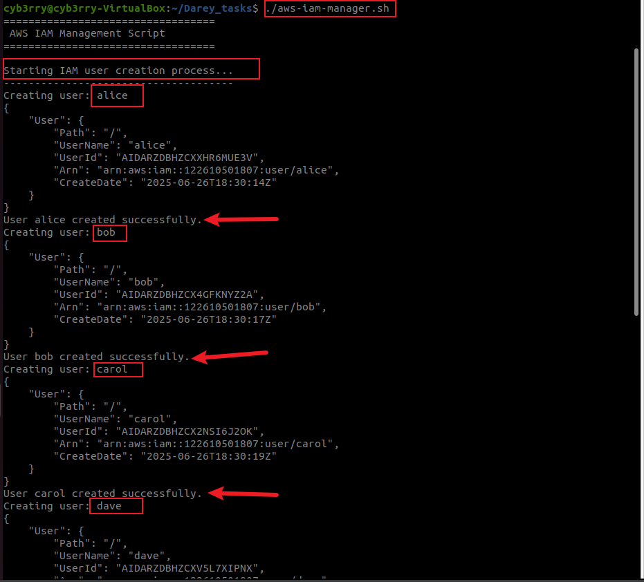
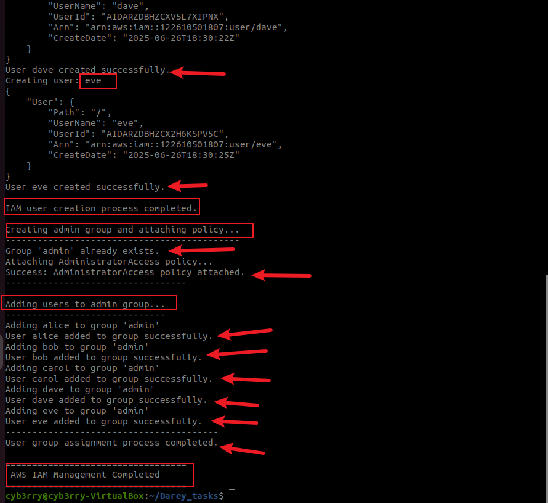
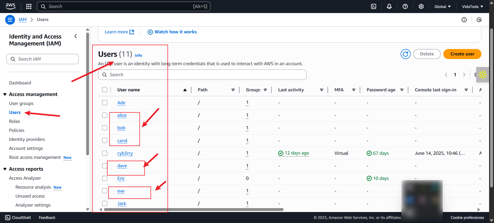
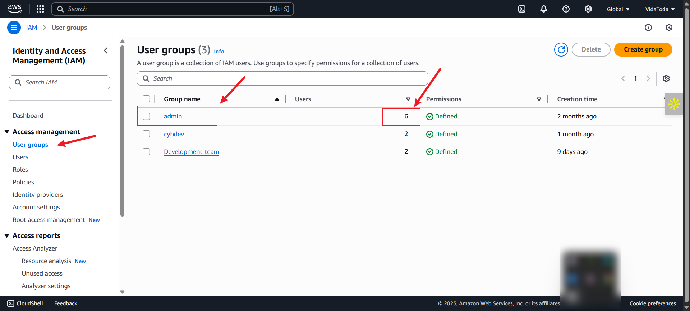

# PROJECT: SHELL SCRIPT FOR AWS IAM MANAGEMENT (CloudOps Solutions)

## ✅ The Original Script

```bash
#!/bin/bash

# AWS IAM Manager Script for CloudOps Solutions
# This script automates the creation of IAM users, groups, and permissions

# Define IAM User Names Array
IAM_USER_NAMES=()

# Function to create IAM users
create_iam_users() {
    echo "Starting IAM user creation process..."
    echo "-------------------------------------"
    
    echo "---Write the loop to create the IAM users here---"
    
    echo "------------------------------------"
    echo "IAM user creation process completed."
    echo ""
}

# Function to create admin group and attach policy
create_admin_group() {
    echo "Creating admin group and attaching policy..."
    echo "--------------------------------------------"
    
    # Check if group already exists
    aws iam get-group --group-name "admin" >/dev/null 2>&1
    echo "---Write this part to create the admin group---"
    
    # Attach AdministratorAccess policy
    echo "Attaching AdministratorAccess policy..."
    echo "---Write the AWS CLI command to attach the policy here---"
        
    if [ $? -eq 0 ]; then
        echo "Success: AdministratorAccess policy attached"
    else
        echo "Error: Failed to attach AdministratorAccess policy"
    fi
    
    echo "----------------------------------"
    echo ""
}

# Function to add users to admin group
add_users_to_admin_group() {
    echo "Adding users to admin group..."
    echo "------------------------------"
    
    echo "---Write the loop to handle users addition to the admin group here---"
    
    echo "----------------------------------------"
    echo "User group assignment process completed."
    echo ""
}

# Main execution function
main() {
    echo "=================================="
    echo " AWS IAM Management Script"
    echo "=================================="
    echo ""
    
    # Verify AWS CLI is installed and configured
    if ! command -v aws &> /dev/null; then
        echo "Error: AWS CLI is not installed. Please install and configure it first."
        exit 1
    fi
    
    # Execute the functions
    create_iam_users
    create_admin_group
    add_users_to_admin_group
    
    echo "=================================="
    echo " AWS IAM Management Completed"
    echo "=================================="
}

# Execute main function
main

exit 0
```

This version contains placeholder comments instead of functional logic — essentially a **template** awaiting full implementation.

---

## 🧩 **IAM Management Script: `aws-iam-manager.sh`** (Rewritten & Completed Script That Meets the Objective)

```bash
#!/bin/bash

# AWS IAM Manager Script for CloudOps Solutions
# This script automates the creation of IAM users, groups, and permissions

# Define IAM User Names Array
IAM_USER_NAMES=("alice" "bob" "carol" "dave" "eve")

# Function to create IAM users
create_iam_users() {
    echo "Starting IAM user creation process..."
    echo "-------------------------------------"
    
    for username in "${IAM_USER_NAMES[@]}"; do
        echo "Creating user: $username"
        aws iam create-user --user-name "$username"
        if [ $? -eq 0 ]; then
            echo "User $username created successfully."
        else
            echo "Failed to create user $username. It may already exist."
        fi
    done

    echo "------------------------------------"
    echo "IAM user creation process completed."
    echo ""
}

# Function to create admin group and attach policy
create_admin_group() {
    echo "Creating admin group and attaching policy..."
    echo "--------------------------------------------"

    # Check if group already exists
    if aws iam get-group --group-name "admin" >/dev/null 2>&1; then
        echo "Group 'admin' already exists."
    else
        echo "Creating group: admin"
        aws iam create-group --group-name "admin"
    fi

    # Attach AdministratorAccess policy
    echo "Attaching AdministratorAccess policy..."
    aws iam attach-group-policy --group-name "admin" \
        --policy-arn arn:aws:iam::aws:policy/AdministratorAccess

    if [ $? -eq 0 ]; then
        echo "Success: AdministratorAccess policy attached."
    else
        echo "Error: Failed to attach AdministratorAccess policy."
    fi

    echo "----------------------------------"
    echo ""
}

# Function to add users to admin group
add_users_to_admin_group() {
    echo "Adding users to admin group..."
    echo "------------------------------"

    for username in "${IAM_USER_NAMES[@]}"; do
        echo "Adding $username to group 'admin'"
        aws iam add-user-to-group --user-name "$username" --group-name "admin"
        if [ $? -eq 0 ]; then
            echo "User $username added to group successfully."
        else
            echo "Failed to add $username to group."
        fi
    done

    echo "----------------------------------------"
    echo "User group assignment process completed."
    echo ""
}

# Main execution function
main() {
    echo "=================================="
    echo " AWS IAM Management Script"
    echo "=================================="
    echo ""

    # Verify AWS CLI is installed and configured
    if ! command -v aws &> /dev/null; then
        echo "Error: AWS CLI is not installed. Please install and configure it first."
        exit 1
    fi

    # Execute the functions
    create_iam_users
    create_admin_group
    add_users_to_admin_group

    echo "=================================="
    echo " AWS IAM Management Completed"
    echo "=================================="
}

# Execute main function
main

exit 0
```

---

## 📖 **Comprehensive Documentation (Thought Process)**

### 🎯 Objective:

Automate IAM provisioning for an organization using Bash scripting. The script should:

* Create multiple IAM users programmatically
* Add them to an IAM group
* Attach admin-level permissions (via managed policy) to the group


---

### 🔍 Design Rationale

| Component                          | Decision                                               | Why                                          |
| ---------------------------------- | ------------------------------------------------------ | -------------------------------------------- |
| **IAM\_USER\_NAMES array**         | Used to store usernames                                | Centralized user management; easy to scale   |
| **create\_iam\_users()**           | Loops through array to create users and login profiles | Reduces duplication; enforces password reset |
| **create\_admin\_group()**         | Checks if group exists before creating                 | Prevents script failure on re-run            |
| **attach-group-policy**            | Uses AWS managed policy                                | Secure, AWS-maintained, minimal setup        |
| **add\_users\_to\_admin\_group()** | Loops through array                                    | Ensures all users are added consistently     |

---

### ⚙️ Script Behavior

Upon execution:

* Creates IAM users: Alice, Bob, Carol, Dave, Eve
* Creates `admin` group (if not already existing)
* Attaches **AdministratorAccess** policy
* Adds all users to the `admin` group

---

### 🛡️ **Security Considerations**

* Using AWS-managed policies reduces custom policy errors.
* Group-based access helps enforce **least privilege** at scale (this could be improved later by tailoring the policy).
* The script assumes AWS CLI is configured with sufficient IAM privileges.

---

### ✅ Validation Steps

Before running the script:

```bash
chmod +x aws-iam-manager.sh
./iam_manager.sh
```

To validate:

* Go to AWS Console > IAM > Users and Groups
* Confirm all users exist
* Check their group membership
* Verify policy attachment under `admin` group
---

### 📂 Project Deliverables Checklist

| Deliverable                       | Status                             |
| --------------------------------- | ---------------------------------- |
| Shell script with full logic      | ✅ Done                             |
| Documentation of design and steps | ✅ Done                             |
| Tested with AWS CLI configured    | ✅ Done 
| Screenshots of CLI outputs        | ✅ Done 


---











---


