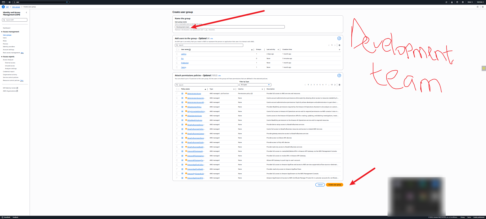
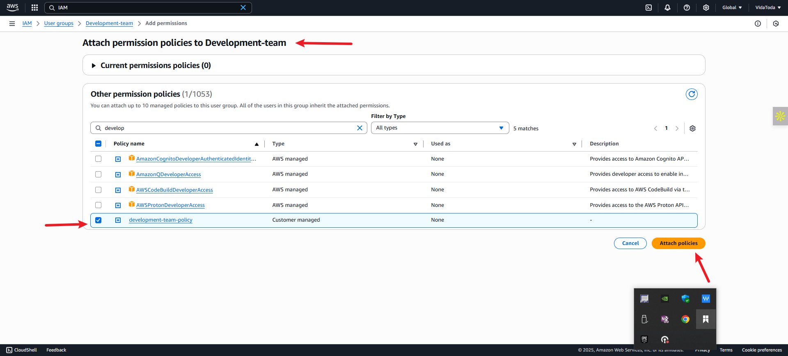

# ✅ **Project Title:**

**AWS Identity and Access Management (IAM) – Hands-on Mini Project for GatoGrowFast.com**

## 📌 **Project Summary**

This mini project focused on implementing secure access control within Amazon Web Services (AWS) using **Identity and Access Management (IAM)**. A fictional growth marketing company, **GatoGrowFast.com**, was used to simulate a real-world environment where access to cloud resources must be restricted based on user roles.

The project covered:

* Creation and attachment of IAM policies
* Setting up individual users and user groups
* Assigning permissions to users and groups
* Practical validation of access rights
* Following IAM best practices including least privilege and MFA

---

## 🛠️ **Walkthrough: IAM Setup for GatoGrowFast.com**

---

### 🔹 **Part 1: Creating User Eric with EC2 Access**

1. **Log in to the AWS Management Console**.
2. Search and navigate to **IAM** service.
3. On the IAM dashboard, go to **Policies > Create Policy**.
4. Choose the service: **EC2**.
5. Allow **All EC2 actions** and **All resources**.
6. Click **Next**, name the policy e.g., `policy_for_eric`, and create it.

📌 *Note: This is a customer-managed policy for EC2 access.*

7. Go to **IAM > Users > Add User**.
8. Username: `Eric`. Enable **Management Console access** and set a password.
9. Under permissions, **Attach policy directly**.
10. Filter by *customer-managed policies* and select `policy_for_eric`.
11. Create the user and download the credentials.

---

### 🔹 **Part 2: Creating Group + Users (Jack and Ade) with EC2 & S3 Access**

1. Navigate to **IAM > User Groups > Create Group**.
2. Group name: `development-team`.

---

#### 🧑‍💻 Add Users to Group:

* Create a user `Jack`, give console access, and **add him to the group** `development-team`.
* Repeat the same for user `Ade`.

---

#### 📜 Create EC2 + S3 Policy:

1. Go to **IAM > Policies > Create Policy**.
2. Select services: **EC2 and S3**.
3. Allow **All actions** on **All resources**.
4. Name it `development-policy` and create it.

---

#### 🔗 Attach Policy to Group:

1. Go to **IAM > User Groups > development-team**.
2. Navigate to **Permissions > Attach Policy**.
3. Choose **Customer-managed policy**: `development-policy`.
4. Attach it to the group.

✅ Users `Jack` and `Ade` now inherit full access to both EC2 and S3.

---

### 🧪 **Validation & Testing**

* **Eric** should be able to perform **EC2 actions only**, with no access to S3 or other services.
* **Jack** and **Ade** should have **full access to EC2 and S3**, but nothing beyond.
* This setup adheres to the **Principle of Least Privilege** and **role-based access control**.

---

## 🧠 **Project Reflection**

---

### 🔐 **Role of IAM in AWS**

IAM in AWS is a critical service that enables organizations to securely control access to their cloud resources. It determines *who* can access *what*, and *how* they can interact with services. IAM strengthens security, enforces compliance, and supports operational scalability by managing users, groups, roles, and policies systematically.

---

### 👤 **Difference Between IAM Users and Groups**

* **IAM Users** are individual identities with unique credentials. They represent people or applications interacting directly with AWS services.
* **IAM Groups** are collections of users. Permissions assigned to the group apply to all members, enabling scalable and consistent access management.

*Example:*

* Eric was added individually with a custom policy.
* Jack and Ade were added to a group (`development-team`) to inherit shared permissions via one policy.

---

### 📜 **Process of Creating IAM Policies**

Creating an IAM policy involves:

1. Selecting the services (e.g., EC2, S3)
2. Defining permitted actions (e.g., `All actions`)
3. Specifying applicable resources (e.g., `All`)
4. Naming and saving the policy

Policies can be:

* **AWS Managed:** Predefined by AWS.
* **Customer Managed:** Created by the user (used in this project).
* **Inline:** Embedded within a specific user or role.

We created two customer-managed policies: one for Eric (EC2) and another for Jack/Ade (EC2 + S3).

---

### 🛡️ **Significance of the Principle of Least Privilege**

The **Principle of Least Privilege** ensures users are granted only the permissions necessary for their role. This reduces potential misuse or exposure of sensitive data.

In this project:

* Eric only had access to EC2.
* Jack and Ade were given access to EC2 and S3—but nothing more.

This minimizes risks and aligns with AWS security best practices.

---

### 📊 **Reflect on the Scenario with Eric, Jack, and Ade**

* **Eric** was created as an individual IAM user with a dedicated EC2 policy.
* **Jack and Ade** were placed in a group (`development-team`) and granted access to EC2 and S3 through a shared group policy.

The configuration ensured:

* **Role-specific access**
* **Efficient policy management**
* **Scalable permission control**

By applying IAM concepts such as **users**, **groups**, **policies**, and **least privilege**, the setup demonstrated real-world best practices for cloud security management.

---

