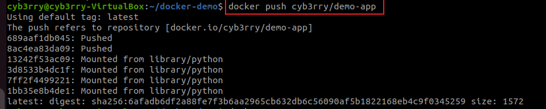

# 🐳 INTRODUCTION TO DOCKER

## 🐳 **What is Docker?**

Docker is a powerful **open-source platform** that enables developers and system administrators to **build, ship, and run applications in isolated environments called containers**. Containers are lightweight, portable units that bundle an application with all of its dependencies — including libraries, configuration files, and system tools — ensuring that it runs consistently across different computing environments.

Traditionally, developers faced challenges where an application that worked on one machine (e.g., the developer’s laptop) would fail in a production or testing environment due to configuration mismatches. Docker eliminates this problem by providing a **standardized containerized environment**, guaranteeing reliability and consistency from development through deployment.

Unlike virtual machines, which require a full guest operating system, Docker containers **share the host system's OS kernel**, making them significantly more efficient and faster to start. This resource efficiency allows multiple containers to run on a single machine without the heavy overhead of multiple OS instances.

---

## 🚀 **Key Features and Benefits of Docker**

* **Portability**: Docker containers run the same on any platform — whether it's a developer laptop, a staging server, or a production cloud instance.
* **Resource Efficiency**: Containers are lightweight, use less memory/CPU, and start quickly compared to VMs.
* **Isolation**: Each container runs in its own isolated environment, reducing conflicts and improving security.
* **Scalability**: Docker makes it easy to spin up multiple containers for load balancing and horizontal scaling.
* **Consistency**: Applications packaged in containers behave the same across all environments, removing the "it works on my machine" issue.
* **Speed**: Developers can build and deploy applications rapidly, accelerating DevOps workflows.

---

## 🧠 **Why Docker Matters in Modern Development**

Docker has transformed how teams build and deploy software in the cloud era. It promotes DevOps practices, enables **microservices architecture**, and integrates easily with continuous integration/continuous deployment (CI/CD) pipelines.

For developers, Docker simplifies testing and versioning. For operations teams, it improves resource utilization and environment stability. For organizations, it reduces time-to-market and improves the reliability of software releases.

---

Perfect! Here’s a **full professional walkthrough** starting from Docker installation, all the way through to pushing and deleting an image — seamlessly combining the extracted steps from your document and the recent tasks you performed (like login, push, and image cleanup).

---

## 🛠️ **Docker Walkthrough: Installation to Image Management**

This walkthrough guides you through the practical steps of working with Docker — from installation on Ubuntu, running your first container, to creating, pushing, and deleting a custom image on Docker Hub. It assumes you're using **Ubuntu 20.04 LTS**.

---

### 📦 **1. Installing Docker on Ubuntu 20.04**

**Step 1: Update system packages**

```bash
sudo apt-get update
```


**Step 2: Install required dependencies**

```bash
sudo apt-get install ca-certificates curl gnupg
```

**Step 3: Create a directory for Docker’s GPG key**

```bash
sudo install -m 0755 -d /etc/apt/keyrings
```


**Step 4: Add Docker’s official GPG key**

```bash
curl -fsSL https://download.docker.com/linux/ubuntu/gpg | sudo gpg --dearmor -o /etc/apt/keyrings/docker.gpg
sudo chmod a+r /etc/apt/keyrings/docker.gpg
```

**Step 5: Add the Docker repository**

```bash
echo \
  "deb [arch=$(dpkg --print-architecture) signed-by=/etc/apt/keyrings/docker.gpg] https://download.docker.com/linux/ubuntu \
  $(. /etc/os-release && echo "$VERSION_CODENAME") stable" | \
  sudo tee /etc/apt/sources.list.d/docker.list > /dev/null
```

**Step 6: Update apt and install Docker**

```bash
sudo apt-get update
sudo apt-get install docker-ce docker-ce-cli containerd.io docker-buildx-plugin docker-compose-plugin
```


**Step 7: Verify Docker status**

```bash
sudo systemctl status docker
```


**Step 8: Allow your user to run Docker without `sudo`**

```bash
sudo usermod -aG docker $USER
```


> After this, **log out and log back in** for the group change to take effect.

---

### 🐳 **2. Running the “Hello World” Container**

This is the easiest way to verify Docker is working:

```bash
docker run hello-world
```

What it does:

* Pulls the `hello-world` image from Docker Hub.
* Creates a container and runs it.
* Prints a confirmation message.

> Note: This container exits immediately after printing — it doesn’t stay running.

---

### 🔧 **3. Common Docker Commands**

**List running containers**

```bash
docker ps
```

**List all containers (including stopped)**

```bash
docker ps -a
```


**Stop a running container**

```bash
docker stop <CONTAINER_ID>
```


**Remove a stopped container**

```bash
docker rm <CONTAINER_ID>
```

**List available images**

```bash
docker images
```


**Remove a Docker image**

```bash
docker rmi <IMAGE_ID>
```


> If the image is still tied to a stopped container, remove the container first.

**Clean up all stopped containers**

```bash
docker container prune
```

---

### 🔐 **4. Logging into Docker Hub**

If you haven’t yet:

1. Create an account at [https://hub.docker.com/signup](https://hub.docker.com/signup)


2. Log in via terminal:

   ```bash
   docker login
   ```


You’ll be prompted for your Docker Hub username and password (or access token if 2FA is enabled).

---

### 🧪 **5. Creating a Demo Docker Image**

#### Step 1: Create project folder

```bash
mkdir docker-demo && cd docker-demo
```

#### Step 2: Create a simple web server script

```bash
echo "from http.server import SimpleHTTPRequestHandler, HTTPServer

print('Starting server on port 8000...')
HTTPServer(('', 8000), SimpleHTTPRequestHandler).serve_forever()" > app.py
```

#### Step 3: Create a Dockerfile

```bash
echo "FROM python:3.9-slim

WORKDIR /app

COPY app.py .

CMD [\"python\", \"app.py\"]" > Dockerfile
```


---

### 📦 **6. Build the Docker Image**

Tag the image with your Docker Hub username:

```bash
docker build -t your-dockerhub-username/demo-app .
```


---

### 🚀 **7. Push Image to Docker Hub**

Make sure you're logged in, then:

```bash
docker push your-dockerhub-username/demo-app
```



You should see the image appear in your [Docker Hub repositories](https://hub.docker.com/repositories).


---

### 🧼 **8. Delete Images and Containers**

If you need to delete an image but it’s in use:

**Find the container using it:**

```bash
docker ps -a
```

**Remove the container:**

```bash
docker rm <container_id>
```

**Then delete the image:**

```bash
docker rmi <image_id>
```


> If you get:
> `conflict: unable to delete... image is being used by stopped container`
> That means a stopped container is still linked to it — remove the container first.

You can also clean unused resources:

```bash
docker image prune
docker container prune
```

#### **📦 Basic Docker Commands**

| Task                           | Command                                             |
| ------------------------------ | --------------------------------------------------- |
| **List running containers**    | `docker ps`                                         |
| **List all containers**        | `docker ps -a`                                      |
| **Stop a container**           | `docker stop <CONTAINER_ID>`                        |
| **Pull image from Docker Hub** | `docker pull ubuntu`                                |
| **Push image to Docker Hub**   | `docker push <username>/image-name` *(after login)* |
| **List all images**            | `docker images`                                     |
| **Remove image**               | `docker rmi <IMAGE_ID>`                             |

---

### 🎯 **Project Goals Recap**

By the end of the guide, learners should:

* Understand containers and Docker's role in modern development.
* Be able to install and run Docker on Ubuntu.
* Use core Docker commands confidently.
* Appreciate the performance and deployment advantages over VMs.

---

