# INTRODUCTION TO JENKINS

# 📘 Jenkins CI/CD Setup and Walkthrough on Amazon Linux 2023

## 🧩 **Introduction to CI/CD**

**Continuous Integration (CI)** is the practice of merging all developer working copies to a shared repository several times a day, with automated testing and builds.
**Continuous Delivery (CD)** extends this by automating the release process, so deployments can happen on demand with minimal manual intervention.

Together, CI/CD fosters faster, more reliable, and more automated software development workflows.

## ⚙️ **What is Jenkins?**

[Jenkins](https://www.jenkins.io) is an open-source automation server widely used to implement CI/CD workflows. It supports:

* Automatic building, testing, and deployment of applications
* Integration with Git and other version control systems
* Extensible pipelines defined as code
* A large ecosystem of plugins

## 🛠️ Project Goals

By the end of this project, learners will:

* Understand CI/CD principles
* Master Jenkins installation and configuration
* Automate builds, tests, and deployments
* Apply best practices like parameterized builds, external integrations, and Docker usage

# 🚀 Jenkins Setup Walkthrough (Amazon Linux 2023)

### 🧱 1. Install Java

Before that, update the EC2 instance:

```bash
sudo yum update
```


Jenkins requires Java 11 or 17. For Amazon Linux 2023:

```bash
sudo dnf install java-17-amazon-corretto -y
```

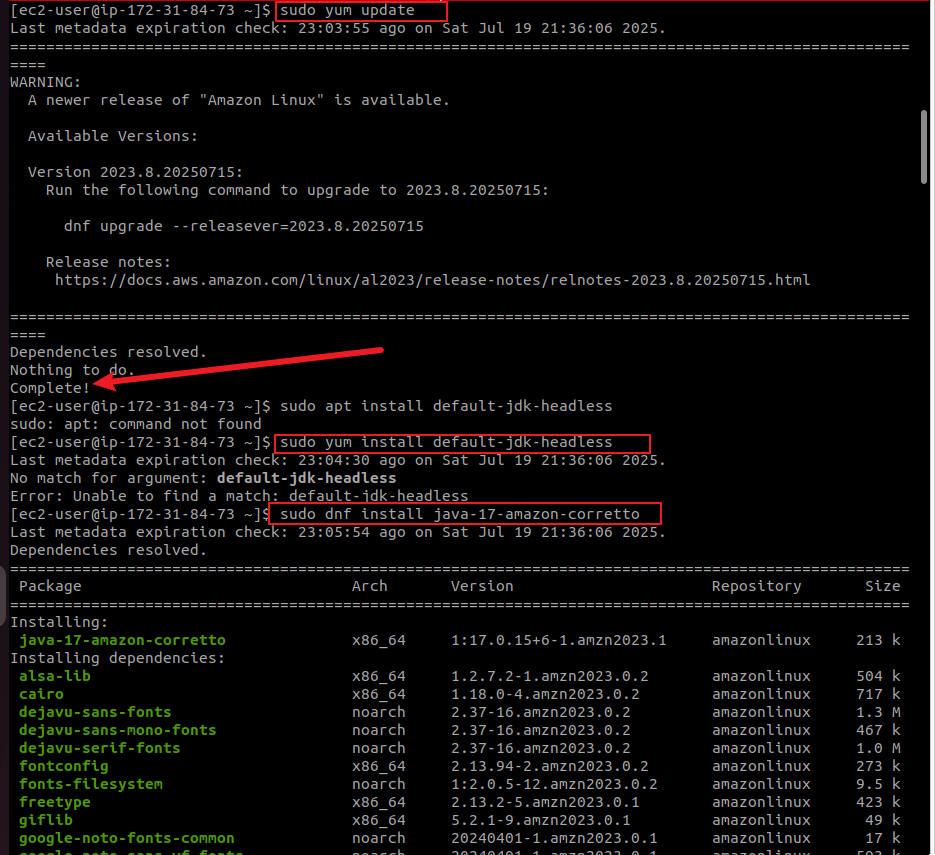

Verify:

```bash
java -version
```

Expected output:

```
openjdk version "17.0.15" ...
```

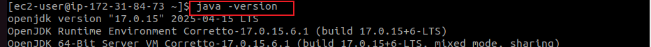

### 📦 2. Install Jenkins

#### a. Add the Jenkins repo and key

```bash
sudo curl --silent --location https://pkg.jenkins.io/redhat-stable/jenkins.repo -o /etc/yum.repos.d/jenkins.repo
sudo rpm --import https://pkg.jenkins.io/redhat-stable/jenkins.io-2023.key
```

#### b. Install Jenkins

```bash
sudo dnf install jenkins -y
```

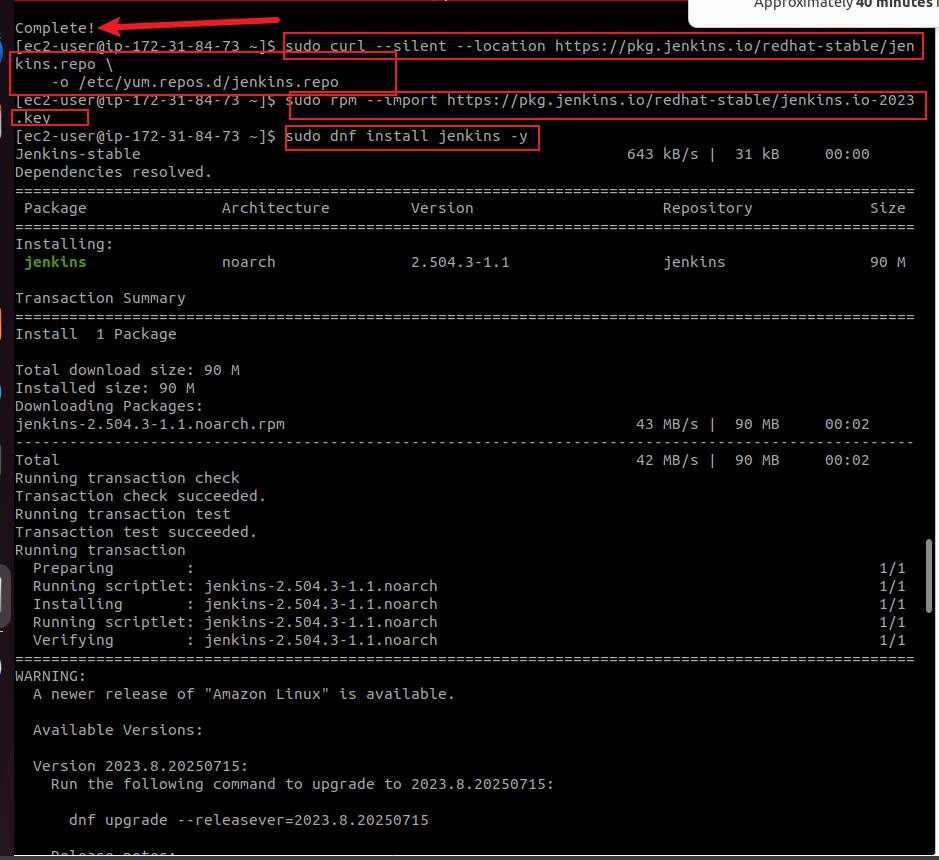

### 🔁 3. Configure Jenkins to Avoid Port Conflicts

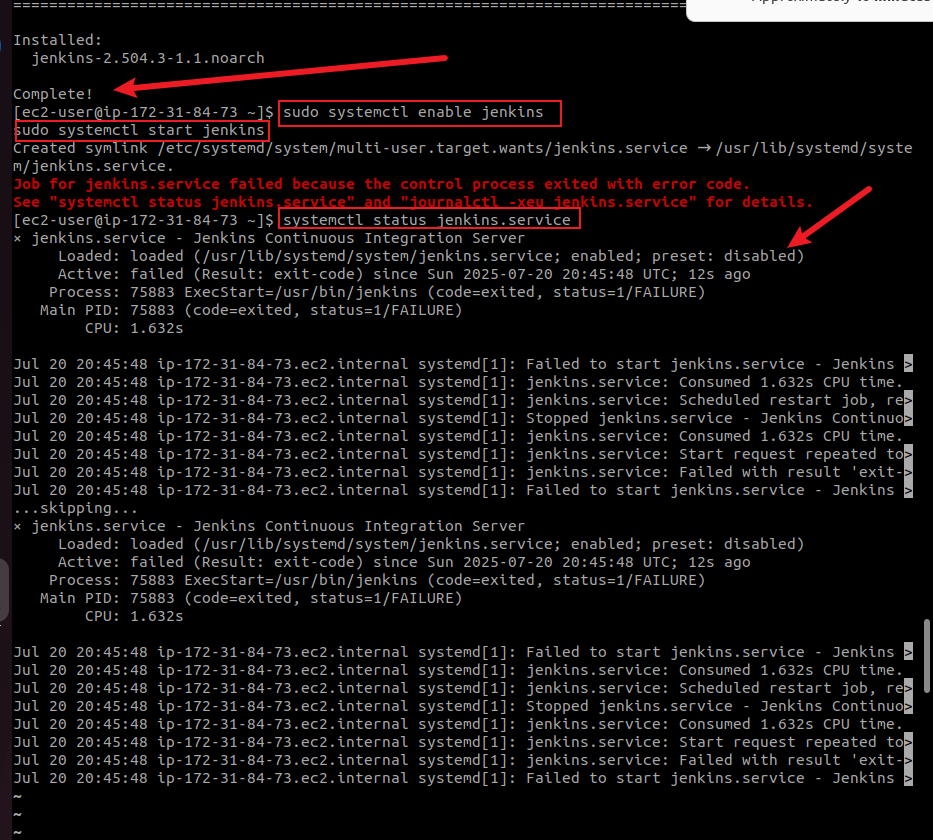

If a sevice/process (in this case, docker is using the port) is using port 8080, the above error will be encountered. Do the following:

If `docker` or another process is using port 8080:

```bash
sudo lsof -i :8080
```

Change Jenkins port to 8090:

```bash
sudo mkdir -p /etc/systemd/system/jenkins.service.d
sudo vi /etc/systemd/system/jenkins.service.d/override.conf
```

Add:

```ini
[Service]
Environment="JENKINS_PORT=8090"
```

Apply and restart:

```bash
sudo systemctl daemon-reexec
sudo systemctl daemon-reload
sudo systemctl enable jenkins
sudo systemctl restart jenkins
```

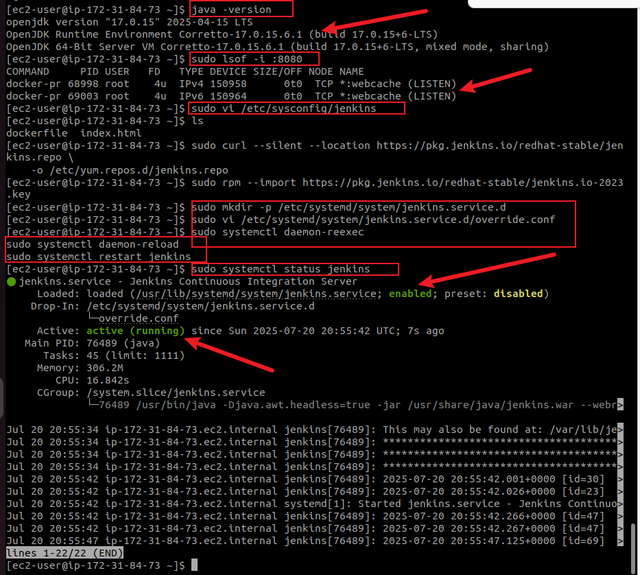

### 🔧 4. Open EC2 Inbound Port

In EC2:

* Go to **Security Groups** → **Inbound rules**
* Add:

  * **Type**: Custom TCP
  * **Port**: `8090`
  * **Source**: `0.0.0.0/0` (or more secure source)

## Check this on how to edit inbound rules for your instance: [Working_with_docker_images](https://github.com/Kzian/Darey-Projects-3mtt/blob/main/Working_with_docker_imgs/README.md)

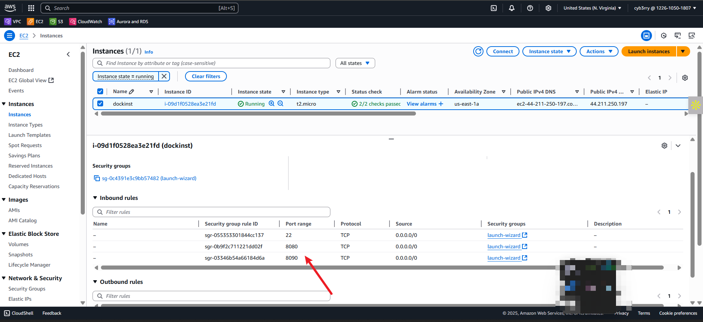

### 🌐 5. Access Jenkins in Browser

1. Go to: `http://<your-ec2-public-ip>:8090`
2. Unlock Jenkins:

   ```bash
   sudo cat /var/lib/jenkins/secrets/initialAdminPassword
   ```
3. Follow setup wizard:

   * Install suggested plugins
   * **(Important)** Create a user account

     * If missed, you can create one later from the **Manage Jenkins > Manage Users** panel
     * Or via Groovy script override (as shown previously)


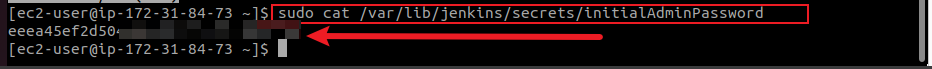

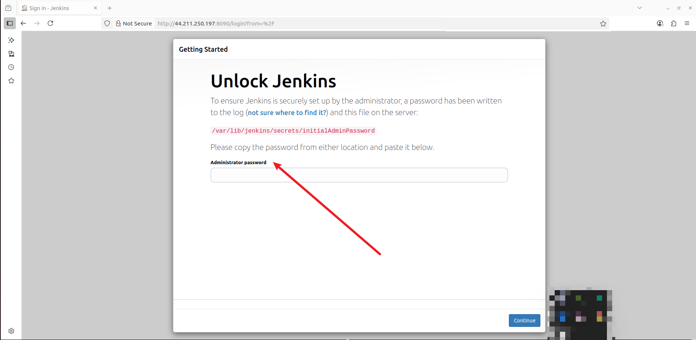

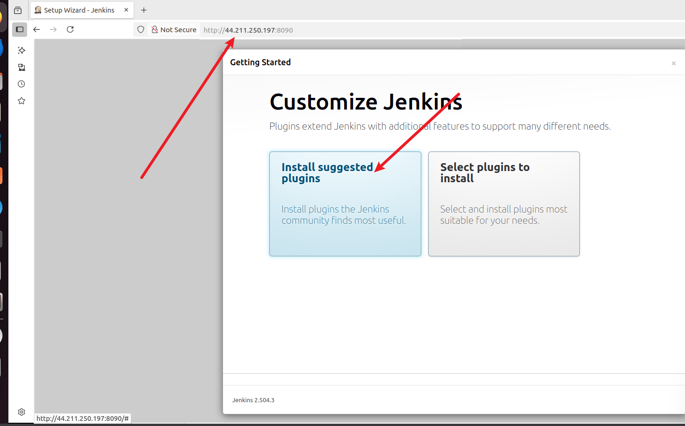

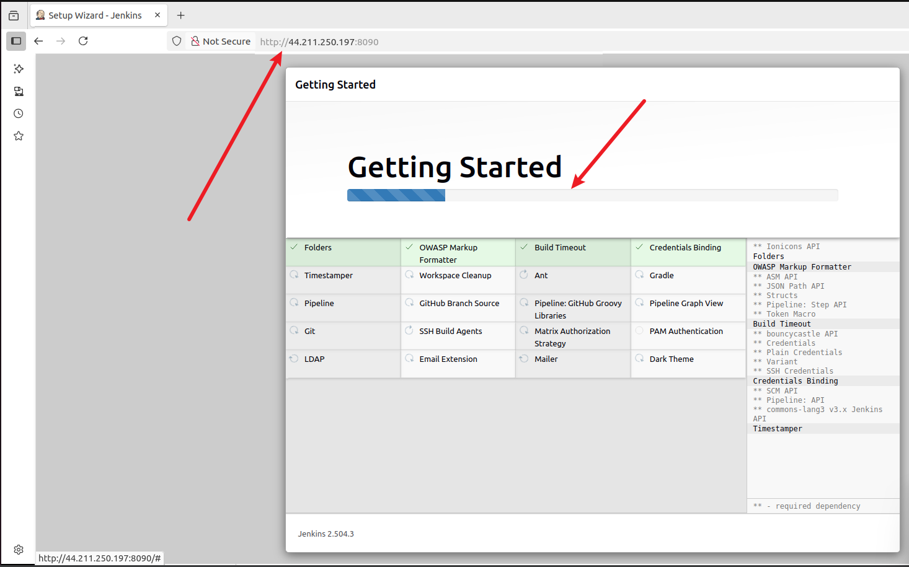

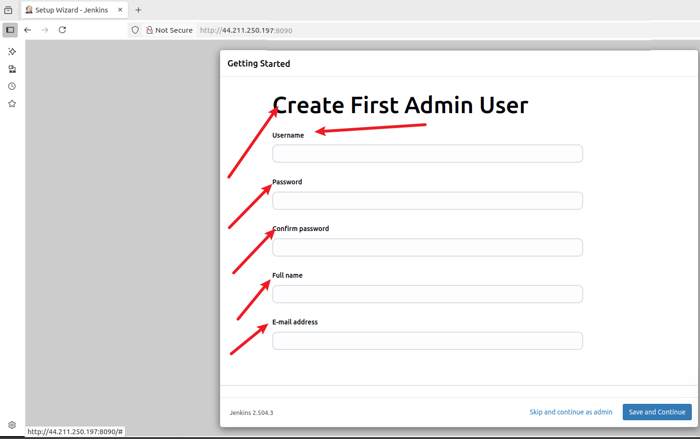

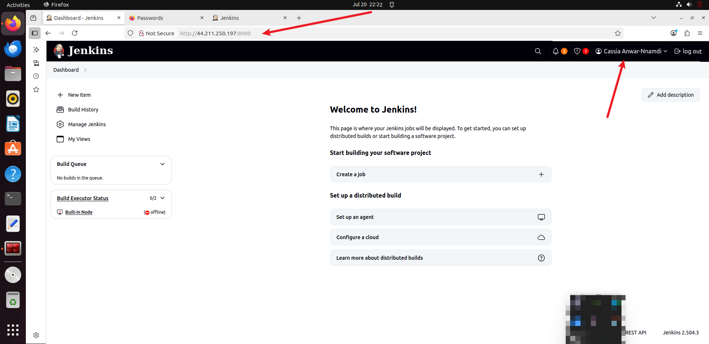

## 🔑 Managing Jenkins Users (Missed Account Creation)

If you missed creating a user during setup, do the following:

### Use UI

* Log in using the initial admin password
* Go to: **Manage Jenkins > Manage Users > Create User**


Then restart Jenkins.

## 🏁 Conclusion

This hands-on Jenkins setup covered:

* Installing Java and Jenkins on Amazon Linux 2023
* Solving port conflicts with Docker
* Launching Jenkins via systemd with a custom port
* Accessing Jenkins in the browser
* Handling user account creation