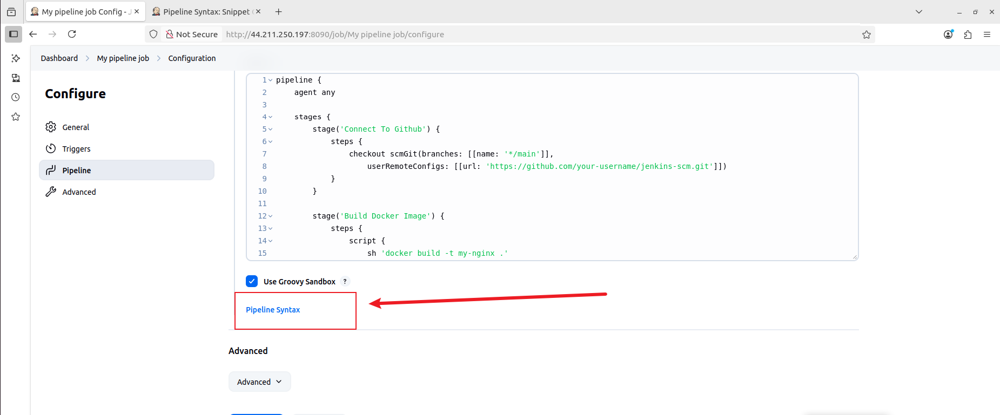
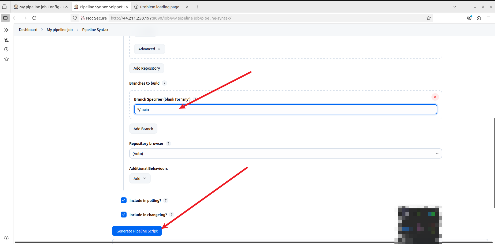

# ✅ Final Jenkins CI/CD Project Summary (Freestyle + Pipeline on Amazon Linux 2023)

## 📌 Overview

This project covers setting up **Jenkins CI/CD** from scratch on an **Amazon EC2 (Amazon Linux 2023)** instance, integrating it with GitHub, and automating build and deployment workflows using both **freestyle** and **pipeline jobs**. Docker was used to containerize the build output, and GitHub webhooks were configured for automated triggers.

---

## 🏗️ Phase 1: Jenkins Installation & Setup

### ✅ What was done:

* Installed Java 17 using Amazon Corretto
* Installed Jenkins via DNF and configured it to run on port `8090`
* Started and enabled Jenkins as a systemd service
* Configured EC2 security group to allow inbound HTTP access on ports `8090` (Jenkins) and `8080` (Docker app)
* Accessed Jenkins UI, installed plugins, and created an admin account

### 🧠 Errors & Fixes:

| Error                                                  | Solution                                                                                    |
| ------------------------------------------------------ | ------------------------------------------------------------------------------------------- |
| Jenkins service failed to start (port conflict)        | Docker was using port 8080 → changed Jenkins to port 8090 via systemd override              |
| Skipped admin account creation                         | Created admin using Groovy script in `/var/lib/jenkins/init.groovy.d/`                      |
| Jenkins stuck on “Waiting for next available executor” | Node was offline; brought it online and verified executor count                             |
| Disk space warning on `/tmp`                           | Jenkins saw less than 1 GiB free on tmpfs; configured `JAVA_OPTS=-Djava.io.tmpdir=/var/tmp` |

---

## 🛠️ Phase 2: Jenkins Freestyle Project Walkthrough

### 🔧 Steps:

1. **Create a GitHub repository**: `jenkins-scm`
2. **Create a freestyle job** in Jenkins named `my-first-job`
3. **Configure SCM**:

   * SCM: Git
   * URL: `https://github.com/your-username/jenkins-scm.git`
   * Branch: `main`
4. **Add Build Trigger**:

   * Checked: **GitHub hook trigger for GITScm polling**
5. **Push a change to GitHub (e.g., edit README.md)**
6. **GitHub Webhook**:

   * Configured on GitHub: `http://<jenkins-ip>:8090/github-webhook/`
7. **Jenkins auto-runs build** upon push (triggered via webhook)

✅ Confirmed the build ran with “Started by GitHub push by `username`”.

## Check out the following:

### [1-Introduction-to-Jenkins](https://github.com/Kzian/Darey-Projects-3mtt/blob/main/IntrotoJenkins/README.md)

### [2-Jenkins-freestyle-project](https://github.com/Kzian/Darey-Projects-3mtt/blob/main/Jenkins_freestyle_project/README.md)

---

## 🧪 Phase 3: Jenkins Pipeline Project (with Docker)

### 📦 What is a Pipeline Job?

A **pipeline job** defines the build/test/deploy stages using code (Jenkinsfile or inline). It's more powerful and reproducible than freestyle jobs.

### 🛠️ Pipeline Walkthrough

#### 1. **Create the Job**

* From dashboard → **New Item**
* Name: `my-pipeline-job`
* Type: **Pipeline**


#### 2. **Configure Build Trigger**

* Enable: **GitHub hook trigger for GITScm polling**
* Webhook from freestyle job is reused — no need to create a new one


#### 3. **Install Docker on EC2**

Updated version for **Amazon Linux 2023** (your previous script was Ubuntu-specific):

If you dont already have docker installed, copy the script below and put in a file `docker.sh`

```bash
#!/bin/bash
sudo dnf install docker -y
sudo systemctl enable --now docker
sudo usermod -aG docker jenkins
sudo systemctl restart jenkins
```

Run:

```bash
chmod +x docker.sh
./docker.sh
```

---

### 4. **Create `Dockerfile` and `index.html` in GitHub repo**

**Dockerfile**:

```dockerfile
FROM nginx:latest
WORKDIR /usr/share/nginx/html/
COPY index.html /usr/share/nginx/html/
EXPOSE 80
```

**index.html**:

```html
Congratulations, You have successfully run your first pipeline code.
```

Commit both files to `main` branch of `jenkins-scm`.

Or better still create the files in the EC2 instance and push to github

---

### 5. **Pipeline Script (Declarative)**

Paste into **pipeline script section** in Jenkins job:

```groovy
pipeline {
    agent any

    stages {
        stage('Connect To Github') {
            steps {
                checkout scmGit(branches: [[name: '*/main']],
                    userRemoteConfigs: [[url: 'https://github.com/your-username/jenkins-scm.git']])
            }
        }

        stage('Build Docker Image') {
            steps {
                script {
                    sh 'docker build -t my-nginx .'
                }
            }
        }

        stage('Run Docker Container') {
            steps {
                script {
                    sh 'docker run -itd --name nginx-app -p 8081:80 my-nginx'
                }
            }
        }
    }
}
```


### 🔁 6. Generate the GitHub Checkout Syntax

To dynamically generate the correct `checkout` script for your GitHub repo:

#### i. Scroll down to the **Pipeline** section in the job config

#### ii. Click **Pipeline Syntax** (a link below the script box)

> This opens the **Pipeline Syntax Generator tool**



#### iii. In the generator:

* From **Sample Step** dropdown: select
  `checkout: General SCM`

* For SCM: choose `Git`

* Fill in the following:

  * **Repository URL**:
    `https://github.com/your-username/jenkins-scm.git`
  * **Branches to build**:
    `*/main`
  * Leave others as default for now

#### iv. Click **Generate Pipeline Script**

You’ll get something like:

```groovy
checkout([$class: 'GitSCM',
  branches: [[name: '*/main']],
  userRemoteConfigs: [[url: 'https://github.com/your-username/jenkins-scm.git']]
])
```





---

### 🧾 7. Paste the Script into Jenkins Pipeline

Now go back to the pipeline script text box and paste the full script:

```groovy
pipeline {
    agent any

    stages {
        stage('Connect To Github') {
            steps {
                checkout([$class: 'GitSCM',
                  branches: [[name: '*/main']],
                  userRemoteConfigs: [[url: 'https://github.com/your-username/jenkins-scm.git']]
                ])
            }
        }

        stage('Build Docker Image') {
            steps {
                script {
                    sh 'docker build -t my-nginx .'
                }
            }
        }

        stage('Run Docker Container') {
            steps {
                script {
                    sh 'docker run -itd --name nginx-app -p 8081:80 my-nginx'
                }
            }
        }
    }
}
```

✅ Check **"Use Groovy Sandbox"**

Click **Save**.

---


### 8. **Open Port 8081 in EC2 Security Group**

This allows access to the NGINX container Jenkins launched.


---

### 9 **Trigger the Pipeline**

1. Push a change to the GitHub repo (e.g., update index.html)
2. GitHub fires the webhook
3. Jenkins job `my-pipeline-job` runs
4. Docker container runs on port 8081


---


### ✅ Final Test: Access Web Page

Visit:

```
http://<jenkins-ec2-ip>:8081
```

You should see:

> Congratulations, You have successfully run your first pipeline code.


## 🐞 Errors Encountered & Fixes

| Error | Solution |
|-------|----------|
| `default-jdk-headless` not found | Installed Amazon Corretto 17 instead |
| Jenkins stuck in queue | Ensured node is online and disk space sufficient |
| Port 8080 already in use | Changed Jenkins port to 8090 |
| Docker run container conflict | Added `docker rm -f nginx-app || true` to pipeline |
| Git push auth failed | Used **GitHub PAT** instead of password |
| Jenkins didn’t trigger | Set up GitHub webhook and verified it triggered builds |

---

## ✅ Key Lessons Learned

| Lesson                       | Description                                                            |
| ---------------------------- | ---------------------------------------------------------------------- |
| Jenkins on Amazon Linux 2023 | Requires systemd configuration and minor setup differences from Ubuntu |
| Jenkins + GitHub             | Use webhooks and credential configuration for full automation          |
| Declarative Pipelines        | Offer maintainable, version-controlled CI/CD pipelines                 |
| Docker + Jenkins             | Docker must be installed and accessible by Jenkins user                |
| Debugging Builds             | Always check console logs, system logs, and executor status for clues  |

- Jenkins on Amazon Linux requires RPM-based setup
- Always check for port conflicts and container reuse
- GitHub removed password auth — use PAT or SSH
- Automating cleanup in pipeline prevents container name conflicts
- Jenkins webhooks can trigger builds reliably with the right setup

---

## 🏁 Final Outcome

A **CI/CD pipeline** that:

* Builds from GitHub
* Triggers automatically on code push
* Builds and runs a Docker container
* Serves web content on a custom port

---
