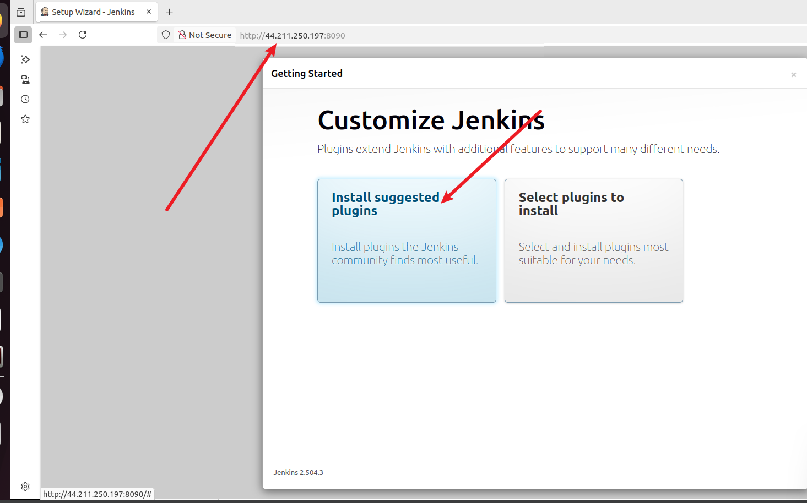

# INTRODUCTION TO JENKINS

# 📘 Jenkins CI/CD Setup and Walkthrough on Amazon Linux 2023

## 🧩 **Introduction to CI/CD**

**Continuous Integration (CI)** is the practice of merging all developer working copies to a shared repository several times a day, with automated testing and builds.
**Continuous Delivery (CD)** extends this by automating the release process, so deployments can happen on demand with minimal manual intervention.

Together, CI/CD fosters faster, more reliable, and more automated software development workflows.

## ⚙️ **What is Jenkins?**

[Jenkins](https://www.jenkins.io) is an open-source automation server widely used to implement CI/CD workflows. It supports:

* Automatic building, testing, and deployment of applications
* Integration with Git and other version control systems
* Extensible pipelines defined as code
* A large ecosystem of plugins

## 🛠️ Project Goals

By the end of this project, learners will:

* Understand CI/CD principles
* Master Jenkins installation and configuration
* Automate builds, tests, and deployments
* Apply best practices like parameterized builds, external integrations, and Docker usage

# 🚀 Jenkins Setup Walkthrough (Amazon Linux 2023)

### 🧱 1. Install Java

Before that, update the EC2 instance:

```bash
sudo yum update
```


Jenkins requires Java 11 or 17. For Amazon Linux 2023:

```bash
sudo dnf install java-17-amazon-corretto -y
```


Verify:

```bash
java -version
```

Expected output:

```
openjdk version "17.0.15" ...
```


### 📦 2. Install Jenkins

#### a. Add the Jenkins repo and key

```bash
sudo curl --silent --location https://pkg.jenkins.io/redhat-stable/jenkins.repo -o /etc/yum.repos.d/jenkins.repo
sudo rpm --import https://pkg.jenkins.io/redhat-stable/jenkins.io-2023.key
```

#### b. Install Jenkins

```bash
sudo dnf install jenkins -y
```


### 🔁 3. Configure Jenkins to Avoid Port Conflicts


If a sevice/process (in this case, docker is using the port) is using port 8080, the above error will be encountered. Do the following:

If `docker` or another process is using port 8080:

```bash
sudo lsof -i :8080
```

Change Jenkins port to 8090:

```bash
sudo mkdir -p /etc/systemd/system/jenkins.service.d
sudo vi /etc/systemd/system/jenkins.service.d/override.conf
```

Add:

```ini
[Service]
Environment="JENKINS_PORT=8090"
```

Apply and restart:

```bash
sudo systemctl daemon-reexec
sudo systemctl daemon-reload
sudo systemctl enable jenkins
sudo systemctl restart jenkins
```


### 🔧 4. Open EC2 Inbound Port

In EC2:

* Go to **Security Groups** → **Inbound rules**
* Add:

  * **Type**: Custom TCP
  * **Port**: `8090`
  * **Source**: `0.0.0.0/0` (or more secure source)

## Check this on how to edit inbound rules for your instance: [Working_with_docker_images](https://github.com/Kzian/Darey-Projects-3mtt/blob/main/Working_with_docker_imgs/README.md)


### 🌐 5. Access Jenkins in Browser

1. Go to: `http://<your-ec2-public-ip>:8090`
2. Unlock Jenkins:

   ```bash
   sudo cat /var/lib/jenkins/secrets/initialAdminPassword
   ```
3. Follow setup wizard:

   * Install suggested plugins
   * **(Important)** Create a user account

     * If missed, you can create one later from the **Manage Jenkins > Manage Users** panel
     * Or via Groovy script override (as shown previously)





## 🔑 Managing Jenkins Users (Missed Account Creation)

If you missed creating a user during setup, do the following:

### Use UI

* Log in using the initial admin password
* Go to: **Manage Jenkins > Manage Users > Create User**


Then restart Jenkins.

# 📦 Jenkins Freestyle Project – Build Automation

### What is a Freestyle Project?

A Jenkins **freestyle project** is a basic job type to automate tasks like:

* Compiling code
* Running tests
* Packaging apps
* Deploying builds

## 🏗️ Walkthrough: Creating a Freestyle Job

### 1. From the Jenkins Dashboard

* Click **New Item**
* Name it: `my-first-job`
* Choose **Freestyle project**
* Click **OK**


### 2. Connect to GitHub

Create a GitHub repo `jenkins-scm` with a `README.md`.


Then in Jenkins:

* Go to **Configure** the project
* Under **Source Code Management**, select **Git**
* Enter repo URL:
  `https://github.com/your-username/jenkins-scm.git`
* Set branch to `main`


### 3. Build Now

Click **Build Now** to verify the job runs.


---

## 🔔 Configure Build Trigger with Webhook

### Automate builds on GitHub changes

#### i. In Jenkins:

* Go to **Configure > Build Triggers**
* Select: **GitHub hook trigger for GITScm polling**
* Save


#### ii. On GitHub:

* Go to **Settings > Webhooks** for the repo
* Add a webhook:

  * Payload URL: `http://<your-EC2-public-ip>:8090/github-webhook/`
  * Content type: `application/json`


Now, any GitHub push will auto-trigger a Jenkins build.

Test by editing and committing `README.md`.


---

## ❗ Errors Encountered and Solutions Applied

### ⚠️ **1. Jenkins failed to start**

**Error:**

```
Job for jenkins.service failed because the control process exited with error code.
```

**Cause:** Port 8080 was already in use by Docker.

**Solution:**

* Created a systemd override to change Jenkins port to `8090`
* Restarted Jenkins using:

  ```bash
  sudo systemctl daemon-reload
  sudo systemctl restart jenkins
  ```

---

### ⚠️ **2. Skipped user creation during setup wizard**

**Problem:** Couldn’t create a new admin account after initial setup.

**Solution:**

* Created an admin user using a Groovy script placed in `/var/lib/jenkins/init.groovy.d/`
* Restarted Jenkins to apply

---

### ⚠️ **3. GitHub repository not accessible**

**Error:**

```
Failed to connect to repository: Error performing git command...
```

**Cause:** Missing Git or credentials for private repo

**Solution:**

* Installed Git via `sudo dnf install git -y`
* Added GitHub Personal Access Token in Jenkins credentials
* Reconfigured job to use proper credentials

---

### ⚠️ **4. Job stuck in “pending”**

**Symptom:** Jenkins job stayed in queue, showing:

```
Waiting for next available executor
```

**Causes and Fixes:**

* Built-in node was initially offline → marked it online
* Executors were misconfigured → set to 2
* Jenkins was blocked due to failed health check for `/tmp` space

---

### ⚠️ **5. Jenkins disk space warning**

**Error:**

```
Disk space is below threshold of 1.00 GiB. Only 470.20 MiB left on /tmp.
```

**Cause:** `/tmp` was a RAM-based `tmpfs` limited to \~475MB

**Solution:**

* Configured Jenkins to use `/var/tmp` by overriding `JAVA_OPTS` in systemd:

  ```ini
  Environment="JAVA_OPTS=-Djava.io.tmpdir=/var/tmp"
  ```
* Restarted Jenkins

### ✅ Core Tasks Accomplished

| Task                                             | Outcome                          |
| ------------------------------------------------ | -------------------------------- |
| Installed Java 17 (Amazon Corretto)              | ✅                                |
| Installed Jenkins on Amazon Linux 2023 using DNF | ✅                                |
| Resolved port conflict (Docker using port 8080)  | ✅ Changed Jenkins to port `8090` |
| Configured Jenkins as a systemd service          | ✅                                |
| Enabled Jenkins to start on boot                 | ✅                                |
| Created and configured Jenkins Freestyle Job     | ✅                                |
| Connected Jenkins to GitHub via SCM              | ✅                                |
| Configured webhook for automatic build triggers  | ✅                                |
| Successfully triggered builds via GitHub push    | ✅                                |

---

## 🔁 Final Verification

After fixing all issues:

* Jenkins builds were triggered **automatically** by GitHub push via webhook
* Console output showed the build history and success logs
* Job was running on the correct branch (`main`)
* Build executor status confirmed jobs were being assigned and completed

---

## 📚 Lessons Learned

| Lesson                       | Description                                                                      |
| ---------------------------- | -------------------------------------------------------------------------------- |
| Jenkins on Amazon Linux 2023 | Requires systemd-based configuration instead of legacy `/etc/sysconfig/jenkins`  |
| Troubleshooting Builds       | Logs (`systemctl status`, `journalctl`, `executor status`) are your best friends |
| Port Conflicts               | Always check for active ports before binding services                            |
| Webhooks + SCM               | Must align Jenkins config, GitHub settings, and credentials                      |
| Disk Space Checks            | Jenkins monitors not just root `/`, but `/tmp` and workspace health              |
| Node & Executor Management   | Jobs won't run if the node is offline or executors are unavailable               |

---

## 🏁 Project Outcomes

By completing this walkthrough, you’ve:

✅ Installed Jenkins on Amazon Linux 2023
✅ Fixed real-world issues like port conflicts
✅ Secured Jenkins with a user account
✅ Created and ran a freestyle job
✅ Connected Jenkins to GitHub
✅ Triggered builds with GitHub webhooks


