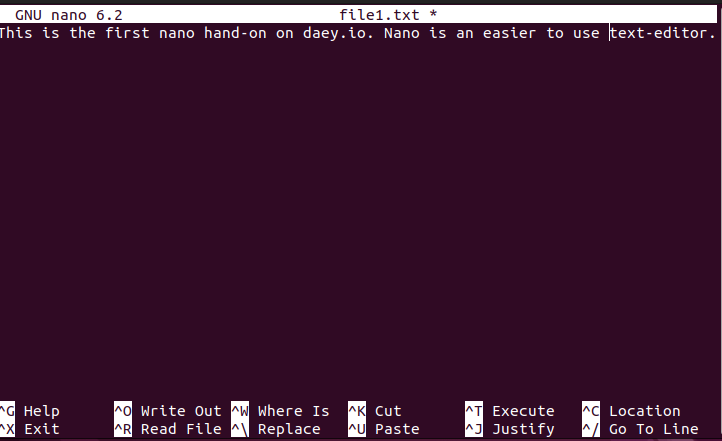

# Linux text editors

In Linux, **text editors** are essential tools for editing configuration files, scripts, source code, and more—especially in terminal or server environments. Two of the most commonly used terminal-based text editors are **Vim** and **Nano**.

---

## 🟩 **Nano** – *Beginner-Friendly Editor*

### ✅ **Features:**
- Easy to use
- Simple interface
- Commands visible at the bottom of the screen
- Great for quick edits

### 📌 **Basic Usage:**
```bash
nano filename.txt
```

### 🔹 **Common Shortcuts (use Ctrl + key):**
| Command        | Description             |
|----------------|--------------------------|
| `Ctrl + O`     | Save (Write Out)         |
| `Ctrl + X`     | Exit                     |
| `Ctrl + K`     | Cut line                 |
| `Ctrl + U`     | Paste line               |
| `Ctrl + W`     | Search                   |

### Practice


 


> 📝 Nano is user-friendly and ideal for beginners or simple editing tasks.

---

## 🟦 **Vim** – *Powerful and Advanced Editor*

### ✅ **Features:**
- Extremely powerful and fast
- Supports syntax highlighting, macros, plugins
- Steeper learning curve
- Ideal for programmers and advanced users

### 📌 **Start Vim:**
```bash
vi filename.txt
```

### 🚦 **Modes in Vim:**
1. **Normal Mode** (default): for navigation and commands  
2. **Insert Mode** (`i`): for editing text  
3. **Command Mode** (`:`): for file operations and settings

### 🔹 **Basic Commands:**
| Command        | Description                    |
|----------------|---------------------------------|
| `i`            | Switch to insert mode           |
| `Esc`          | Return to normal mode           |
| `:w`           | Save file                       |
| `:q`           | Quit                            |
| `:wq` or `ZZ`  | Save and quit                   |
| `dd`           | Delete a line                   |
| `yy`           | Copy a line                     |
| `p`            | Paste below current line        |
| `/searchterm`  | Search for a word               |
| `x`            | Delete a character (in cmd mode)                                              |


> 💡 Vim is a favorite among power users for its speed and extensibility.
### Practice


---

### 🆚 **Nano vs. Vim (Quick Comparison)**

| Feature         | Nano           | Vim             |
|-----------------|----------------|------------------|
| Ease of Use     | ⭐⭐⭐⭐⭐         | ⭐⭐              |
| Power/Features  | ⭐⭐            | ⭐⭐⭐⭐⭐          |
| Learning Curve  | Low            | High             |
| Best For        | Beginners, quick edits | Advanced users, programming |

---

