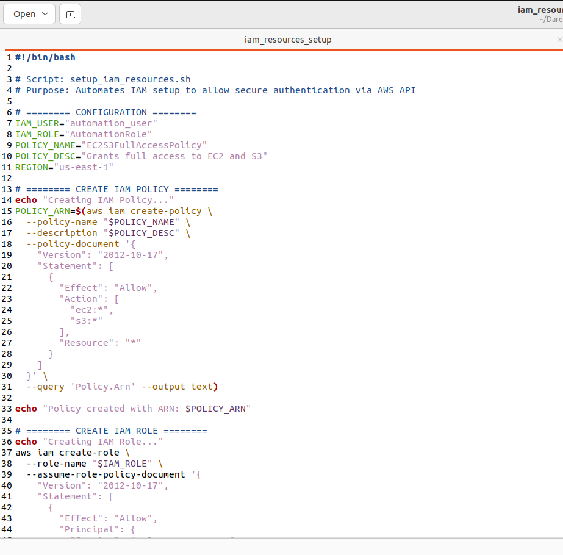
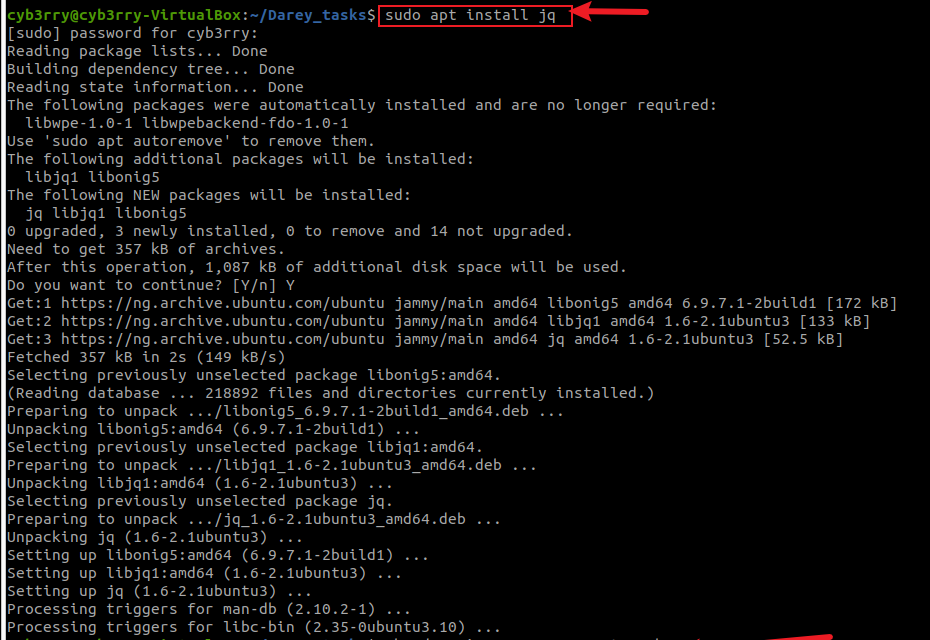
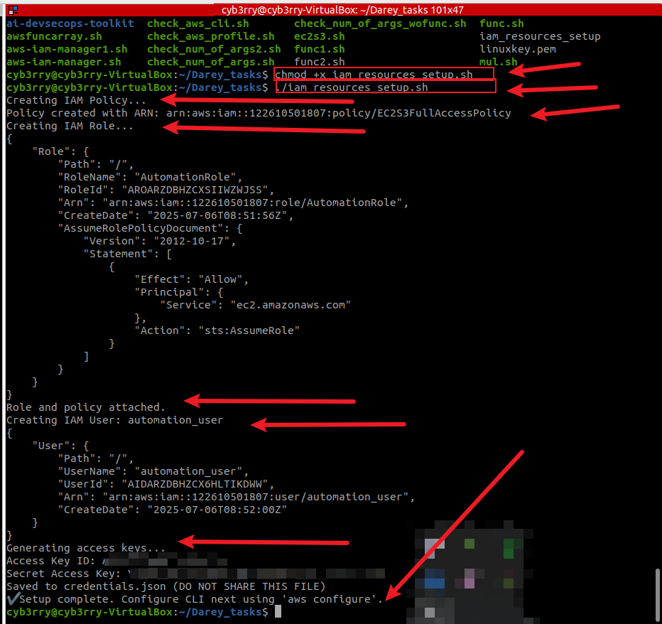
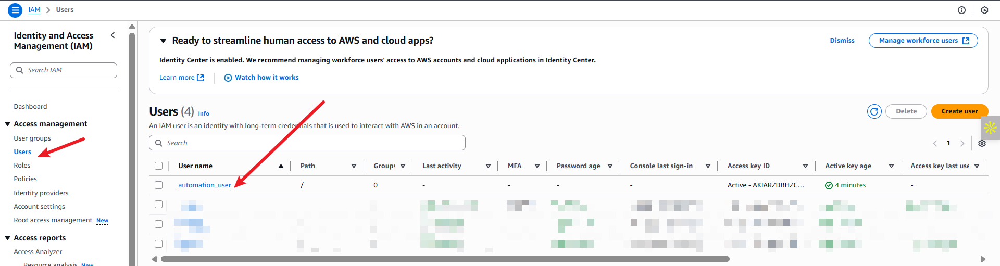
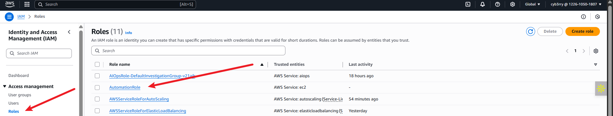
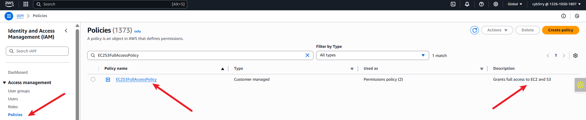
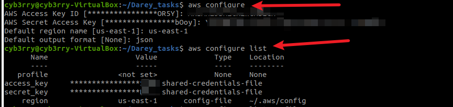
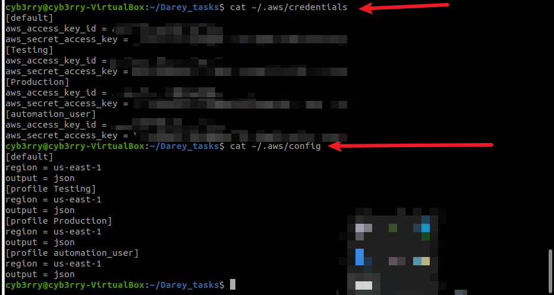
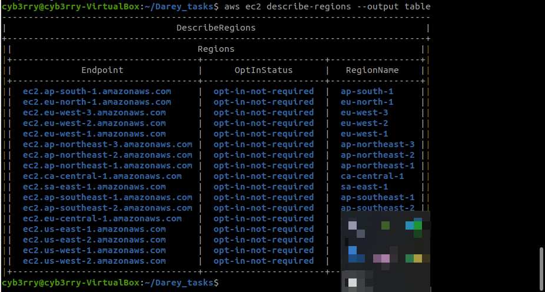

# ✅ **Setting up Secure Authentication to AWS API**

This mini project focuses on setting up **secure programmatic access** to AWS using the **AWS Command Line Interface (CLI)** and an IAM user. The objective is to automate AWS resource creation — specifically EC2 instances and S3 buckets — through a shell script. To accomplish this, a new IAM user (`automation_user`) is created and granted permissions via an IAM policy and role. 
This script will:

* Create an IAM policy with full EC2 and S3 access
* Create an IAM role
* Create an IAM user `automation_user`
* Attach the policy to both the role and user
* Create programmatic credentials for the user


The AWS CLI is configured using the user’s programmatic credentials, allowing the shell script to securely interact with AWS services via API calls. The project also includes a note on what APIs are and how they enable cloud automation.

## 🔑 **Note on APIs**

An **API (Application Programming Interface)** allows different systems to communicate. In AWS, APIs expose endpoints like `ec2.amazonaws.com` or `s3.amazonaws.com`, which your scripts or the AWS CLI interact with via structured HTTP requests. By using an IAM user's credentials, your CLI commands become authenticated API calls, enabling resource creation, deletion, and management without needing to use the AWS Management Console.

---

### 📦 **How to Install AWS CLI**

**On Linux:**

```bash
curl "https://awscli.amazonaws.com/awscli-exe-linux-x86_64.zip" -o "awscliv2.zip"
unzip awscliv2.zip
sudo ./aws/install
aws --version
```

**On Windows:**

* Download the installer from [https://aws.amazon.com/cli/](https://aws.amazon.com/cli/)
* Run the `.msi` file and verify with:

  ```
  aws --version
  ```

**On macOS:**

* Download `.pkg` file, install, then:

  ```
  aws --version
  ```

### **PS: I ALREADY HAVE AWS CLI INSTALLED FROM PREVIOUS PROJECTS** 

## ✅ Shell Script: `setup_iam_resources.sh`

```bash
#!/bin/bash

# Script: setup_iam_resources.sh
# Purpose: Automates IAM setup to allow secure authentication via AWS API

# ======== CONFIGURATION ========
IAM_USER="automation_user"
IAM_ROLE="AutomationRole"
POLICY_NAME="EC2S3FullAccessPolicy"
POLICY_DESC="Grants full access to EC2 and S3"
REGION="us-east-1"

# ======== CREATE IAM POLICY ========
echo "Creating IAM Policy..."
POLICY_ARN=$(aws iam create-policy \
  --policy-name "$POLICY_NAME" \
  --description "$POLICY_DESC" \
  --policy-document '{
    "Version": "2012-10-17",
    "Statement": [
      {
        "Effect": "Allow",
        "Action": [
          "ec2:*",
          "s3:*"
        ],
        "Resource": "*"
      }
    ]
  }' \
  --query 'Policy.Arn' --output text)

echo "Policy created with ARN: $POLICY_ARN"

# ======== CREATE IAM ROLE ========
echo "Creating IAM Role..."
aws iam create-role \
  --role-name "$IAM_ROLE" \
  --assume-role-policy-document '{
    "Version": "2012-10-17",
    "Statement": [
      {
        "Effect": "Allow",
        "Principal": {
          "Service": "ec2.amazonaws.com"
        },
        "Action": "sts:AssumeRole"
      }
    ]
  }'

# Attach the custom policy to the role
aws iam attach-role-policy \
  --role-name "$IAM_ROLE" \
  --policy-arn "$POLICY_ARN"

echo "Role and policy attached."

# ======== CREATE IAM USER ========
echo "Creating IAM User: $IAM_USER"
aws iam create-user --user-name "$IAM_USER"

# Attach the same policy to the user directly
aws iam attach-user-policy \
  --user-name "$IAM_USER" \
  --policy-arn "$POLICY_ARN"

# Optional: Add user to a group (not required in your case)

# ======== CREATE ACCESS KEYS FOR USER ========
echo "Generating access keys..."
aws iam create-access-key --user-name "$IAM_USER" > credentials.json

ACCESS_KEY_ID=$(jq -r '.AccessKey.AccessKeyId' credentials.json)
SECRET_ACCESS_KEY=$(jq -r '.AccessKey.SecretAccessKey' credentials.json)

echo "Access Key ID: $ACCESS_KEY_ID"
echo "Secret Access Key: $SECRET_ACCESS_KEY"
echo "Saved to credentials.json (DO NOT SHARE THIS FILE)"

# Note: Directly assigning IAM Role to a user is not allowed in AWS,
# Instead, you can assume the role if needed via sts:AssumeRole

echo "✔️ Setup complete. Configure CLI next using 'aws configure'."
```


---


## 📌 Walkthrough: How to Run the Script

1. **Install AWS CLI** (if not done already — see prior answer).
2. **Install `jq`** (used to parse JSON output):

   ```bash
   sudo apt install jq    # for Ubuntu/Debian
   ```



3. **Save the script** as ``
4. **Make it executable**:

   ```bash
   chmod +x iam_resources_setup.sh
   ```
5. **Run it**:

   ```bash
   ./iam_resources_setup.sh
   ```







---

## ⚙️ Configure AWS CLI with the Generated User

After running the script, `credentials.json` will contain the keys.

To configure your AWS CLI using them:

```bash
aws configure
```

Enter the values as follows:

* **AWS Access Key ID** → copy from `credentials.json`
* **AWS Secret Access Key** → copy from `credentials.json`
* **Default region name** → `us-east-1`
* **Default output format** → `json`





---
**Test the configuration:**

```bash
aws ec2 describe-regions --output table
```
If it returns a table of AWS regions, your CLI is set up correctly.



---

## 🧠 Note on IAM Roles and Users

You **cannot directly assign a role to an IAM user** in AWS. Roles are assumed — typically by services (like EC2) or federated users. However, you can grant a user permission to **assume a role** by editing the trust relationship and using `sts:AssumeRole`.

In this script, we’ve granted the same **policy permissions to both the user and the role**. The role can be used for EC2, and the user for programmatic CLI access.

---


