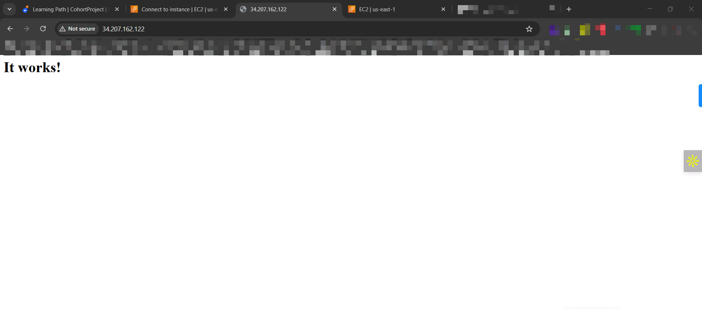
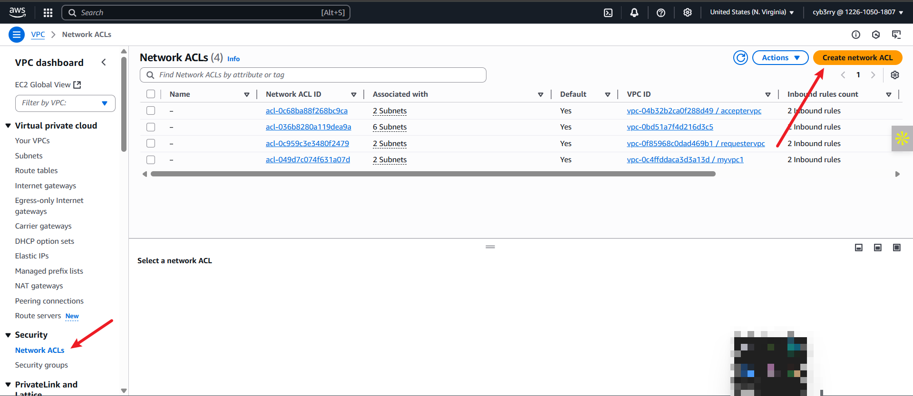

# 🔐 **AWS Security Groups vs Network ACLs**

In Amazon Web Services (AWS), **Security Groups** and **Network Access Control Lists (NACLs)** serve as foundational components of cloud network security. Both are used to control inbound and outbound traffic to resources within a Virtual Private Cloud (VPC), but they operate at different layers and with distinct rules and purposes.

---

### 🔹 **Security Groups (SGs)** – Instance-Level Firewalls

**Security Groups** act as **virtual firewalls for EC2 instances** and other AWS resources. They operate at the **instance level**, controlling traffic based on defined rules.

#### ✅ Key Characteristics:

* **Stateful:** If you allow inbound traffic on a port, outbound responses are automatically allowed.
* **Applies to instances**: Assigned directly to EC2, RDS, Lambda (VPC), etc.
* **Only allows traffic**: You explicitly define **allowed** inbound and outbound traffic.
* **Rules based on**: Protocol, port range, and source/destination (CIDR or SG ID).

#### 📌 Example Use Case:

Allow SSH (port 22) access from a corporate IP range, and HTTPS (port 443) access from anywhere.

---

### 🔸 **Network ACLs (NACLs)** – Subnet-Level Firewalls

**Network ACLs** are applied at the **subnet level** and act as an **optional stateless firewall** for VPCs. They control traffic entering and leaving entire subnets.

#### ✅ Key Characteristics:

* **Stateless:** Rules must be defined separately for inbound and outbound traffic.
* **Applies to subnets:** Automatically applies to all resources within a subnet.
* **Allows or denies traffic:** You can explicitly allow or deny traffic.
* **Rules based on**: Protocol, port, CIDR block, rule number (priority-based).

#### 📌 Example Use Case:

Block all inbound traffic from a specific malicious IP range across an entire subnet.

---

### 🔄 **Comparison: Security Groups vs NACLs**

| Feature          | Security Group                       | Network ACL                         |
| ---------------- | ------------------------------------ | ----------------------------------- |
| Scope            | Instance-level                       | Subnet-level                        |
| Traffic Type     | Allow only                           | Allow and Deny                      |
| Stateful?        | ✅ Yes                                | ❌ No                                |
| Default behavior | Deny all inbound, allow all outbound | Allow all inbound/outbound          |
| Rule evaluation  | All rules are evaluated              | Rules are evaluated by order number |
| Applies to       | EC2, RDS, Lambda (VPC)               | Entire subnet                       |

## 🚀 PRACTICAL WALKTHROUGHS

This practical will be in two parts-
1. Security group
2. NACL

### A.   SECURITY GROUP
   The following scenarios will be explored:

- Implement inbound traffic rules for HTTP and SSH protocols and allow outbound traffic for all.
- Configure inbound rules for HTTP with no outbound rules.
- Remove both inbound and outbound rules.
- Have no inbound rules but configure outbound rules for all traffic


To begin, create an EC2 instance (if none already exists) and attach it to the VPC and private subnet created in the previous lesson `AWS VPC Mini Project`


Here's the security group configuration for the instance. In the inbound rules, only IPv4 SSH traffic on port 22 is permitted to access this instance.


For the outbound rule, you'll notice that all IPv4 traffic with any protocol on any port number is allowed, meaning this instance has unrestricted access to anywhere on the internet.


Now, let's test accessibility to the website using the public IP address assigned to this instance.
Here, let's retrieve the public IP address.


If you enter "http:// 54.255.228.191" into your Chrome browser, and hit enter, you'll notice that the page doesn't load; it keeps attempting to connect. And finally it’ll show this page. After some time, you'll likely see a page indicating that the site can't be reached.


This is because of the security group, because we haven't defined HTTP protocol in the security group so whenever the outside world is trying to go inside our instance and trying to get the data, security group is restricting it and that’s why we are unable to see the data.
To resolve this issue, we can create a new security group that allows HTTP (port 80) traffic.

### 🔐 Steps to Create a Security Group Inbound Rule for HTTP (Port 80)


1. **Open the "Security Groups" Section**
   In the **left sidebar**, under *Network & Security*, click **Security Groups**.

2. **Select or Create a Security Group**

   * To use an existing group: select a security group from the list.
   * To create a new one: click **Create Security Group**, provide a name, description, and VPC (choose the already created VPC).


3. **Add Inbound Rule for HTTP**

   * Click on the **Inbound rules** tab → **Edit inbound rules**.
   * Click **Add Rule**

     * **Type**: `HTTP`
     * **Protocol**: `TCP` (auto-filled)
     * **Port Range**: `80` (auto-filled)
     * **Source**: `Anywhere (0.0.0.0/0)` — or limit to a specific IP or security group for better security
   * Click **Save rules**
   * Keep outbound rules as it is.


Now navigate to the instance section of left side bar.
- Select the instance   
- Click on “Actions.” 
- Choose "Security"
- Click on “Change security group.”
- Choose the security group you created.
- Click on “Add security group”
- You can see security group is being added, Click on “save.”


Copy the IP address again and try opening in a browser - if the web page contains no info, do the following:

### ✅ Step 1: Check Your EC2 Linux Distribution

Run this on your EC2 instance:

```bash
cat /etc/os-release
```

You'll see something like:

* `Amazon Linux`
* `Ubuntu`
* `CentOS`
* `Red Hat`

### ✅ Step 2: Use the Correct Package Manager

Based on your OS:

| OS                | Package Manager | Apache Package Name | Install Command               |
| ----------------- | --------------- | ------------------- | ----------------------------- |
| **Amazon Linux**  | `yum` or `dnf`  | `httpd`             | `sudo yum install httpd -y`   |
| **CentOS/RHEL**   | `yum` or `dnf`  | `httpd`             | `sudo yum install httpd -y`   |
| **Ubuntu/Debian** | `apt`           | `apache2`           | `sudo apt install apache2 -y` |

---

### ✅ Step 3: Start Apache and Enable It

For **Amazon Linux, CentOS, or RHEL**, use:

```bash
sudo systemctl start httpd
sudo systemctl enable httpd
```

Then open your EC2 public IP in a browser:
📬 `http://<EC2-Public-IP>`

Once it is done, the following will be seen with:  `http://<EC2-Public-IP>`



Currently, let's take a look at how our inbound and outbound rules are configured.
This setup allows the HTTP and SSH protocols to access the instance.


The outbound rule permits all traffic to exit the instance. Through this rule, we're able to access the website.


Now delete the `outbound rule` to see what happens

### 🔐 Steps to Delete an Outbound Rule from a Security Group

1. **Open the "Outbound rules" tab**

   * Click on the **Outbound rules** tab at the bottom.

2. **Edit Outbound Rules**

   * Click the **Edit outbound rules** button.


3. **Delete the Desired Rule(s)**

   * Click the **trash icon** 🗑 next to the rule you want to delete.


4. **Save Changes**

   * After deleting, click the **Save rules** button to apply changes.


Now recheck the webpage:


   So, even though we've removed the outbound rule that allows all traffic from the instance to the outside world, we can still access the website. According to the logic we discussed, when a user accesses the instance, the inbound rule permits HTTP protocol traffic to enter. However, when the instance sends data to the user's browser to display the website, the outbound rule should prevent it. Yet, we're still able to view the website. Why might that be?
   Security groups are stateful, which means they automatically allow return traffic initiated by the instances to which they are attached. So, even though we removed the outbound rule, the security group allows the return traffic necessary for displaying the website, hence we can still access it.

Let's explore the scenario:

   If we delete both the inbound and outbound rules, essentially, we're closing all access to and from the instance. This means no traffic can come into the instance, and the instance cannot send any traffic out. So, if we attempt to access the website from a browser or any other client, it will fail because there are no rules permitting traffic to reach the instance. Similarly, the instance won't be able to communicate with any external services or websites because all outbound traffic is also blocked.

Follow same procedure (as can seed with deleting the outbound rule) and delete the inbound rule:

### 🔐 Steps to Delete an Inbound Rule from a Security Group

1. **Open the "Inbound rules" tab**

   * Navigate to the **Inbound rules** tab at the bottom of the page.

2. **Edit Inbound Rules**

   * Click the **Edit inbound rules** button.


3. **Delete Rule(s)**

   * Click the **trash can icon** 🗑 next to the rule you want to delete (e.g., HTTP rule on port 80).


5. **Save Changes**

   * Click the **Save rules** button to confirm and apply the changes.


Now, as both the inbound and outbound rules deleted, there's no way for traffic to enter or leave the instance. This means that any attempt to access the website from a browser or any other client will fail because there are no rules permitting traffic to reach the instance. In this state, the instance is essentially isolated from both incoming and outgoing traffic.
So you can’t access the website now.


In the next scenario,
We'll add a rule specifically allowing HTTP traffic in the outbound rules. This change will enable the instance to initiate outgoing connections over HTTP.
1.	Click on edit outbound rule in the outbound tab,


- Click on “add rule”
- Choose type.
- Choose destination.
- Choose CIDR.
- Click on “save rules”


Now, let’s see if we can access the website:


So, we are not able to see it.

### B.   NACLs

 The following scenarios will be explored:

- Examine the default settings for both inbound and outbound rules in NACL configuration.
- Modify the inbound rules to permit traffic from any IPv4 CIDR on all ports.
- Adjust the outbound rules to allow traffic to all CIDRs.

### 🌐 Steps to Create a NACL (Network ACL) in AWS

1. **Navigate to the VPC Dashboard**
   From the **Services** menu, search and select **VPC**.


2. **Access Network ACLs**
   In the **left navigation pane**, under **Security**, click **Network ACLs**.



3. **Click “Create network ACL”**

   * **Name tag**: Enter a name (e.g., `MyPublicNACL`)
   * **VPC**: Select the VPC where this NACL will be used
   * Click **Create network ACL**


4. ✅ **NACL is now created** — but it has no custom rules or subnet associations yet.

* If you select the Network ACL you created and navigate to the "Inbound" tab, you will that by default,vit's denying all traffic from all ports. 


* Similarly, if you look at the outbound rules, you'll observe that it's denying all outbound traffic on all ports by default.


---

### ➕ Step 2: Add Rules to the NACL

1. Select the created NACL from the list.
2. Go to the **Inbound Rules** tab.
3. Click **Edit inbound rules**, then:


   * Click **Add new rule**

     * **Rule #**: e.g., 100 (lower numbers have higher priority)
     * **Type**: Choose from dropdown (e.g., HTTP, HTTPS, ALL Traffic)
     * **Protocol**: Auto-filled based on type (or choose custom)
     * **Port Range**: e.g., 80 for HTTP
     * **Source/Destination**: e.g., `0.0.0.0/0` for all IPs
     * **Allow/Deny**: Select `ALLOW` or `DENY`

      

4. Click **Save changes**


---

### 🔗 Step 3: Associate Subnets with the NACL

Currently, this NACL is not associated with any of the subnets in the VPC.

1. With the NACL selected, go to the **Actions**.
2. Click **Edit subnet associations**


3. Check the box(es) of the subnet(s) (remember to use the public subnet) you want this NACL to control.


4. Click **Save**


As soon as you have attached this NACL to your public subnet, and then you try to access the website again by typing the URL, you will notice that you are unable to see the website.


Although we've permitted all traffic in the inbound rule of our NACL, we're still unable to access the website. This raises the question: why isn't the website visible despite these permissions?
The reason why we're unable to access the website despite permitting inbound traffic in the NACL is because NACLs are stateless. They don't automatically allow return traffic. As a result, we must explicitly configure rules for both inbound and outbound traffic.
Even though the inbound rule allows all traffic into the subnet, the outbound rules are still denying all traffic.
You can see:


If we allow outbound traffic as well,

1. Select the created NACL from the list.
2. Go to the **Outbound Rules** tab.
3. Click **Edit outbound rules**, then:


   * Click **Add new rule**

     * **Rule #**: e.g., 100 (lower numbers have higher priority)
     * **Type**: Choose from dropdown (e.g., HTTP, HTTPS, ALL Traffic)
     * **Protocol**: Auto-filled based on type (or choose custom)
     * **Port Range**: e.g., 80 for HTTP
     * **Source/Destination**: e.g., `0.0.0.0/0` for all IPs
     * **Allow/Deny**: Select `ALLOW` or `DENY`

      

4. Click **Save changes**


Upon revisiting the website, you should now be able to access it without any issues.


In the next scenario:

*Security Group:* Allows inbound traffic for HTTP and SSH protocols and permits all outbound traffic.
*Network ACL:* Denies all inbound and outbound traffic. Let's observe the outcome of this configuration.


Now try accessing the site - So we are unable to access the website. why? Even if we have allowed inbound traffic for HTTP in security group.

- Imagine you're at the entrance of a building, and there's a security guard checking everyone who wants to come in. That security guard is like the NACL. They have a list of rules (like "no backpacks allowed" or "no food or drinks inside"), and they check each person against these rules as they enter.
- Once you're inside the building, there's another layer of security at each room's door. These are like the Security Groups. Each room has its own rules, like "only employees allowed" or "no pets." These rules are specific to each room, just like Security Groups are specific to each EC2 instance.
- So, the traffic first goes through the NACL (the security guard at the entrance), and if it passes those rules, it then goes through the Security Group (the security check at each room's door). If it doesn't meet any of the rules along the way, it's denied entry.
- The reason we can't see the website is because the NACL has denied inbound traffic. This prevents traffic from reaching the security group, much like a security guard not allowing entry to another room if access to the building is denied. Similarly, if someone can't enter a building, they can't access any rooms inside without first gaining entry to the building."

### Let’s have a look on some scenarios and their outcomes:

- NACL allows all inbound and outbound traffic, Security Group denies all inbound and outbound traffic: Outcome: Website access will be blocked because the Security Group denies all traffic, overriding the NACL's allowance.
- NACL denies all inbound and outbound traffic, Security Group allows all inbound and outbound traffic: Outcome: Website access will be blocked because the NACL denies all traffic, regardless of the Security Group's allowances.
- NACL allows HTTP inbound traffic, outbound traffic is denied, Security Group allows inbound traffic and denies outbound traffic: Outcome: Website access will be allowed because the Security Group allows HTTP inbound traffic, regardless of the NACL's allowances. However, if the website requires outbound traffic to function properly, it won't work due to the Security Group's denial of outbound traffic.
- NACL allows all inbound and outbound traffic, Security Group allows HTTP inbound traffic and denies outbound traffic: Outcome: Website access will be allowed because the Security Group allows HTTP inbound traffic, regardless of the NACL's allowances. However, if the website requires outbound traffic to function properly, it won't work due to the Security Group's denial of outbound traffic.
- NACL allows all inbound and outbound traffic, Security Group allows all inbound and outbound traffic: Outcome: Website access will be allowed, as both NACL and Security Group allow all traffic.
- NACL denies all inbound and outbound traffic, Security Group allows HTTP inbound traffic and denies outbound traffic: Outcome: Website access will be blocked because the NACL denies all traffic, regardless of the Security Group's allowances.


### 🛡️ **Best Practices**

* Use **Security Groups** for controlling instance-specific access — keep them tight and descriptive.
* Use **NACLs** as an **additional layer of subnet protection**, especially when you need to **deny** certain traffic.
* **Minimize overly permissive rules**, such as `0.0.0.0/0` without proper justification.
* Regularly **audit and clean up unused SGs and NACL rules**.

---

### 🧠 Takeaway

Security Groups and NACLs complement each other in securing AWS environments. While Security Groups provide granular control at the resource level, NACLs offer broader protections at the subnet level. Used together effectively, they help enforce a defense-in-depth strategy for your cloud network infrastructure.


