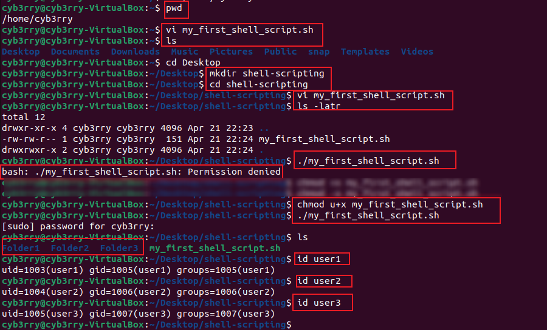
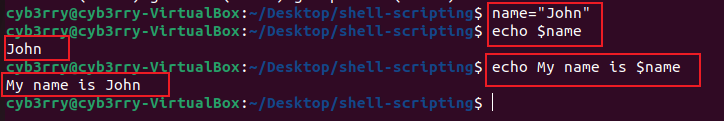

# Shell scripting

---

### 🐚 **Introduction to Shell Scripting**

**Shell scripting** is a way to automate tasks in Unix/Linux by writing a series of commands in a plain text file. These scripts are interpreted by a shell (like `bash`, `sh`, `zsh`, etc.), making it easier to run repetitive tasks, set up environments, and manage system operations.

---

### 📄 **What is a Shell Script?**

A **shell script** is simply a file containing a list of commands that the shell can execute. Instead of typing each command manually, you write them in a file and run the file like a program.

---

### 📌 **Example: A Simple Shell Script**

```bash
#!/bin/bash
# This is a simple shell script

echo "Hello, World!"
name="Ada"
echo "Welcome, $name!"
```

Save it as `welcome.sh`.

---

### 🔐 **Making a Script Executable (+x)**

After creating a script, it’s just a plain text file. To make it executable:

```bash
chmod +x welcome.sh
```

Now you can run it like this:

```bash
./welcome.sh
```
### Practice
```bash
#!/bin/bash
 #add to an empty shell script for practice

# Create directories
mkdir Folder1
mkdir Folder2
mkdir Folder3

# Create users
sudo useradd user1
sudo useradd user2
sudo useradd user3

#check to see its permissions
ls -latr

#attempt running the script
./my_first_shell_script.sh
#an error is thrown
#add execute permission for the file owner
chmod u+x my_first_shell_script.sh
#run the script again and use `ls` to see if the folders have been creadted and `id` to confirm the users were also created
ls
id user1
id user2
id user3
```


---

### 🔰 **Shebang (`#!`)**

The first line `#!/bin/bash` is called a **shebang**. It tells the system which interpreter to use to run the script. Common examples:

- `#!/bin/bash` → for bash shell
- `#!/bin/sh` → for basic POSIX-compliant shell
- `#!/usr/bin/env python3` → for Python scripts

---

### 📦 **Variables in Shell Scripts**

**Declaration and Initialization:**

```bash
greeting="Hello"
name="Tunde"
```
### Practice
```bash
#Example: Assigning value to a variable:
name="John"
#retrieving value from valuable
echo $name
```


**Retrieving Variable Values:**

```bash
echo "$greeting, $name!"
```

Note:
- No spaces around `=`
- Use double quotes for safety (prevents word splitting and globbing)

---

### 🧠 **More Useful Shell Scripting Concepts**

#### 🧮 Arithmetic Operations

```bash
a=5
b=3
sum=$((a + b))
echo "Sum: $sum"
```

#### 🔁 Loops

```bash
for i in {1..3}; do
  echo "Iteration $i"
done
```

#### ❓ Conditional Statements

```bash
if [ "$name" == "Ada" ]; then
  echo "Nice to see you, Ada!"
else
  echo "Hello, guest!"
fi
```

#### 🗂️ Reading User Input

```bash
read -p "Enter your name: " user
echo "Welcome, $user"
```

---

### 🧰 **Pro Tips**

- Use `set -e` at the top to stop the script on the first error.
- Use functions to organize complex scripts:

```bash
say_hello() {
  echo "Hello from a function!"
}
say_hello
```

- Use comments generously (`#`) to document what your script does.
- Test scripts in small parts to avoid system-wide changes.

---
