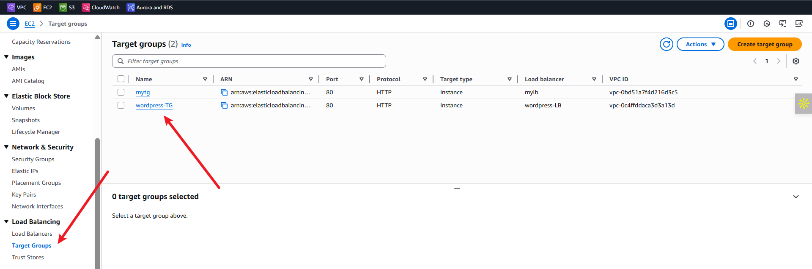
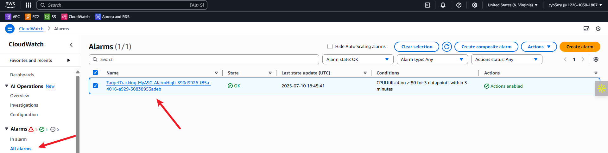

# WORDPRESS SITE ON AWS

## ✅ **Executive Summary**

**Project Title:** Deploying a Scalable WordPress Site on AWS
**Client:** DigitalBoost – a digital marketing agency
**Goal:** Build a secure, scalable, and cost-effective WordPress site using AWS infrastructure.
**Role:** AWS Solutions Architect

DigitalBoost seeks a resilient web hosting environment with automatic scaling, high availability, and centralized data storage. You are tasked with setting up this WordPress environment using AWS services such as VPC, EC2, RDS, EFS, Load Balancer, and Auto Scaling.

---

## 🧱 **Project Architecture Overview**

The infrastructure is broken into these layers:

1. **Networking (VPC, Subnets, NAT, Route Tables)**
2. **Compute (EC2 instances for WordPress)**
3. **Storage (Amazon EFS for WordPress files)**
4. **Database (Amazon RDS MySQL)**
5. **Load Balancing (Application Load Balancer)**
6. **Auto Scaling (for fault tolerance & elasticity)**

---

# ✅ **Network and Security Setup – Step-by-Step**

This section outlines how the VPC, subnets, routing, and security groups were configured to support a secure and scalable WordPress deployment on AWS.

---

## 🌐 **Step 1: Create a Custom VPC**

1. Go to the **VPC Dashboard**.
2. Click **“Create VPC”**, choose:

   * **VPC only**
   * **Name:** `wordpress-vpc`
   * **IPv4 CIDR block:** `10.0.0.0/16`
3. Leave other settings as default and click **Create VPC**.


---

## 🧱 **Step 2: Create Subnets**

Create **6 subnets** in at least **2 Availability Zones (AZs)**:

| Type    | Name               | CIDR Block    | AZ           |
| ------- | ------------------ | ------------- | ------------ |
| Public  | `public-subnet-1`  | `10.0.1.0/24` | `us-east-1a` |
| Public  | `public-subnet-2`  | `10.0.2.0/24` | `us-east-1b` |
| Public  | `public-subnet-3`  | `10.0.3.0/24` | `us-east-1c` |
| Private | `private-subnet-1` | `10.0.4.0/24` | `us-east-1a` |
| Private | `private-subnet-2` | `10.0.5.0/24` | `us-east-1b` |
| Private | `private-subnet-3` | `10.0.6.0/24` | `us-east-1c` |

Ensure all subnets are **associated with your VPC**.


---

## 🚪 **Step 3: Create an Internet Gateway**

1. Go to **Internet Gateways** → Create
2. Name: `wordpress-igw`
3. Attach it to `wordpress-vpc`


---

## 🛣️ **Step 4: Create Route Tables**

### 🔸 **Public Route Table**

1. Create new route table: `public-rt`
2. Associate with all **public subnets**
3. Add route:

   * Destination: `0.0.0.0/0`
   * Target: **Internet Gateway**

### 🔸 **Private Route Table**

1. Create new route table: `private-rt`
2. Associate with all **private subnets**
3. Initially leave routing blank (NAT comes next)


---

## 🌐 **Step 5: Create NAT Gateway (in a Public Subnet)**

1. Go to **NAT Gateways** → Create

2. Choose:

   * Subnet: any of the **public subnets**
   * Elastic IP: Allocate a new one

3. Name: `wordpress-natgw`

4. Update **private route table**:

   * Destination: `0.0.0.0/0`
   * Target: **NAT Gateway**


---

### For further clarity, visit the link below:

[AWS_VPC_MINI_PROJECT](https://github.com/Kzian/Darey-Projects-3mtt/blob/main/AWS_VPC_Mini_Project/README.md)

## 🔐 **Step 6: Create Security Groups**

### 1. **Load Balancer SG** (`lb-sg`)

* **Inbound Rules**:

  * HTTP (80) from `0.0.0.0/0`
  * HTTPS (443) from `0.0.0.0/0`
* **Outbound**: All traffic (default)

---

### 2. **SSH Security Group** (`ssh-sg`)

* **Inbound**:

  * SSH (22) from **Instance Connect Endpoint SG**
* **Outbound**: All traffic (default)

---

### 3. **Instance Connect Endpoint SG** (`ice-sg`)

* **Inbound**: None (default)
* **Outbound**:

  * SSH (22) to **SSH SG** (target group: `ssh-sg`)

---

### 4. **Application Server SG** (`app-sg`)

* **Inbound Rules**:

  * HTTP (80) from **`lb-sg`**
  * HTTPS (443) from **`lb-sg`**
  * SSH (22) from **`ice-sg`**
* **Outbound**: All traffic

---

### 5. **Database Server SG** (`db-sg`)

* **Inbound Rules**:

  * MySQL (3306) from **`app-sg`**
* **Outbound**: All traffic

---

### 6. **EFS Security Group** (`efs-sg`)

* **Inbound Rules**:

  * NFS (2049) from **`app-sg`**
  * NFS (2049) from **itself** (`efs-sg`)
  * SSH (22) from **`ssh-sg`**
* **Outbound**: All traffic

---


### For further clarity, visit the link below:

[SecurityGroups&NACLs](https://github.com/Kzian/Darey-Projects-3mtt/blob/main/SecurityGroups%26NACLs_miniproject/README.md)

## ✅ Summary of Network Flow

| Component    | Communicates With     | Protocol        |
| ------------ | --------------------- | --------------- |
| ALB (lb-sg)  | Public internet       | HTTP/HTTPS      |
| EC2 (app-sg) | ALB + SSH via ICE     | HTTP/HTTPS, SSH |
| RDS (db-sg)  | EC2 app server        | MySQL           |
| EFS (efs-sg) | EC2 app server        | NFS             |
| SSH SG       | Accessed via ICE only | SSH             |

---

# ✅ **Infrastructure & Application Deployment – Extended Steps**

## 🧩 **VPC & Endpoint Enhancements**

### 🔸 EC2 Instance Connect Endpoint (ICE)

To avoid using a bastion host, an **Instance Connect Endpoint** was created in one of the private subnets.

* The endpoint was placed in **`wordpress-vpc`**
* Associated with a **security group (`ice-sg`)** that:

  * Has **outbound SSH (22)** to the **`ssh-sg`** (for EC2 access)
  * No inbound rules (as expected)
* This enabled secure **browser-based SSH access** into EC2s within private subnets


---

## 🛢️ **RDS Subnet Group and Database Setup**

1. **RDS Subnet Group** was created:

   * Included **3 private subnets** across **3 different Availability Zones**
   * Named: `wordpress-db-subnet-group`

2. **RDS MySQL Database** was launched with:

   * **Engine**: MySQL
   * **VPC**: `wordpress-vpc`
   * **Subnets**: Used the RDS subnet group
   * **Security Group (`db-sg`)**:

     * Allowed MySQL (3306) only from the **Application Server SG (`app-sg`)**
   * **Backup, Multi-AZ, and auto minor version upgrades** configured as needed

.png)

.png)

.png)

.png)

.png)

.png)

.png)


---

## 📦 **EFS Setup (Custom)**

A custom **Amazon EFS** file system was created:

* Placed in **private subnets**
* Mount targets created in **each AZ**
* Attached security group (`efs-sg`) with:

  * **Inbound NFS (2049)** from:

    * The **application server SG**
    * **Itself** (for EFS-to-EFS communications)
  * **Inbound SSH** from `ssh-sg` (for troubleshooting if needed)


---

## 🖥️ **EC2 Instance Launch & Configuration**

### 🔸 EC2 Setup:

* **AMI**: Amazon Linux 2
* **Instance type**: t2.micro or t3.micro (Free Tier eligible)
* **Subnet**: One of the **private subnets**
* **Security group**: `app-sg` (allows HTTP/HTTPS from ALB and SSH from ICE)
* **Storage**: Enough to host WordPress and dependencies


### 🔸 Connection:

* Connected via **EC2 Instance Connect Endpoint (ICE)** — no public IP, no bastion host.

.png)

.png)
---

## ⚙️ **Script-Based Setup**

### 🔸 Execution Flow:

1. **Upload Bash script** to the EC2 instance [setupscript](./efs-mount.sh)
2. Mak it **executable**:

```bash
chmod +x setup-script.sh
```

3. **Run the script** to:

   * Install Apache, PHP, and required modules
   * Install and unzip WordPress
   * Mount EFS (if applicable)
   * Start and enable the `httpd` service

.png)

.png)

.png)

.png)

.png)

.png)

.png)

.png)

4. Open the generated **`wp-config.php`** file using `vi`:

   * Manually edit (using the created db configuration):

     * `DB_NAME`
     * `DB_USER`
     * `DB_PASSWORD`
     * `DB_HOST` (use RDS endpoint)

.png)


5. **Save the file** and restart Apache:

```bash
sudo systemctl restart httpd
```

---

# ✅ **Application Deployment & Domain Integration Steps**

---

## 🌐 **Step 1: Create an Application Load Balancer (ALB)**

1. Go to **EC2 > Load Balancers > Create Load Balancer**
2. Choose **Application Load Balancer**
3. Configuration:

   * Name: `wordpress-alb`
   * Scheme: **Internet-facing**
   * IP type: IPv4
4. Select **3 public subnets** (across multiple AZs)
5. **Security Group:** Select `lb-sg` (allows HTTP/HTTPS)
6. Add listeners:

   * **HTTP (port 80)** – initially added
   * Later, HTTPS (443) was added after ACM setup


---

## 🎯 **Step 2: Create a Target Group for EC2 Instances**

1. Go to **Target Groups > Create**
2. Choose:

   * Target type: **Instances**
   * Protocol: HTTP (port 80)
   * Name: `wordpress-target-group`
3. Register the **EC2 instance(s)** running in **private subnets**
4. Health check path: `/` (you can customize this later)


---

## 🔗 **Step 3: Associate ALB with the Target Group**

1. Back in ALB settings, **Edit Listener Rules**
2. Forward all HTTP traffic to the `wordpress-target-group`
3. Confirm that instances show as **healthy**

---

## 🖥️ **Step 4: Launch WordPress via ALB**

* Visit the ALB DNS name (e.g., `http://wordpress-alb-123456.us-east-1.elb.amazonaws.com`)
* This loads the **WordPress setup wizard**
* Complete the installation:

  * Set site title: `DigitalBoost`
  * Create admin username/password
  * Save login credentials

.png)

.png)

.png)

---

## 🎨 **Step 5: Customize the WordPress Site**

1. Log in to the admin panel via ALB DNS + `/wp-admin`
2. Installed professional theme (e.g., Astra or Neve)
3. Customized:

   * Site logo
   * Homepage sections (Hero, Services, CTA)
   * Pages: About, Services, Contact
   * Menu navigation
   * Footer and colors to match **DigitalBoost** branding

---

## 🌍 **Step 6: Purchase and Set Up Domain from GoDaddy**

1. Bought domain (e.g., `digitalboostxyz.com`) via **GoDaddy**
2. In **GoDaddy DNS settings**, created:

   * **CNAME or A record** pointing to the **ALB DNS name**
   * Set TTL to 600 seconds (or as required)

---

## 🔐 **Step 7: Request and Configure SSL Certificate (ACM)**

1. Go to **AWS Certificate Manager (ACM)**
2. Request a **Public Certificate**:

   * Domain names: `devcloudops.online`, `www.digitalboost.devcloudops.online`
   * Validation method: **DNS validation**
3. Added the given **CNAME record** to **GoDaddy DNS**
4. Once validation passed, the certificate status changed to **“Issued”**


---

## 🔁 **Step 8: Update ALB to Use HTTPS**

1. Go to **EC2 > Load Balancers > Listeners**
2. Add a new **HTTPS (443) listener**

   * Attach the **ACM certificate**
   * Forward traffic to the same target group
3. Edit **HTTP (80) listener** to redirect all traffic to HTTPS:

   * Action: **Redirect to HTTPS**
   * Status code: **301 (Permanent)**


---

## 📁 **Step 9: Update wp-config.php for SSL Compatibility**

SSH into the EC2 instance via **Instance Connect Endpoint**, then:

```bash
vi /var/www/html/wp-config.php
```

Add these lines: [http](./https)

```php
/* SSL Settings */
define('FORCE_SSL_ADMIN', true);

// Get true SSL status from AWS load balancer
if(isset($_SERVER['HTTP_X_FORWARDED_PROTO']) && $_SERVER['HTTP_X_FORWARDED_PROTO'] === 'https') {
  $_SERVER['HTTPS'] = '1';
}

```

Save and restart Apache:

```bash
sudo systemctl restart httpd
```

---

## ⚙️ **Step 10: Create Auto Scaling Group (ASG)**

1. Create a **Launch Template** using the properly configured EC2 instance - use this script ([script](./efs-asg.sh))

   * Includ EFS mount, Apache/PHP installation, and `wp-config.php` preparation
2. Create **Auto Scaling Group**:

   * Name: `wordpress-asg`
   * Min: 2, Max: 4
   * Subnets: **3 private subnets**
   * Target group: **Attached ALB target group**
   * Scaling policy: Based on **CPU utilization**
3. Health check:

   * Enabled **ALB health checks**
   * Health check grace period: 300 seconds


### Check out:

[Autoscaling_with_ALB_miniproject](https://github.com/Kzian/Darey-Projects-3mtt/blob/main/AutoScaling_with_ALB_miniproject/README.md)

### Testing ASG:

   ### Using stress:




---

## ✅ **Result**

* WordPress site live on `https://digitalboost.devcloudops.online`


* Fully secured with SSL via ACM
* Accessible via ALB (HTTPS only, with redirection)
* Auto-scaling enabled to handle load
* No public access to EC2 or RDS — ICE endpoint used for internal management
