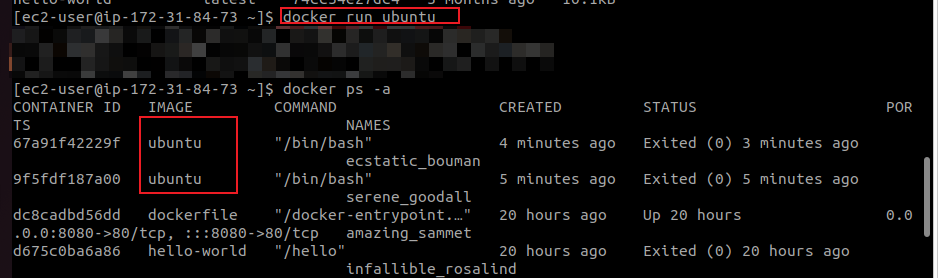
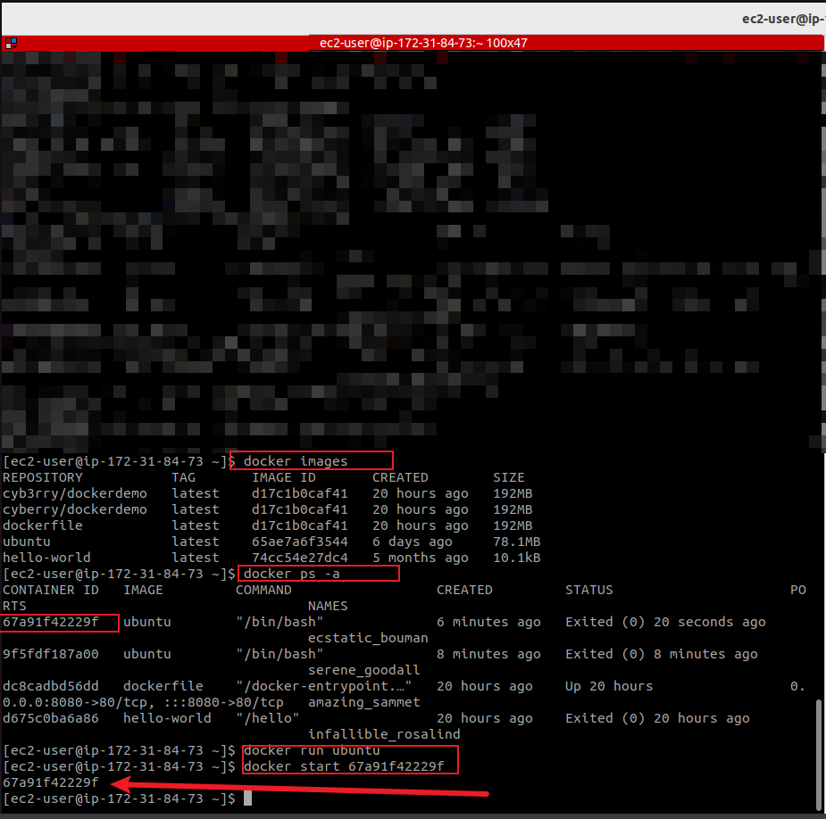
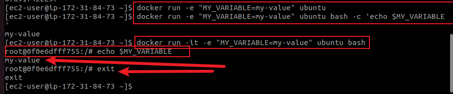
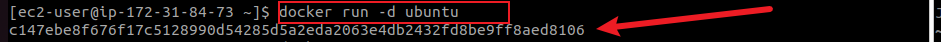
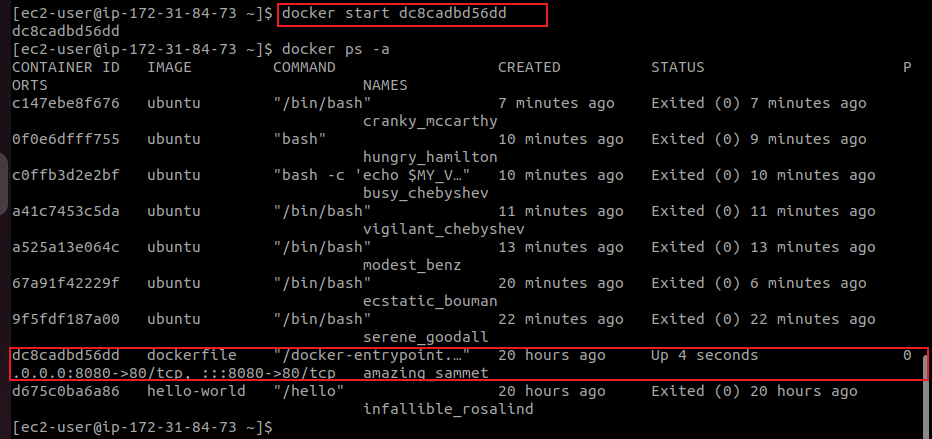
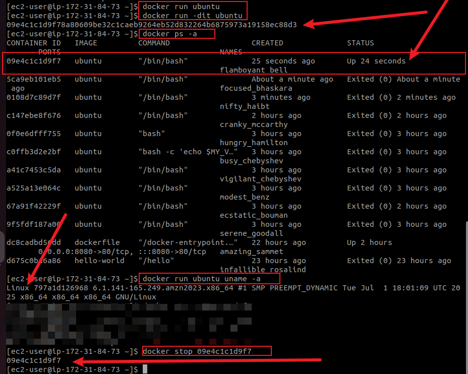
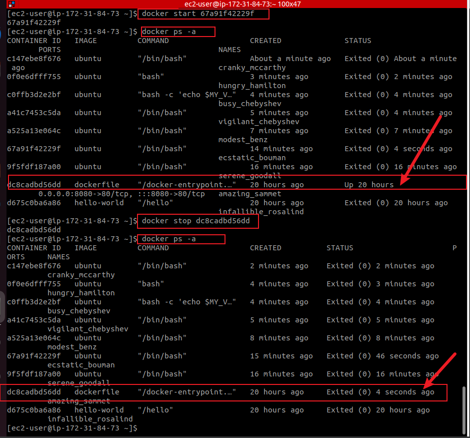
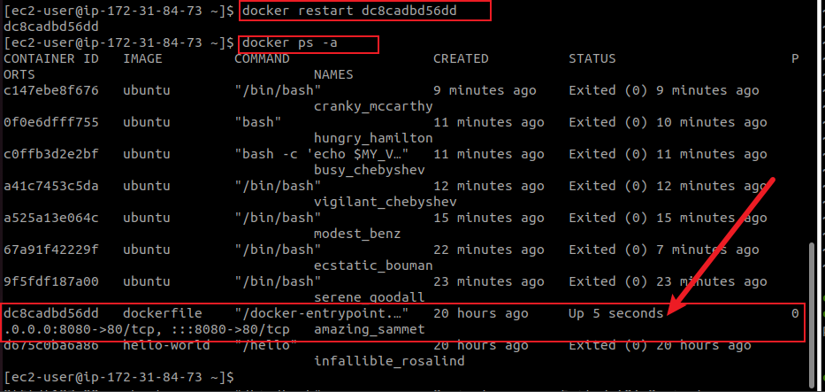
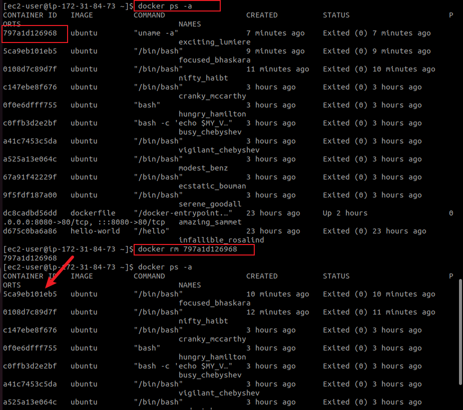

# 🧱 Working with Docker Containers

Building upon the previous Docker image project, where I pulled, built, tagged, and pushed a custom NGINX image, I progressed into **Docker container management**. This next phase focused on understanding how to run containers from images, manage their lifecycle, and execute basic container operations. These foundational container tasks are essential for effective Docker-based development and deployment workflows.

---

## 🧱 **Docker Container Operations: Extension of Image Work**

Having previously created and pushed a Docker image (a lightweight, self-contained filesystem), I now transitioned to **instantiating** those images by running **containers**. The difference is that while an image is static, a container is a live, executable instance of that image.

---

### 🔹 **Launching a Container from Ubuntu Image**

Reusing the Ubuntu image pulled earlier:

```bash
docker run ubuntu
```

This command created a container, but since no interactive command was specified, it exited immediately after execution. I confirmed the container's existence using:

```bash
docker ps -a
```




---

### 🔹 **Starting a Stopped Container**

Using the container ID from the previous command, I restarted it:

```bash
docker start <CONTAINER_ID>
```



This activated the previously exited container.

---

### 🔹 **Running a Container with Options**

To understand how containers can be customized at runtime, I ran a new container with an environment variable:

```bash
docker run -e "MY_VARIABLE=my-value" ubuntu
```
The command above creates a new Ubuntu container and sets an environment variable named `MY_VARIABLE` inside it. However, by default, Ubuntu containers exit immediately if you don’t specify a command. So while the variable is set, the container shuts down before you can do anything with it.


## ✅ To Actually Use That Variable

You need to **run a shell** (e.g., `bash`) and **echo the variable** to see its value.

```bash
docker run -e "MY_VARIABLE=my-value" ubuntu bash -c 'echo $MY_VARIABLE'
```

### 🔍 What It Does:

* `-e "MY_VARIABLE=my-value"`: sets the environment variable.
* `bash -c 'echo $MY_VARIABLE'`: runs a command that prints the value.

### 🧪 Output Example:

```text
my-value
```

## ✅ For Interactive Use

If you want to drop into a shell **and explore** the environment:

```bash
docker run -it -e "MY_VARIABLE=my-value" ubuntu bash
```

Then inside the container:

```bash
echo $MY_VARIABLE
```



To **exit the shell** inside a Docker container, simply type:

```bash
exit
```

or press:

```bash
Ctrl + D
```

### 🧠 What Happens When You Exit?

* If the container was **run interactively** (`docker run -it ...`), exiting will **stop** the container (but it still exists unless you used `--rm`).
* You can restart it later with:

  ```bash
  docker start -ai <container_id>
  ```

I also tested background mode, which runs the container detached from the terminal:

```bash
docker run -d ubuntu
```



This is helpful when running long-running services without keeping the terminal busy.

---

### 🔹 **Container Lifecycle Commands**

Here are the lifecycle commands I used throughout this stage:

| Action  | Command                           |
| ------- | --------------------------------- |
| Start   | `docker start <container_name>`   |
| Stop    | `docker stop <container_name>`    |
| Restart | `docker restart <container_name>` |
| Remove  | `docker rm <container_name>`      |

I tested these commands to manage container state and confirmed each change using:

```bash
docker ps -a
```

---

### ✅ **Side Hustle Task: Docker Container Operations**

I followed the step-by-step objectives of this task:

---

#### **1. Start a Container and Run a Simple Command**

Pulled and ran the Ubuntu image, then executed a command:

```bash
docker run ubuntu uname -a
```





This displayed the system information from within the container.

---

#### **2. Stop the Container and Verify Its Status**

Stopped the running container:

```bash
docker stop <container_id>
```

Verified status with:

```bash
docker ps -a
```



---

#### **3. Restart and Observe**

```bash
docker restart <container_id>
```

Observed the container restarting and confirmed it stayed active (for containers with persistent tasks).



---

#### **4. Remove the Container**

To clean up unused containers:

```bash
docker rm <container_id>
```

Then verified removal:

```bash
docker ps -a
```



---

### 🔎 **Observations and Lessons Learned**

| Observation                                              | Explanation                                                    |
| -------------------------------------------------------- | -------------------------------------------------------------- |
| Containers exit immediately if no command is specified   | Default behavior of Ubuntu image with no ongoing process       |
| `-d` (detached mode) is ideal for background services    | Useful for long-running web servers, databases, etc.           |
| You can stop, restart, and reattach to containers easily | Lifecycle commands allow container reuse without rebuild       |
| Removing a container does **not** remove the image       | Good separation between runtime (container) and static (image) |

---

## 🔚 Conclusion

This phase of the project deepened my understanding of Docker’s runtime behavior — transitioning from static image handling to dynamic container operations. It reinforced best practices in container lifecycle management, especially how to launch, monitor, and clean up containers in a structured way. With this knowledge, I am now well-equipped to run multi-container setups and integrate Docker more efficiently into production and CI/CD workflows.
