# 📝 **Working with Docker Images**

This report outlines my practical engagement with Docker image management, covering the end-to-end process of pulling base images, building a custom image using a Dockerfile, running a web application in a container, configuring EC2 access, and pushing the image to Docker Hub. It also reflects the real-world issues encountered and how I resolved them.

---

### 🔹 **1. Pulling and Exploring Docker Images**

I began by exploring Docker Hub to identify a suitable base image. Using the command below, I searched for available images:

```bash
docker search ubuntu
```

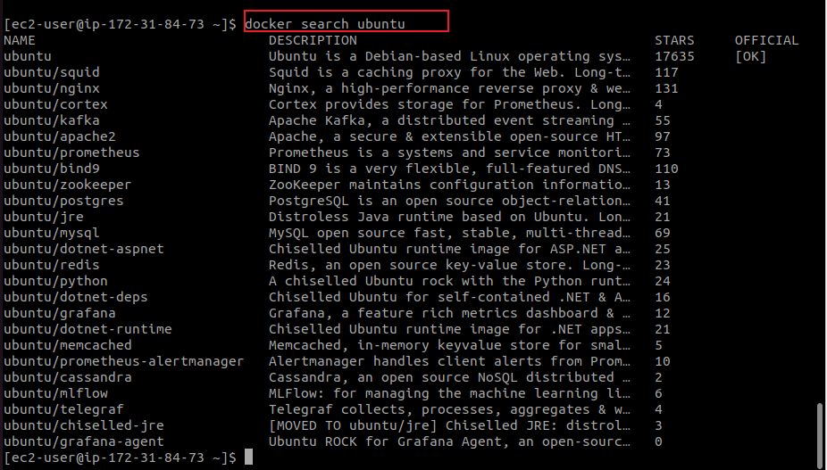

I proceeded to pull the official Ubuntu image:

```bash
docker pull ubuntu
```

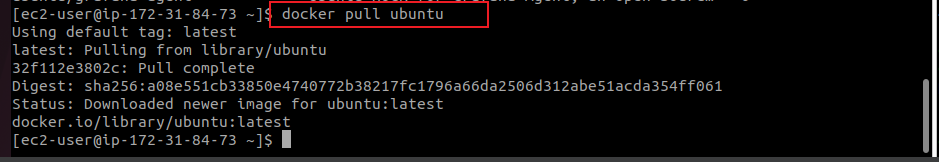

I then verified the image was downloaded locally using:

```bash
docker images
```

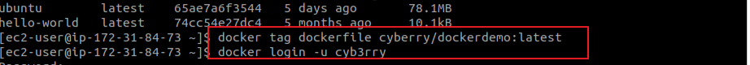

---

### 🔹 **2. Creating a Dockerfile for a Static Web Page**

To create a simple containerized web server, I created a `Dockerfile` using the official **NGINX** base image. I also created a basic HTML file named `index.html` to serve via NGINX.

**Dockerfile Content:**

```Dockerfile
# Use the official NGINX base image
FROM nginx:latest

# Set the working directory in the container
WORKDIR /usr/share/nginx/html/

# Copy the local HTML file to the NGINX default public directory
COPY index.html /usr/share/nginx/html/

# Expose port 80 to allow external access
EXPOSE 80

```

**HTML File:**

```bash
echo "Welcome to Darey.io" > index.html
```

---

### 🔹 **3. Building and Running the Docker Image**

I built the Docker image from the Dockerfile using:

```bash
docker build -t dockerfile .
```
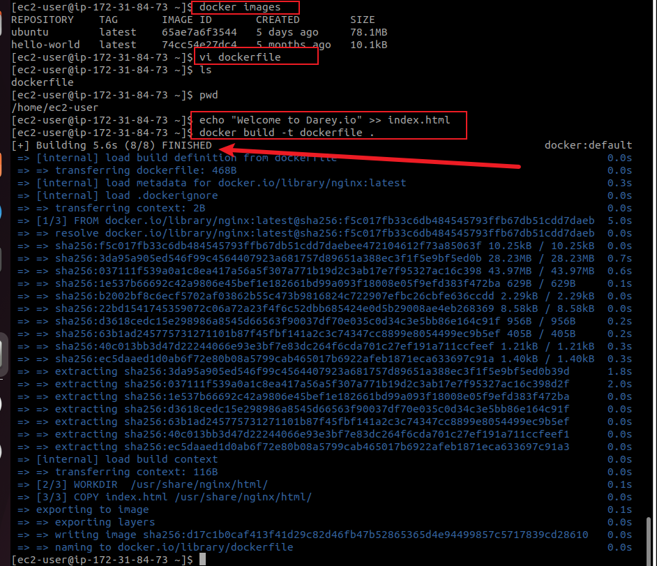

Then I launched a container from the image, exposing port **8080** on the host:

```bash
docker run -p 8080:80 dockerfile
```
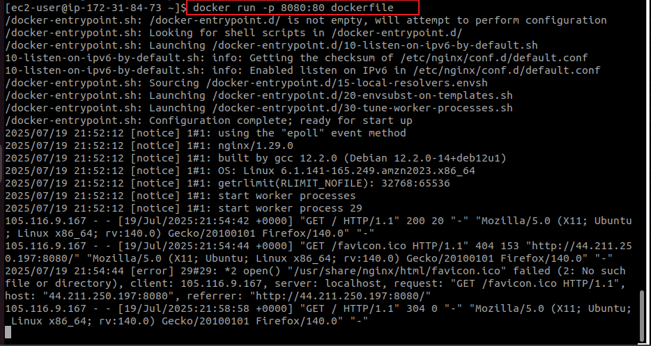


---

### 🔹 **4. Configuring EC2 Access (Security Group)**

To make the container accessible via browser, I:

* Opened the EC2 instance's **Security Group** settings.
* Added a new **inbound rule** to allow **TCP traffic on port 8080**.

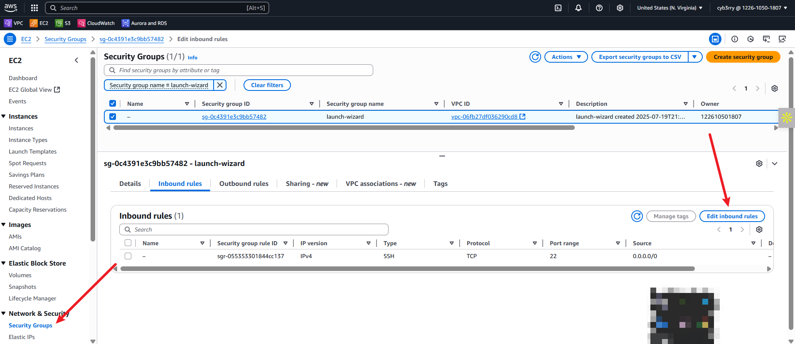

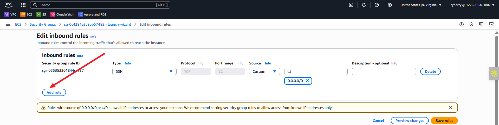

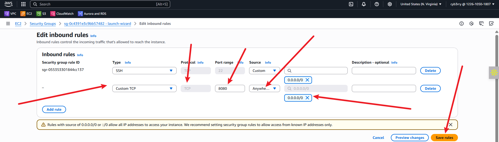

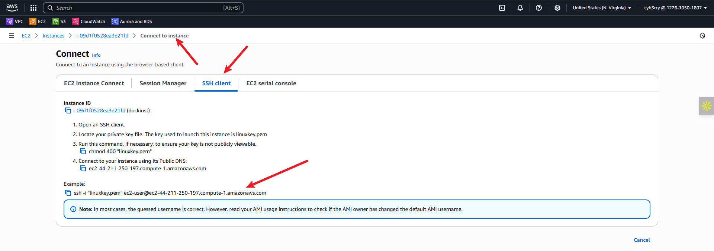

I accessed the running container in my browser using:

```
http://<EC2-Public-IP>:8080
```

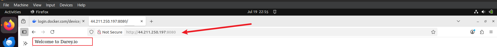

---

### 🔹 **5. Docker Container Management**

I used the following commands to monitor and manage my container:

* List containers (including stopped ones):

  ```bash
  docker ps -a
  ```

* Start the container:

  ```bash
  docker start <CONTAINER_ID>
  ```

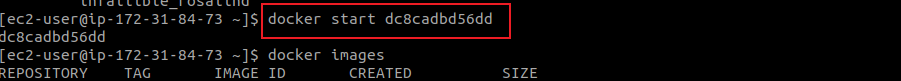

This helped when I encountered a stopped container after the initial `run` command.

---

### 🔹 **6. Creating and Pushing to Docker Hub Repository**

To make the image reusable and shareable:

#### ✅ Created a Docker Hub Repository

* I signed in to [Docker Hub](https://hub.docker.com/).
* Created a new repository named **`dockerdemo`** under my username `cyb3rry`.

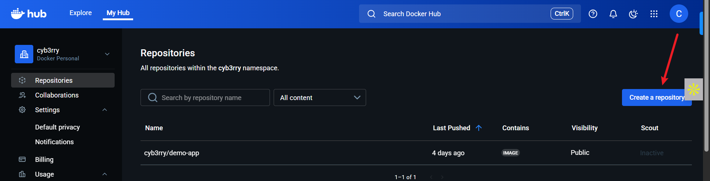

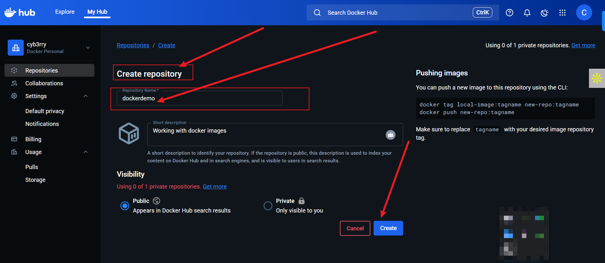

#### ✅ Tagged the Local Image

Before pushing, I tagged the locally built image:

```bash
docker tag dockerfile cyb3rry/dockerdemo:latest
```

#### ✅ Logged into Docker Hub

```bash
docker login
```

#### ✅ Pushed the Image

```bash
docker push cyb3rry/dockerdemo:latest
```

I confirmed the image appeared under my Docker Hub account and could now be pulled from anywhere.

---

### 🔎 **Challenges & Experiences Encountered**

| Issue                                              | Resolution                                                                       |
| -------------------------------------------------- | -------------------------------------------------------------------------------- |
| ❌ Tried pushing before tagging the image correctly | ✔️ Used `docker tag` to properly name it as `cyb3rry/dockerdemo:latest`          |
| ❌ Browser couldn’t access the app on port 8080     | ✔️ Realized I hadn't opened port 8080 in the EC2 Security Group — added rule     |
| ❌ Image not showing up in Docker Hub               | ✔️ Forgot to login before pushing — resolved with `docker login`                 |
| ❌ Confusion around tag usage                       | ✔️ Learned the significance of tags (`latest`, `v1`, etc.) for managing versions |

---

### ✅ **Conclusion**

This project improved my hands-on understanding of Docker and image lifecycle management. I successfully:

* Pulled images,
* Created a custom Dockerfile and HTML file,
* Built and ran a containerized web server,
* Managed EC2 security for access,
* Tagged and pushed the image to Docker Hub.
