# 🐧 Introduction to Linux
## 📌 What is Linux?
Linux is a powerful, open-source operating system (OS) based on Unix. It acts as an interface between the computer hardware and the user, allowing software and hardware to communicate.

Developed originally by Linus Torvalds in 1991, Linux has grown into one of the most widely used operating systems in the world — especially for servers, embedded systems, cloud infrastructure, and cybersecurity.

### 🔑 Key Features of Linux:
Open Source: Source code is freely available and can be modified.

Multitasking: Can run multiple processes at the same time.

Multiuser: Supports multiple users simultaneously.

Secure: Designed with strong permission and access control.

Portable: Runs on many different types of hardware.

Customizable: You can tailor it to your specific needs.

### 📦 What are Linux Distributions (Distros)?

A Linux distribution is a complete Linux-based operating system that includes:

The Linux kernel

System tools and libraries

Package manager

Additional software like desktop environments, browsers, office tools, etc.

Each distro is tailored for specific needs — some are user-friendly for beginners, while others are optimized for security, speed, or servers.

Distro Name | Best For | Notes
----------- | -------- | --------
Ubuntu | Beginners, desktops, servers | Most popular, very user-friendly
Debian | Stability, servers | Foundation for many other distros
Fedora | Developers, cutting-edge tech | Backed by Red Hat
CentOS | Enterprise servers | Stable and secure (now replaced by Rocky Linux)
Arch Linux | Advanced users | DIY, highly customizable
Kali Linux | Cybersecurity, penetration testing | Preloaded with hacking tools
Linux Mint | Beginners switching from Windows | Lightweight and user-friendly
Pop!_OS | Developers and gamers | Created by System76

### 🧰 Use Cases of Linux:
Servers: Powers most of the web (e.g., Google, Facebook).

Cybersecurity: Widely used in ethical hacking and forensics.

Embedded Systems: In smart TVs, routers, and IoT devices.

Programming: Preferred by developers due to its flexibility.

Education: Used for teaching OS concepts and command-line skills.

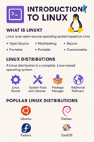

## Client-Server Connection


## 🌐 Connecting to a Server Remotely?

### 💡 **Definition:**
**Connecting to a server remotely** means accessing and controlling a server (computer) that is located somewhere else (often in the cloud) over the internet — **without being physically near it**.

Imagine you rent a powerful computer (a *server*) from a cloud provider like AWS. Even though that server is sitting in a data center somewhere in the world, you can **log into it** and use it from your own laptop at home — this is remote connection.

---

### 🔧 **How It Works:**

When you connect to a server remotely, you typically use a tool like **SSH (Secure Shell)**. SSH is a protocol that allows secure, encrypted communication between your local computer (the **client**) and the remote **server**.

- You type commands on your local terminal
- The commands are sent securely over the internet
- The remote server receives and executes them
- The output is sent back to your screen

It’s as if you’re sitting right in front of that remote server — but you're not!

---

### 📦 Example Use Case:
You spin up a **Linux server on AWS**, and instead of using a mouse and monitor attached to that server (which you can't), you:
- Open your terminal
- Use SSH to access it
- Install software, update it, run websites, etc.

---

### 🔐 Why Is It Secure?
- You use a **private key** (your digital ID) to prove you’re allowed in.
- SSH encrypts the session so no one can eavesdrop on what you're doing.

---

### 🔁 Real-World Analogy:
Think of it like using **remote desktop software** to log in to your office computer from home. But instead of a graphical screen, you're working in a **command-line environment**.

---


# Installation and initial setup

---

## ☁️ **Creating a Server in the Cloud (AWS EC2)**

### 🔹 Step 1: Sign in to AWS Console
- Go to [https://aws.amazon.com](https://aws.amazon.com) and sign in.

### 🔹 Step 2: Launch an EC2 Instance
1. Open the **EC2 Dashboard**.
2. Click **Launch Instance**.
3. Choose an **Amazon Machine Image (AMI)** — e.g., Ubuntu or Amazon Linux.
4. Choose an **instance type** — e.g., `t2.micro` (free-tier eligible).
5. Create or select a **key pair** (used for SSH access).
6. Configure security group:
   - Allow **SSH (port 22)** for remote access.
7. Launch the instance.

[Watch this!](https://drive.google.com/file/d/1H9WXDPhEmhTV0ClDua5x13EWvmxhIeeP/view?usp=sharing)

[And this!](https://www.youtube.com/watch?v=TxT6PNJts-s)

---

## 🔗 **Connecting to the Server Remotely**

### ✅ Requirements:
- Your **private key file** (e.g., `my-key.pem`)
- The **public IP address** of your EC2 instance
    - Extract the Public IP address
    

### 🖥️ On Your Terminal (Linux/macOS) or Git Bash/MobaXterm (Windows):

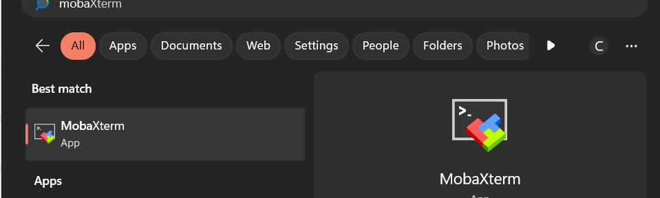

```bash
cd Downloads #where the key was downloaded to
chmod 400 my-key.pem  # Secure your private key

ssh -i my-key.pem ec2-user@<your-ec2-ip-address>

```
- Replace `ec2-user` with `ubuntu` if you're using an Ubuntu instance.
- Replace `<your-ec2-ip-address>` with the actual IP (e.g., `3.12.34.56`).

---

### 📌 Example:
```bash
ssh -i "linuxkey.pem" ubuntu@ec2-54-236-165-224.compute-1.amazonaws.com
```

This logs you into your cloud server just like you're using a terminal on it.

Using MobaXterm on Windows to connect remotely

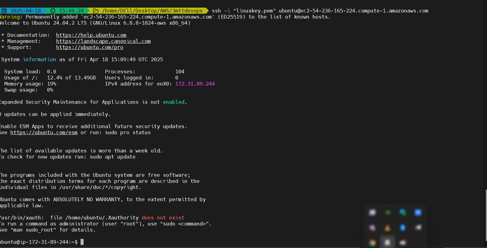

---
# Package Managers/Installation

## 📦 **What is a Package Manager in Linux?**

A **package manager** is a tool used in Linux to **install, update, configure, and remove software** packages on your system.

Linux software is typically distributed in the form of **packages** — which include the program files, configuration files, and dependencies.

### 🔧 Why It’s Useful:
- Automatically handles software **dependencies**
- Helps keep your system **updated**
- Ensures **safe and easy installation/removal** of software

---

## 🗂️ **Popular Package Managers by Linux Distribution:**

| Linux Distribution | Package Manager | Package Format |
|--------------------|------------------|----------------|
| **Ubuntu/Debian**  | `apt`            | `.deb`         |
| **Fedora/Red Hat** | `dnf` or `yum`   | `.rpm`         |
| **Arch Linux**     | `pacman`         | `.pkg.tar.zst` |
| **OpenSUSE**       | `zypper`         | `.rpm`         |

---

## 🔽 **Installing Software Example**

### On Ubuntu/Debian:
```bash
sudo apt update
sudo apt upgrade
sudo apt install tree
```
Updating and Installing packages in the connected cloud server (Ubuntu) via the terminal
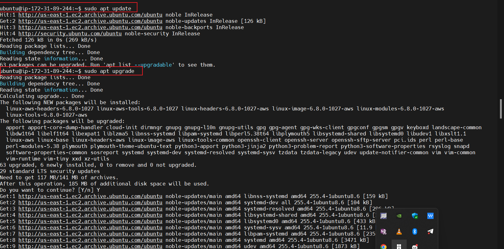
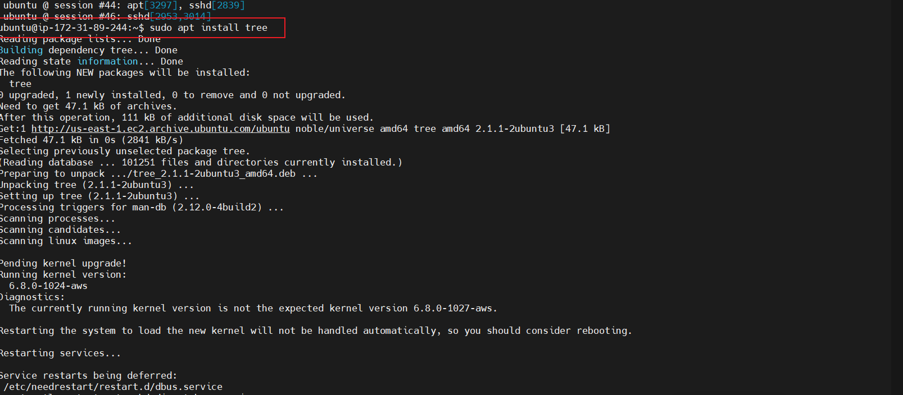
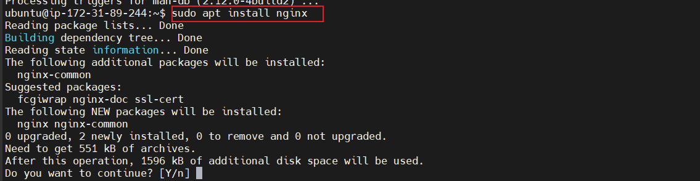
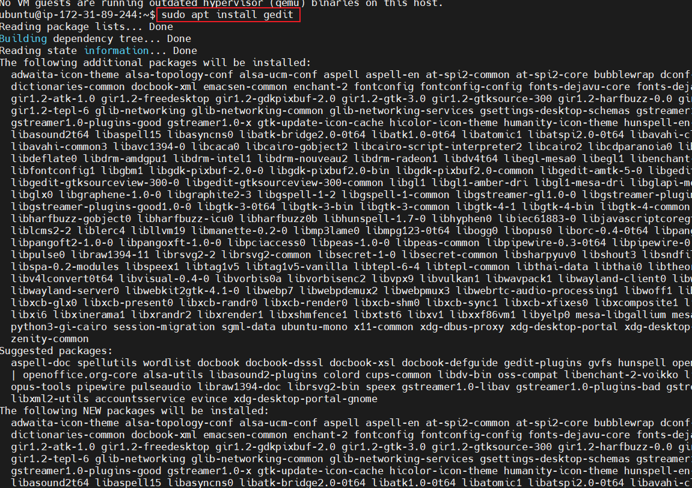

### On Fedora:
```bash
sudo dnf install tree
```

### On Arch Linux:
```bash
sudo pacman -S tree
```

These commands download and install the packages, along with any required dependencies.

To remove these packages, a simple `sudo apt remove <package name will do>`

```bash
sudo apt remove tree
sudo apt remove nginx
sudo apt remove gedit
```

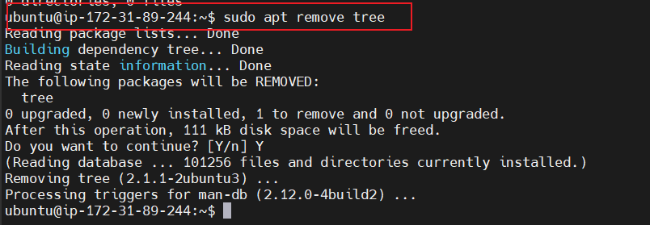
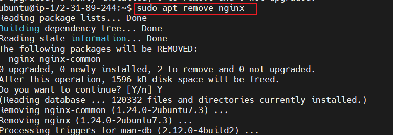
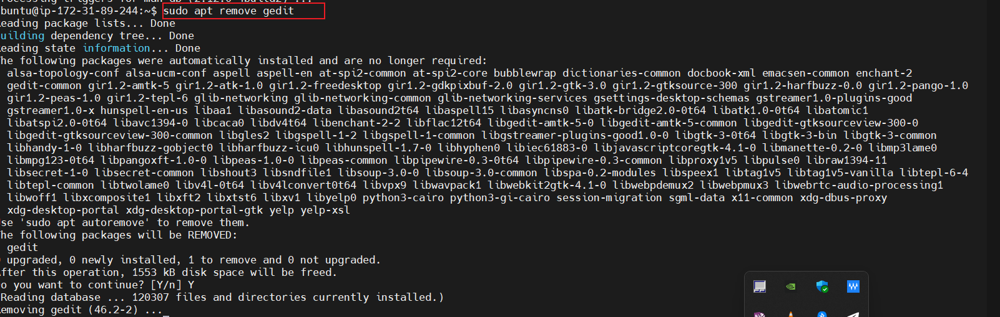

Always remember to update and upgrade packages for a smooth walk-around when using a terminal.

```bash
sudo apt update && upgrade
```

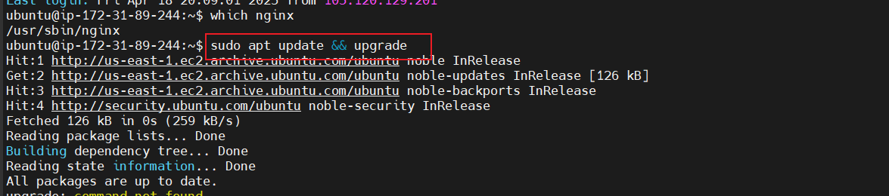
---

Exit the cloud server's terminal and stop the instance


## 📌 Summary:
- **Package managers** make it easy to install and manage software.
- Each distro has its **own manager** and **package format**.
- You don’t need to manually download and configure software.

DONE!!!
---


