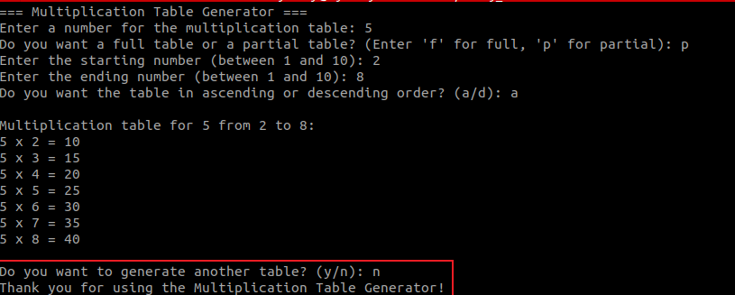
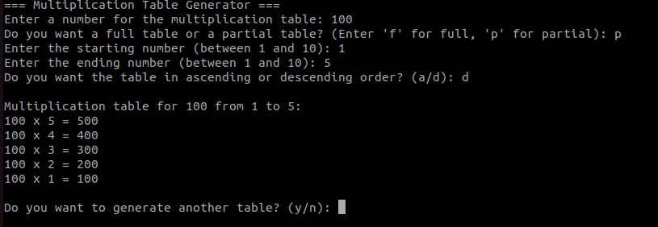
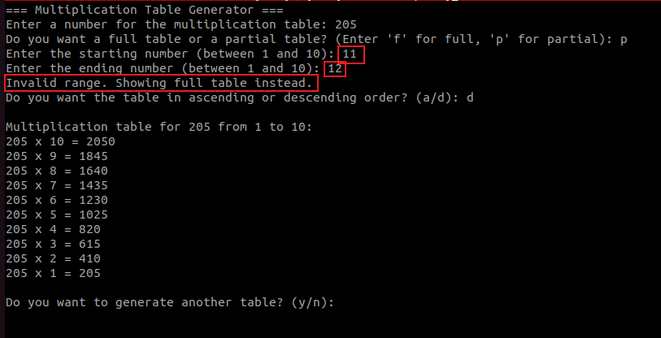

# 🔧 **Project Title:**

## **Multiplication Table Generator (Bash Script)**

### 🎯 **Objective:**

To create a user-interactive Bash script that generates a multiplication table for a number entered by the user, with options for full or partial range, ascending or descending order, and repeatability—all while demonstrating proper use of loops, conditionals, and input validation.

### 📌 **Key Features:**

* Prompts the user to enter a number.
* Offers choice between a full (1–10) or partial multiplication table.
* Validates numeric input and range.
* Allows display in ascending or descending order.
* Uses both **list-form** and **C-style** `for` loops.
* Offers the option to repeat the process without restarting the script.
* Outputs are cleanly formatted for readability.

### 🛠️ **Technical Concepts Used:**

* Bash scripting syntax
* User input handling (`read`)
* Input validation using regular expressions
* Loop constructs: `for`, `seq`, and C-style
* Conditional logic (`if`, `elif`, `else`)
* Arithmetic operations and formatting
* Code modularity and user-friendly interaction
---

## ✅ Multiplication Table Bash Script

```bash
#!/bin/bash

# Function to validate if input is a number
is_number() {
    [[ "$1" =~ ^[0-9]+$ ]]
}

# Main loop to allow repeating the script
while true; do
    clear
    echo "=== Multiplication Table Generator ==="

    # Prompt user for the number
    read -p "Enter a number for the multiplication table: " number

    # Validate number
    if ! is_number "$number"; then
        echo "Invalid input. Please enter a valid positive number."
        continue
    fi

    # Ask for full or partial table
    read -p "Do you want a full table or a partial table? (Enter 'f' for full, 'p' for partial): " choice

    # Default values
    start=1
    end=10

    # Handle partial table
    if [[ "$choice" == "p" ]]; then
        read -p "Enter the starting number (between 1 and 10): " start
        read -p "Enter the ending number (between 1 and 10): " end

        # Validate range
        if ! is_number "$start" || ! is_number "$end" || [ "$start" -lt 1 ] || [ "$end" -gt 10 ] || [ "$start" -gt "$end" ]; then
            echo "Invalid range. Showing full table instead."
            start=1
            end=10
        fi
    fi

    # Ask for order
    read -p "Do you want the table in ascending or descending order? (a/d): " order

    echo
    echo "Multiplication table for $number from $start to $end:"

    # Use List Form For Loop (if ascending)
    if [[ "$order" == "a" ]]; then
        for i in $(seq $start $end); do
            echo "$number x $i = $((number * i))"
        done
    # Use C-style For Loop (if descending)
    elif [[ "$order" == "d" ]]; then
        for (( i=end; i>=start; i-- )); do
            echo "$number x $i = $((number * i))"
        done
    else
        echo "Invalid order choice. Showing ascending order by default."
        for i in $(seq $start $end); do
            echo "$number x $i = $((number * i))"
        done
    fi

    # Ask if user wants to try again
    echo
    read -p "Do you want to generate another table? (y/n): " again
    [[ "$again" != "y" ]] && break
done

echo "Thank you for using the Multiplication Table Generator!"
```

---

## 🔍 Code Explanation

```bash
#!/bin/bash
```

* This is called a **shebang**. It tells the system that this script should be run using the **Bash shell**.

---

### 📦 Function to Check for Numeric Input

```bash
is_number() {
    [[ "$1" =~ ^[0-9]+$ ]]
}
```

* This function checks whether the input is a valid positive **integer** using a regular expression.
* It returns true if the input contains **only digits**, which helps in validating user input.

---

### 🔁 Main Script Loop

```bash
while true; do
    clear
    echo "=== Multiplication Table Generator ==="
```

* This starts an **infinite loop** so the user can generate multiple tables without restarting the script.
* `clear` clears the screen to give a clean interface each time.

---

### 🧮 Get the Number from the User

```bash
    read -p "Enter a number for the multiplication table: " number
```

* Prompts the user to enter the number for which the multiplication table will be generated.

---

### ✅ Validate the Number

```bash
    if ! is_number "$number"; then
        echo "Invalid input. Please enter a valid positive number."
        continue
    fi
```

* Calls the `is_number` function.
* If the input is not a number, it shows an error and restarts the loop using `continue`.

---

### 📋 Ask for Table Type: Full or Partial

```bash
    read -p "Do you want a full table or a partial table? (Enter 'f' for full, 'p' for partial): " choice
```

* Asks the user whether they want the **full table (1–10)** or a **custom range**.

---

### 🧮 Default Range Values

```bash
    start=1
    end=10
```

* If the user selects "full", these are the default values used.

---

### 📏 Handle Partial Table

```bash
    if [[ "$choice" == "p" ]]; then
        read -p "Enter the starting number (between 1 and 10): " start
        read -p "Enter the ending number (between 1 and 10): " end

        if ! is_number "$start" || ! is_number "$end" || [ "$start" -lt 1 ] || [ "$end" -gt 10 ] || [ "$start" -gt "$end" ]; then
            echo "Invalid range. Showing full table instead."
            start=1
            end=10
        fi
    fi
```

* If the user selects "partial", they are prompted to enter a **start and end value**.
* The inputs are validated:

  * Must be numbers.
  * Must be between 1 and 10.
  * Start must be less than or equal to End.
* If invalid, the script falls back to a full table (1–10).

---

### ⬆️⬇️ Ask for Order (Bonus Feature)

```bash
    read -p "Do you want the table in ascending or descending order? (a/d): " order
```

* Asks the user if they want the table displayed **from low to high** or **high to low**.

---

### 📤 Display Header

```bash
    echo
    echo "Multiplication table for $number from $start to $end:"
```

* Outputs a header for the table.

---

### 🔁 Table Logic (Ascending and Descending)

```bash
    if [[ "$order" == "a" ]]; then
        for i in $(seq $start $end); do
            echo "$number x $i = $((number * i))"
        done
```

* If ascending, it uses the **list form `for` loop** with `seq`.
* Multiplies `number * i` and prints the result.

```bash
    elif [[ "$order" == "d" ]]; then
        for (( i=end; i>=start; i-- )); do
            echo "$number x $i = $((number * i))"
        done
```

* If descending, it uses the **C-style `for` loop**:

  * Starts from `end`, goes down to `start`.
  * Uses `((...))` for arithmetic loop conditions and updates.

```bash
    else
        echo "Invalid order choice. Showing ascending order by default."
        for i in $(seq $start $end); do
            echo "$number x $i = $((number * i))"
        done
    fi
```

* If the user types anything else (not "a" or "d"), it defaults to ascending.

---

### 🔁 Ask if User Wants to Continue

```bash
    echo
    read -p "Do you want to generate another table? (y/n): " again
    [[ "$again" != "y" ]] && break
```

* Asks the user if they want to repeat the script.
* If they type anything other than "y", the loop breaks and the script ends.

---

### 🏁 Exit Message

```bash
echo "Thank you for using the Multiplication Table Generator!"
```

* Simple goodbye message.

---
### 💡 Features Covered:

* ✅ User input for the number
* ✅ Full or partial range
* ✅ Input validation with fallback
* ✅ Use of both `list form` and `C-style` for loops
* ✅ Ascending or descending order
* ✅ Option to repeat without restarting
* ✅ Clear, readable output
* ✅ Well-commented for clarity

## ✅ Summary of Key Skills Demonstrated

* Input/output with `read` and `echo`
* Input validation using regex
* Looping with both **list** and **C-style** `for`
* Conditional logic (`if`, `else`)
* Arithmetic with `((...))`
* String comparison
* Modular and interactive scripting design
---
### IMAGES






