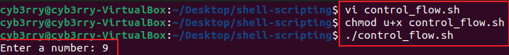
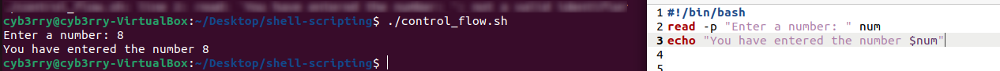
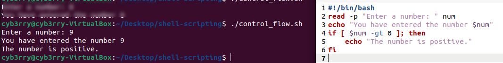
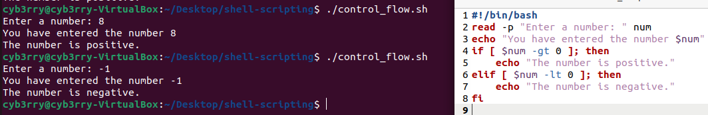
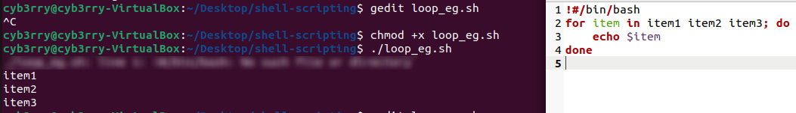
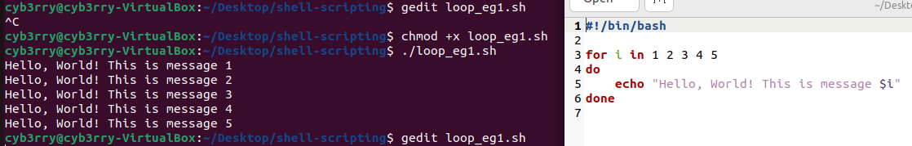
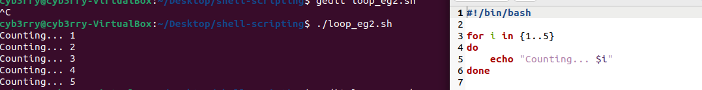

# Control Flow

---

# 🔄 Control Flow in Shell Scripting

Control flow is how you **decide what happens next** in a script, depending on different conditions, loops, or user input.

In simple terms:  
**If this happens → Do that.**  
**Repeat this until that happens.**  
**Choose one of many paths.**

---

# 📍 Key Control Flow Structures

---

## 1. **Conditional Statements (if, if-else, if-elif-else)**

### ➡️ `if` statement
```bash
if [ condition ]; then
  # Commands to execute if condition is true
fi
```

**Example:**

```bash
if [ -f "file.txt" ]; then
  echo "file.txt exists!"
fi
```

---

### ➡️ `if-else` statement
```bash
if [ condition ]; then
  # Commands if true
else
  # Commands if false
fi
```

**Example:**

```bash
if [ -d "backup" ]; then
  echo "Backup directory exists."
else
  echo "No backup directory found."
fi
```

---

### ➡️ `if-elif-else` statement
```bash
if [ condition1 ]; then
  # Commands if condition1 is true
elif [ condition2 ]; then
  # Commands if condition2 is true
else
  # Commands if none are true
fi
```

**Example:**

```bash
if [ "$USER" == "root" ]; then
  echo "You are the root user."
elif [ "$USER" == "admin" ]; then
  echo "Hello Admin."
else
  echo "You are a normal user."
fi
```

---

## 2. **Case Statement**

A cleaner way to match multiple values (like `switch` in other languages).

```bash
case "$variable" in
  pattern1)
    commands
    ;;
  pattern2)
    commands
    ;;
  *)
    default commands
    ;;
esac
```

**Example:**

```bash
echo "Enter a number (1-3):"
read num
case "$num" in
  1)
    echo "You chose One."
    ;;
  2)
    echo "You chose Two."
    ;;
  3)
    echo "You chose Three."
    ;;
  *)
    echo "Invalid choice."
    ;;
esac
```

---

## 3. **Loops**

### ➡️ `for` loop

Repeats a command for a list of items.

```bash
for var in list; do
  commands
done
```

**Example:**

```bash
for file in *.txt; do
  echo "Found file: $file"
done
```

---

### ➡️ `while` loop

Repeats **while** a condition is true.

```bash
while [ condition ]; do
  commands
done
```

**Example:**

```bash
count=1
while [ $count -le 5 ]; do
  echo "Count is $count"
  ((count++))
done
```

---

### ➡️ `until` loop

Repeats **until** a condition becomes true.

```bash
until [ condition ]; do
  commands
done
```

**Example:**

```bash
num=1
until [ $num -gt 5 ]; do
  echo "Number is $num"
  ((num++))
done
```

---

## 4. **Break and Continue**

- `break` → Exit the loop immediately.
- `continue` → Skip the rest of the loop and go to the next iteration.

**Example with break:**

```bash
for i in {1..10}; do
  if [ $i -eq 5 ]; then
    break
  fi
  echo "$i"
done
```

**Example with continue:**

```bash
for i in {1..5}; do
  if [ $i -eq 3 ]; then
    continue
  fi
  echo "$i"
done
```

---

# ✨ Pro Tips for Control Flow

- Always **quote** variables: `"$var"` (prevents issues with spaces or special characters).
- Use `[[ ... ]]` instead of `[ ... ]` when possible; it's more powerful.
- Keep your indentation neat inside loops and conditionals.
- Always close `if`, `case`, `for`, `while`, and `until` properly.

---

# 🛠 A Quick Example Putting It All Together

```bash
#!/bin/bash

read -p "Enter your username: " user

if [ "$user" == "admin" ]; then
  echo "Welcome, Admin!"
elif [ "$user" == "guest" ]; then
  echo "Welcome, Guest!"
else
  echo "User not recognized."
fi

for file in *.txt; do
  echo "Processing file: $file"
done
```
# TASK
### The following script will be practiced with but one line at a time

```bash
#!/bin/bash

read -p "Enter a number: " num

if [ $num -gt 0 ]; then
    echo "The number is positive."
elif [ $num -lt 0 ]; then
    echo "The number is negative."
else
    echo "The number is zero."
fi
```

1. Now create a file and name it `check_number.sh`
2. Put the following: `read -p "Enter a number: " num` and exceute it
3. 
4. Update the code with the following:
```bash
#!/bin/bash
read -p "Enter a number: " num
echo "You have entered the number $num"
```
5. 
6. Now update the code to look like this:
```bash
#!/bin/bash
read -p "Enter a number: " num
echo "You have entered the number $num"
if [ $num -gt 0 ]; then
    echo "The number is positive."
fi
``` 
and execute
7. 
8. Update with this:
```bash
#!/bin/bash
read -p "Enter a number: " num
echo "You have entered the number $num"
if [ $num -gt 0 ]; then
    echo "The number is positive."
elif [ $num -lt 0 ]; then
    echo "The number is negative."
fi
```
and execute
9. 

### Summarized explanation of the script:

---

1. **`#!/bin/bash`**  
   ➔ Tells the computer: "I'm writing in Bash language."

2. **`read -p "Enter a number: " num`**  
   ➔ The computer says: **"Enter a number:"**, waits for you to type something, and stores it in a "container" called `num`.

3. **`if [ $num -gt 0 ]; then`**  
   ➔ Now the computer asks: **"Is the number greater than 0?"**  
   ➔ If **yes**, it runs the command inside:  
   `echo "The number is positive."`

4. **`elif [ $num -lt 0 ]; then`**  
   ➔ If the number wasn't greater than 0, the computer now checks: **"Is the number less than 0?"**  
   ➔ If **yes**, it runs:  
   `echo "The number is negative."`

5. **`else`**  
   ➔ If the number isn't greater than or less than 0 (meaning it must be **exactly 0**), it says:  
   `echo "The number is zero."`

6. **`fi`**  
   ➔ **This is important:**  
   `fi` means **"End of if"** —  
   It tells Bash:  
   👉 *"I have finished writing my conditions."*

**(Fun fact: `fi` is just `if` spelled backwards!)** 🔄

---

## 🎯 In Super Simple Words:

- You type a number.
- The computer checks:
  - Is it positive?
  - Is it negative?
  - Is it zero?
- Then it gives the correct response.
- **`fi`** closes the decision-making section.
---
## Loop example
A
Create a shell script `loop_list.sh` and put the following code:
```bash
for item in item1 item2 item3; do
    echo $item
done
```
---

### 🧠 What It Does:

This is a **`for` loop** in Bash. It repeats a command for **each item in a list**.

---

### 🧱 Step-by-step Explanation:

1. **`for item in item1 item2 item3;`**  
   ➔ You're telling the computer:  
   "Take each of these — `item1`, `item2`, and `item3` — one at a time, and call each one `item` while I do something with it."

2. **`do` ... `done`**  
   ➔ This is like saying:  
   “Now I’ll tell you what to do with each item.”  
   Everything between `do` and `done` is the repeated action.

3. **`echo $item`**  
   ➔ This prints out the current item.

---

### 🖨️ What the Output Looks Like:

```
item1
item2
item3
```

It prints each item on a new line.

---

### ✅ Real-Life Analogy:

Think of it like a teacher calling out student names in roll call:

> "For every name in this list, say the name out loud."


B
```bash
#!/bin/bash

for i in 1 2 3 4 5
do
    echo "Hello, World! This is message $i"
done
```


---

### 🔍 Line-by-Line Explanation:

---

#### ✅ `#!/bin/bash`
This is called the **shebang**.  
It tells the computer:  
> “Use the Bash shell to run this script.”

---

#### ✅ `for i in 1 2 3 4 5`
This is the start of a **for loop**.  
It means:
> “Go through the list of numbers — 1, 2, 3, 4, and 5 — one by one.”

Each time, the number is stored in the variable `i`.

---

#### ✅ `do ... done`
This defines **what to do for each number**.

Everything between `do` and `done` is repeated **once per number** in the list.

---

#### ✅ `echo "Hello, World! This is message $i"`
This prints out the message, and **replaces `$i` with the current number** in the loop.

So the output will look like:

```
Hello, World! This is message 1
Hello, World! This is message 2
Hello, World! This is message 3
Hello, World! This is message 4
Hello, World! This is message 5
```

---

### ✅ Summary:

This script:
- Says “Hello, World!” **five times**
- Each time, it includes the number of the message

It's a **basic loop** — great for beginners — and a perfect example of **repeating a task with slight variation.**

---
C

Create a shell script `loop_range.sh` and put the following code:
```bash
for i in {1..5}
do
    echo "Counting... $i"
done
```


---

### 🔍 Line-by-Line Explanation:

#### ✅ `for i in {1..5}`
This is a **for loop** using **brace expansion**.

- `{1..5}` means: “create a list of numbers from 1 to 5”
- So Bash sees it as: `1 2 3 4 5`

The loop goes through each number one by one:
- First time: `i=1`
- Second time: `i=2`
- ...
- Fifth time: `i=5`

---

#### ✅ `do` ... `done`
This block tells the computer:
> "Here is what I want you to **do** for each value of `i`."

Everything between `do` and `done` is the action that will be repeated.

---

#### ✅ `echo "Counting... $i"`
This line prints a message and includes the current value of `i`.

So each time through the loop, it prints:

```
Counting... 1
Counting... 2
Counting... 3
Counting... 4
Counting... 5
```

---

### 🧠 Summary:
You're telling Bash:
> “Count from 1 to 5, and for each number, print a message.”
---
## The last style of for loop is the C-style form:

The **C-style `for` loop** in Bash — a more flexible way to write loops, especially for numerical control. 
---

### 🧾 Code:
Create a shell script `loop_cstyle.sh` and put the following code:
```bash
for (( i=0; i<5; i++ )); do
    echo "Number $i"
done
```

---

## 🔍 C-Style Syntax Breakdown

This format mimics the **C programming language** style of writing loops.

```bash
for (( initialization; condition; increment ))
```

### ✅ 1. `i=0` → **Initialization**
- Sets the starting value of variable `i` to `0`.
- This is done **once**, at the very start.

### ✅ 2. `i<5` → **Condition**
- Before each loop run, Bash checks this condition.
- If it is **true**, the loop runs.
- If it becomes **false**, the loop **stops**.
- In this case: the loop runs **while `i` is less than 5**.

### ✅ 3. `i++` → **Increment**
- After each loop cycle, increase the value of `i` by 1.
- Same as: `i = i + 1` or `((i+=1))`

---

### ✅ `do ... done`
Defines the **body** of the loop — the commands to run each time.

---

### ✅ `echo "Number $i"`
This prints the current value of `i`.

---

## 🔢 What the Loop Does

Step-by-step, it behaves like:

```
i = 0 → condition: 0 < 5 → echo "Number 0"
i = 1 → condition: 1 < 5 → echo "Number 1"
i = 2 → condition: 2 < 5 → echo "Number 2"
i = 3 → condition: 3 < 5 → echo "Number 3"
i = 4 → condition: 4 < 5 → echo "Number 4"
i = 5 → condition: 5 < 5 → ❌ false → loop stops
```

---

### ✅ Output:
```
Number 0
Number 1
Number 2
Number 3
Number 4
```

---

## 🧠 Why Use C-Style Loops?

- **More control** over loop logic (start, stop, step)
- Easier for **numeric iterations** or **complex counters**
- Familiar to programmers from other languages like C, Java, or C++


DONE
---


