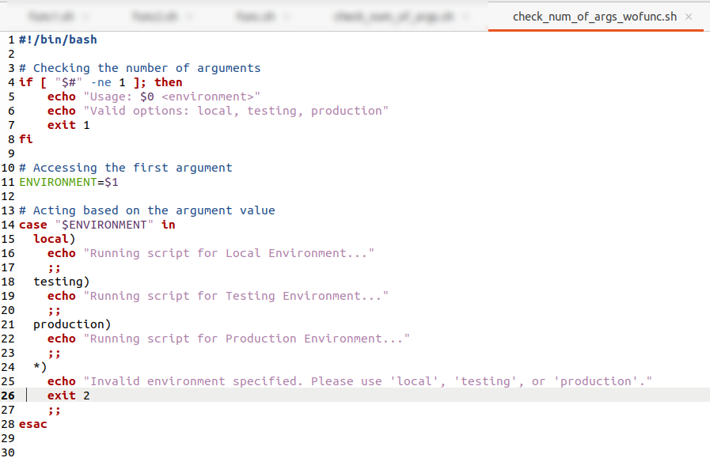
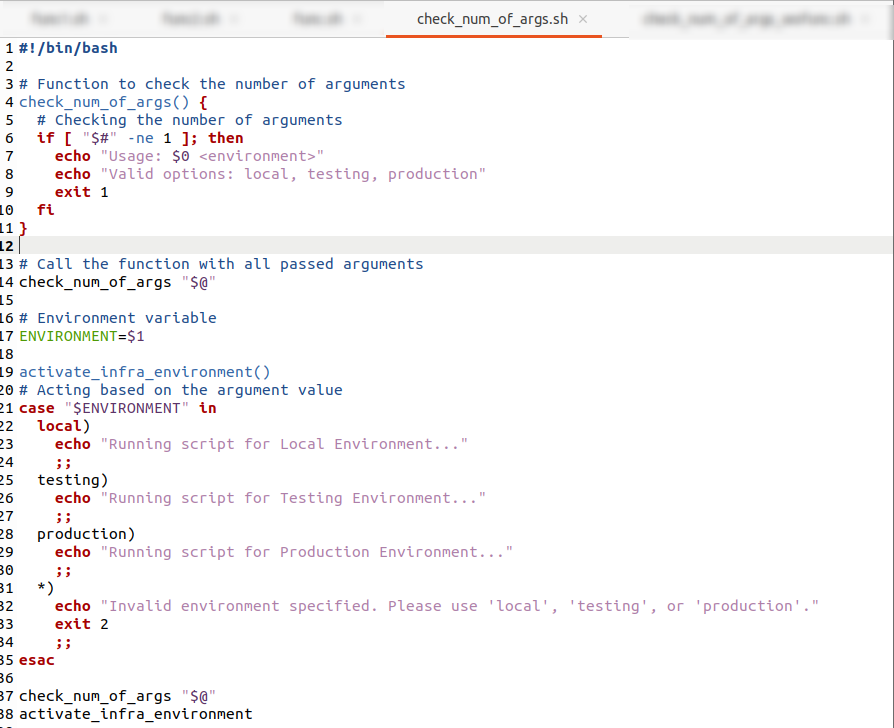
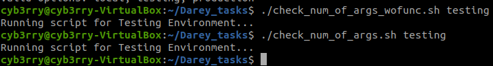
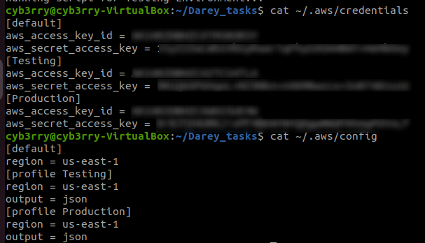
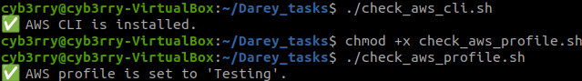
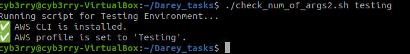

# Working with functions

---

## ✅ **Defining a Function in Bash**

### Basic syntax:

```bash
function_name() {
  # commands
}
```

Or:

```bash
function function_name {
  # commands
}
```

> 🔹 Both styles are valid. The first is more common.

---

## ✅ **Calling a Function**

Just use the name:

```bash
say_hello() {
  echo "Hello, world!"
}

say_hello  # calling the function
```

---

## ✅ **Passing Arguments to Functions**

Arguments are accessed using `$1`, `$2`, etc.

```bash
greet() {
  echo "Hello, $1!"
}

greet "Alice"
# Output: Hello, Alice!
```

You can loop through all arguments with `"$@"`:

```bash
print_all() {
  for arg in "$@"; do
    echo "$arg"
  done
}

print_all "apple" "banana" "cherry"
```

---

## ✅ **Returning Values**

Use `return` for status codes (0 = success, non-zero = error):

```bash
check_even() {
  if [ $(( $1 % 2 )) -eq 0 ]; then
    return 0
  else
    return 1
  fi
}

check_even 4 && echo "Even" || echo "Odd"
```

To return actual **data**, use `echo` and capture it:

```bash
get_date() {
  echo "Today is $(date)"
}

msg=$(get_date)
echo "$msg"
```

---

## 🧠 Why Use Functions?

* Reusability
* Cleaner structure
* Easier debugging and testing

---
# TASK
In this project, a function will be created to check if AWSCLI is installed and if the environment variables needed to authenticate to AWS is available.

## A 
To create a function in bash, define it thus:
```bash
function_name() {"\n    
# Function body\n    
# You can place any commands or logic here\n"
}
```
---

### 🧠 Explanation:

1. **Function declaration**:
   `function_name()` or `function function_name` — both declare a function.

2. **Function body**:
   Wrapped in `{ ... }`, the commands inside are what the function executes.

3. **Spacing**:

   * It's important to leave a space after the parentheses `()` and before `{`.
   * Each command inside the function should be on a new line or separated by `;`.

4. **Calling the function**:
   Just write the function name:

   ```bash
   function_name
   ```
## B
Writing a function that checks if a script has an arguement
(code w/o a function)
Create a file and name it `check_num_of_args_wofunc.sh`
```bash
#!/bin/bash

# Checking the number of arguments
if [ "$#" -ne 0 ]; then
    echo "Usage: $0 <environment>"
    exit 1
fi

# Accessing the first argument
ENVIRONMENT=$1

# Acting based on the argument value
if [ "$ENVIRONMENT" == "local" ]; then
  echo "Running script for Local Environment..."
elif [ "$ENVIRONMENT" == "testing" ]; then
  echo "Running script for Testing Environment..."
elif [ "$ENVIRONMENT" == "production" ]; then
  echo "Running script for Production Environment..."
else
  echo "Invalid environment specified. Please use 'local', 'testing', or 'production'."
  exit 2
fi
```


(same code with function) - create a script and name it `check_num_of_args.sh`
```bash
#!/bin/bash

check_num_of_args() {"\n# Checking the number of arguments\nif [ \"$#\" -ne 0 ]; then\n    echo \"Usage: $0 <environment>\"\n    exit 1\nfi\n"}

# Accessing the first argument
ENVIRONMENT=$1

# Acting based on the argument value
if [ "$ENVIRONMENT" == "local" ]; then
  echo "Running script for Local Environment..."
elif [ "$ENVIRONMENT" == "testing" ]; then
  echo "Running script for Testing Environment..."
elif [ "$ENVIRONMENT" == "production" ]; then
  echo "Running script for Production Environment..."
else
  echo "Invalid environment specified. Please use 'local', 'testing', or 'production'."
  exit 2
fi
```
It is important to organize your function as it maintains readability and coherence making your script easier to understand and debug. The above script being organized is as follows:
```bash
#!/bin/bash

# Environment variables
ENVIRONMENT=$1

check_num_of_args() {
  # Checking the number of arguments
  if [ "$#" -ne 1 ]; then
    echo "Usage: $0 <environment>"
    exit 1
  fi
}
activate_infra_environment()
# Acting based on the argument value
if [ "$ENVIRONMENT" == "local" ]; then
  echo "Running script for Local Environment..."
elif [ "$ENVIRONMENT" == "testing" ]; then
  echo "Running script for Testing Environment..."
elif [ "$ENVIRONMENT" == "production" ]; then
  echo "Running script for Production Environment..."
else
  echo "Invalid environment specified. Please use 'local', 'testing', or 'production'."
  exit 2
fi

check_num_of_args
activate_infra_environment
```


---

## ✅ **Above Script Explanation**

The script is intended to:

1. Accept **one argument** (the environment: `local`, `testing`, or `production`)
2. Check if the number of arguments is valid
3. Based on the value of the argument, run different logic (e.g., echoing a message)

---

## 🧠 **Logical Flow and Function Organization**

### 🔹 1. **Argument Capture at the Top**

```bash
ENVIRONMENT=$1
```

* This captures the first argument passed to the script into the variable `ENVIRONMENT`.

---

### 🔹 2. **Function Definition: `check_num_of_args`**

```bash
check_num_of_args() {
  # Checking the number of arguments
  if [ "$#" -ne 1 ]; then
    echo "Usage: $0 <environment>"
    exit 1
  fi
}
```

> Note: `"$#"` gives the **number of arguments** passed to the function or script.

---

### 🔹 3. **Function Call**

```bash
check_num_of_args "$@"
```

* This actually **runs the function**, passing all command-line arguments to it.

---

### 🔹 4. **Conditional Logic**

```bash
if [ "$ENVIRONMENT" == "local" ]; then
  echo "Running script for Local Environment..."
...
```

* This block checks the **value** of the `ENVIRONMENT` variable and executes logic accordingly.

---

## 🧩 Function Design Principles Used

| Principle         | How It's Applied                                                        |
| ----------------- | ----------------------------------------------------------------------- |
| **Encapsulation** | Argument checking logic is isolated in a function (`check_num_of_args`) |
| **Reusability**   | Function could be reused in other scripts                               |
| **Clarity**       | Separates concerns — check input *before* doing logic                   |
| **Fail early**    | Exits immediately if arguments are wrong                                |

---
## Task 2
Below outlines how to:

1. ✅ Verify that the AWS CLI is installed
2. ✅ Verify that required AWS authentication environment variables are set (`AWS_ACCESS_KEY_ID` and `AWS_SECRET_ACCESS_KEY`, or that the default profile is configured)


---

## ✅ Bash Function: `check_aws_requirements`
A
### Check if AS CLI is intalled (create a script `aws_cli.sh`)

```bash
#!/bin/bash

# Function to check if AWS CLI is installed
check_aws_cli() {
    if ! command -v aws &> /dev/null; then
        echo "AWS CLI is not installed. Please install it before proceeding."
        return 1
    else
        echo "✅ AWS CLI is installed."
    fi
}
```
B
### Check if AWS PROFILE is set (create a script `aws_profile.sh`)
```bash
#!/bin/bash

# Function to check if AWS profile is set
check_aws_profile() {
    if [ -z "$AWS_PROFILE" ]; then
        echo "AWS profile environment variable is not set."
        return 1
    else
        echo "✅ AWS profile is set to '$AWS_PROFILE'."
    fi
}
```



---

## 🔍 Explanation of Each Part

### ✅ 1. **Check if AWS CLI is Installed**

```bash
check_aws_cli() {
    if ! command -v aws &> /dev/null; then
        echo "AWS CLI is not installed. Please install it before proceeding."
        return 1
    else
        echo "✅ AWS CLI is installed."
    fi
}
```

* This part **asks your computer**:
  *"Do I have the `aws` command installed?"*
* If not, it shows a warning:
  **"AWS CLI is not installed..."**
* If yes, it shows a green light:
  **"✅ AWS CLI is installed."**

👉 Think of this like checking if your car has fuel before starting a trip.

---

### ✅ 2. **Check if AWS Profile is Set**

```bash
check_aws_profile() {
    if [ -z "$AWS_PROFILE" ]; then
        echo "AWS profile environment variable is not set."
        return 1
    else
        echo "✅ AWS profile is set to '$AWS_PROFILE'."
    fi
}
```

* This part checks if you've told the script **which AWS login/credentials to use**.
* If you haven’t, it shows:
  **"AWS profile environment variable is not set."**
* If it is set, it says:
  **"✅ AWS profile is set to 'mydev'"** (or whatever your profile is)

👉 Think of this like checking if you have the **right keys** for the trip you're taking.

---

## 📌 Summary

Before doing anything important in AWS, this script makes sure:

* You **have the tool installed** (AWS CLI)
* You **have your identity set up** (via AWS profile)

If both are good, the script continues. If not, it politely stops and tells you what’s missing.

### Combining it all together

```bash
#!/bin/bash

# Get environment from command-line argument
ENVIRONMENT=$1

# Function to check number of arguments
check_num_of_args() {
    if [ "$#" -ne 1 ]; then
        echo "Usage: $0 <environment>"
        exit 1
    fi
}

# Function to activate based on environment
activate_infra_environment() {
    if [ "$ENVIRONMENT" == "local" ]; then
        echo "Running script for Local Environment..."
    elif [ "$ENVIRONMENT" == "testing" ]; then
        echo "Running script for Testing Environment..."
    elif [ "$ENVIRONMENT" == "production" ]; then
        echo "Running script for Production Environment..."
    else
        echo "Invalid environment specified. Please use 'local', 'testing', or 'production'."
        exit 2
    fi
}

# Function to check if AWS CLI is installed
check_aws_cli() {
    if ! command -v aws &> /dev/null; then
        echo "❌ AWS CLI is not installed. Please install it before proceeding."
        return 1
    else
        echo "✅ AWS CLI is installed."
    fi
}

# Function to check if AWS profile is set
check_aws_profile() {
    if [ -z "$AWS_PROFILE" ]; then
        echo "⚠️ AWS_PROFILE environment variable is not set."
        return 1
    else
        echo "✅ AWS profile is set to '$AWS_PROFILE'."
    fi
}

# Function calls (in logical order)
check_num_of_args "$@"
activate_infra_environment
check_aws_cli
check_aws_profile
```


---

## 💡 Why This Structure Works

| Section                      | Purpose                                |
| ---------------------------- | -------------------------------------- |
| `ENVIRONMENT=$1`             | Captures the first argument            |
| `check_num_of_args "$@"`     | Ensures exactly one argument is passed |
| `activate_infra_environment` | Decides logic based on environment     |
| `check_aws_cli`              | Verifies AWS CLI is installed          |
| `check_aws_profile`          | Ensures AWS\_PROFILE is exported       |

---

## 🔁 Final Tips

* Always define functions using the format:

  ```bash
  function_name() {
      # your code
  }
  ```
* Always test for argument presence **before using the variable**, to avoid undefined values.
* You can improve the script by also supporting `aws configure` fallback instead of just `AWS_PROFILE`.

---


